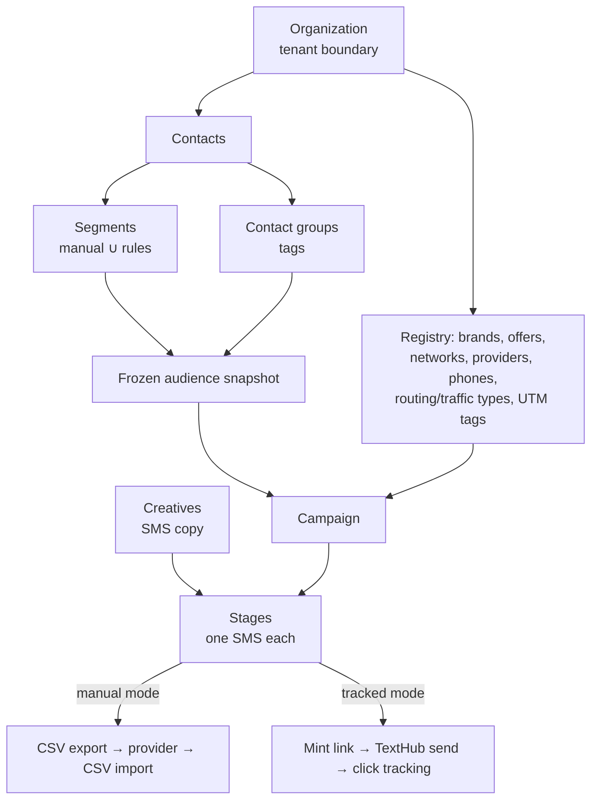

# 01 — Overview

_Last updated: 2026-06-05_

## What CamMan is

CamMan ("Campaign Manager") is an **internal, multi-tenant CRM** for managing **SMS affiliate-marketing campaigns**. It is built by a non-developer with Claude Code's help; single-developer with optional senior-engineer review at milestones.

It is fundamentally a **system of record**: it tracks contacts, audience segments, campaigns, creatives, and campaign results. Historically (v1) the actual SMS sending happened **outside** the app in provider tools (SendNexus, TextHub, …) and results were imported back via CSV. Later phases added a **tracked link shortener** and an **outbound TextHub API send pipeline**, so the app can now also send SMS directly for "tracked" campaigns — but the manual export/import workflow remains fully supported and is the default.

**Display name:** "Campaign Manager" · **Currency:** USD (stored `NUMERIC(12,4)`, displayed `$`) · **Project timezone:** America/New_York (ET).

## Who it's for

| Role | Typical user | Can do |
|------|-------------|--------|
| `viewer` | analyst | read-only |
| `operator` | campaign runner | create/send/archive campaigns & creatives, upload contacts/opt-outs/clickers, trigger spam scoring |
| `manager` | team lead | + delete contacts, create/delete segments, edit registry & config, **drain** real sends |
| `admin` | org admin | + manage users (invite/remove) |
| `owner` | org owner | + delete organization |

Roles are ascending-privilege (each inherits the lower one). See [04-features/multi-tenancy-auth.md](04-features/multi-tenancy-auth.md).

## Core concepts

- **Contact** — a phone number in the org's registry (`contacts`, UUID PK, scales to millions).
- **Contact group** — a categorical **tag** applied directly to contacts (many-to-many). A filter dimension.
- **Segment** — a named audience whose effective membership is the **UNION** of manual members and contacts matching its **rules**. See [audience-segments.md](04-features/audience-segments.md).
- **Campaign** — a long-running container for an SMS sequence. Its **audience is frozen** (snapshotted) the moment it goes `draft → active`. Has a `manual` or `tracked` link mode.
- **Stage** — one SMS-send event under a campaign. Carries a creative, a provider + phone, optional URLs, a schedule, and result counters.
- **Creative** — reusable SMS copy, many-to-many with offers, carries a cached spam score.
- **Opt-out / opt-in / clicker** — suppression and engagement records keyed to a contact; opt-outs exclude a contact from all future audience snapshots.
- **Tracking ID** — an auto-generated, immutable, human-readable analytics identifier on campaigns and stages (separate from the DB id and the editable `human_id`).

## Glossary

| Term | Meaning |
|------|---------|
| **org / tenant** | An `organizations` row. Every domain table has `org_id`; every query filters by it. |
| **audience snapshot** | The frozen set of contacts (`campaign_audience_pool`) computed at activation. Not recomputed afterward. |
| **link mode** | `manual` (operator pastes a short URL) vs `tracked` (app mints a unique link per recipient). Per-campaign. |
| **stage send (`stage_sends`)** | One materialized recipient-message row in the TextHub pipeline; its UUID id doubles as the link idempotency `send_token`. |
| **drain** | The act of actually firing the SMS for a materialized stage. Gated behind `SEND_ENABLED`, `send_approved`, `CRON_SECRET`, and circuit breakers. |
| **circuit breaker** | Per-provider pacing caps + a latching `send_paused` kill-switch protecting against runaway sends. |
| **result import** | A CSV of send outcomes imported back; propagates opt-outs and clickers, updates stage counters; revertible. |
| **spam verdict** | Binary `spam`/`not_spam` from `score > 50`; alongside a 3-way label `ham`/`suspicious`/`spam`. |
| **ET** | `America/New_York`, the single project-wide campaign timezone (`CAMPAIGN_TIMEZONE`). |

## Scope

### In scope (v1 + later phases that have shipped)
- Multi-tenant CRM: contacts, segments, opt-outs, opt-ins, clickers, contact groups
- Registry: brands, offers, networks, providers, provider phones, creatives, routing/traffic types, UTM tags
- Campaign composition, drafts, audience preview & frozen snapshot
- CSV export of audience; CSV import of results with per-provider mapping templates; automatic opt-out/clicker propagation
- Dashboard analytics
- User management (invite/remove, roles)
- **Link shortener** + click tracking + bot/prefetch scoring (`lib/links/`, `app/r/[code]`, migrations 0048–0049)
- **Outbound** SMS sending via TextHub API for tracked campaigns (`lib/sends/`, migration 0050+), with circuit breakers (0058)
- Opt-out (STOP) intake via TextHub inbox polling

### Out of scope (do NOT build/stub)
- Inbound SMS conversations / two-way threads / MMS
- Per-recipient DLR polling (the pipeline stores TextHub's message id so DLR is *possible* later, but does not poll)
- Background job queues (Inngest etc.) — scheduled work uses **Vercel Cron**
- Phone-number-to-campaign assignment ("Load Phones")
- Per-contact send history (`has_been_sent_*` rule types) — deferred; the rules system is structured to absorb them later

See [project CLAUDE.md](../CLAUDE.md) §12–13 for the authoritative scope statement.
