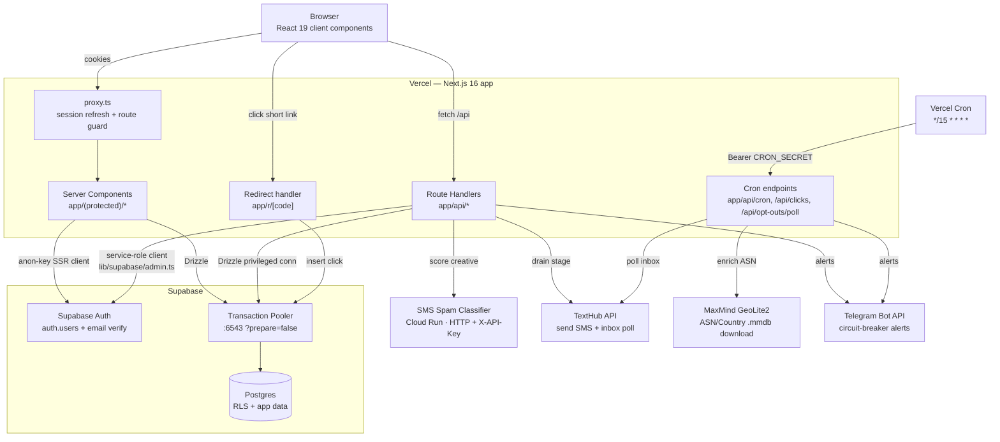

# 02 — Architecture

_Last updated: 2026-06-05_

## Tech stack (real values from config)

| Layer | Choice | Source |
|-------|--------|--------|
| Framework | **Next.js 16.2.6** (App Router, Turbopack default, React 19.2.4) | `package.json` |
| Language | TypeScript 5 | `package.json`, `tsconfig.json` |
| Styling | Tailwind CSS v4 (`@tailwindcss/postcss`), no CSS modules | `package.json`, `postcss.config.mjs` |
| UI kit | **shadcn/ui** (Radix primitives) in `components/ui/` | `components.json` |
| Tables | TanStack Table v8 via a `DataTable` wrapper | `components/data-table.tsx` |
| Forms | react-hook-form + Zod resolvers | `package.json` |
| Charts | Recharts v3 | `package.json` |
| Toasts | sonner · **Icons** lucide-react | `package.json` |
| ORM | **Drizzle ORM 0.45** + drizzle-kit 0.31 | `db/`, `drizzle.config.ts` |
| Driver | `postgres` (postgres-js) 3.4 | `db/client.ts` |
| Validation | Zod v4 | `lib/validators/` |
| DB / Auth | **Supabase** (Postgres + Supabase Auth, `@supabase/ssr`) | `lib/supabase/` |
| Phone parsing | libphonenumber-js | `lib/phone-validation.ts` |
| GeoIP | maxmind (GeoLite2 ASN/Country `.mmdb` at runtime) | `lib/links/geoip.ts` |
| Short codes | nanoid | `lib/links/` |
| Hosting | **Vercel** (push to `main` auto-deploys) | `vercel.json`, CLAUDE.md §14 |

### Next.js 16 notes
- `params` in dynamic routes are **async** (must be `await`ed); so are `cookies()` and `headers()`.
- Server Components are the default; client components opt in with `"use client"`.
- Edge middleware lives in **`proxy.ts`** (Next 16's renamed `middleware.ts`) — it refreshes the Supabase session cookie and guards a prefix list.

## Component / runtime topology



## Supabase connection model (important)

`db/client.ts` is the single Drizzle entry point:

```ts
export const sql = globalForDb.__pg ?? postgres(connectionString, { prepare: false, max: 5 });
if (process.env.NODE_ENV !== "production") globalForDb.__pg = sql;
export const db = drizzle(sql);
```

- **`prepare: false`** — required for postgres-js against Supabase's pooler (prepared statements aren't supported in transaction-pooling mode).
- **`globalThis` singleton** — Next.js HMR re-evaluates modules on every edit; without caching the pool on `globalThis` you leak pools and exhaust the pooler's ~15-client cap (surfaces as `EMAXCONNSESSION`). **Do not strip this caching.**
- **`max: 5`** — small per-instance pool.
- **Pooler port:** CLAUDE.md §6 mandates the **Transaction pooler (port 6543)** with `?prepare=false` for serverless (releases connections per-transaction). `.env.example`'s sample string shows port `5432` with a "Session Pooler" comment — treat **6543/transaction pooler as the production-correct value** and `.env.example` as stale on that point. `> [VERIFY]` which port the live `DATABASE_URL` actually uses.
- **Long transactions** (CSV imports of 50K+ rows) still hold one connection for their duration.

This privileged Drizzle connection **bypasses RLS** — it is the *primary* data-access path, and every query filters by `org_id` in application code. RLS is defense-in-depth (see below).

## Two-layer tenancy enforcement

1. **Application layer (primary).** Every API route resolves the caller's `org_id` + `role` via one helper (`requireApiMembership()` in `lib/api/helpers.ts`), checks `can(role, permission)`, then filters every query by `org_id`. See [04-features/multi-tenancy-auth.md](04-features/multi-tenancy-auth.md).
2. **RLS (defense-in-depth).** Migration `0001_security_layer.sql` enables RLS and defines `public.current_org_id()` (SECURITY DEFINER, reads `org_members` by `auth.uid()`). Policies gate org-scoped tables for any access made with the **anon-key** Supabase client. The service-role client (`lib/supabase/admin.ts`) and the Drizzle privileged connection bypass RLS by design.

## Auth & sessions

- **Supabase Auth**, email + password (not magic link), email verification required before login.
- `proxy.ts` runs on the edge for matched routes, refreshes the session cookie, and redirects unauthenticated users away from protected prefixes (`/dashboard`, `/brands`, `/settings`) and authenticated users away from auth pages. `> [VERIFY]` — the protected-prefix list in `proxy.ts` is narrower than the full protected route set; server-side `requireOrgMembership()` in `app/(protected)/layout.tsx` is the actual gate for all protected pages.
- Three Supabase client factories (`lib/supabase/`): `client.ts` (browser, anon key), `server.ts` (SSR, anon key + cookies), `admin.ts` (service-role, server-only, RLS-bypassing).

## Deployment & runtime specifics

- **Hosting:** Vercel, linked to the GitHub repo; pushes to `main` auto-deploy.
- **Env vars:** set in the Vercel dashboard (not CLI, not committed). `.env.example` lists every variable. See [06-integrations.md](06-integrations.md).
- **Database:** deployed app talks to the **same Supabase project** as local dev (no separate prod Postgres yet). Only `DATABASE_URL` would change per environment when one is added.
- **Migrations are NOT auto-applied on deploy.** Run `npm run db:migrate` locally against the target `DATABASE_URL` **before** pushing dependent code, then `npx tsx scripts/verify-migration-integrity.ts`. See [08-local-setup.md](08-local-setup.md).
- **Cron:** three Vercel Cron entries (`vercel.json`), each `*/15 * * * *`, authenticated with `Authorization: Bearer <CRON_SECRET>`. See [04-features/crons.md](04-features/crons.md).
- **Runtimes:** the click-scoring job uses the Node runtime (filesystem access for the MaxMind `.mmdb`); the redirect handler is `force-dynamic` (no caching). `> [VERIFY]` exact `runtime`/`dynamic` exports per route.

## Repository layout

```
app/
  (auth)/            sign-in / sign-up / reset pages
  (protected)/       authenticated app pages (server components by default)
  api/               route handlers (one folder per entity)
  r/[code]/          public short-link redirect
  auth/              callback / complete / reset handlers
components/          React components (custom)
  ui/               shadcn/ui primitives
  protected/        sidebar + nav-config
  campaigns/        campaign editor, stage form, import dialogs
  spam/             SpamCheckStrip
db/
  schema.ts         Drizzle schema (single file, ~1.9k lines)
  migrations/        hand-authored SQL (0001 … 0058) + meta/journal
  client.ts         Drizzle/postgres-js singleton
lib/
  api/, auth/, supabase/   request context, helpers, clients
  audience-snapshot.ts     freeze-at-activation audience logic
  segment-rules-eval.ts    segment rule → SQL set arithmetic
  tracking-id*.ts          tracking ID generation + formatting
  spam/, links/, sends/    classifier, link shortener, TextHub pipeline
  imports/, csv/, upload/  CSV result imports + phone uploads
  permissions.ts           roles + can()
  feature-flags.ts         ENTITY_AVAILABILITY
  campaign-timezone.ts     ET helpers
  quiet-hours.ts           per-provider send window
scripts/            tsx maintenance/test scripts (backfills, integrity, API tests)
```
