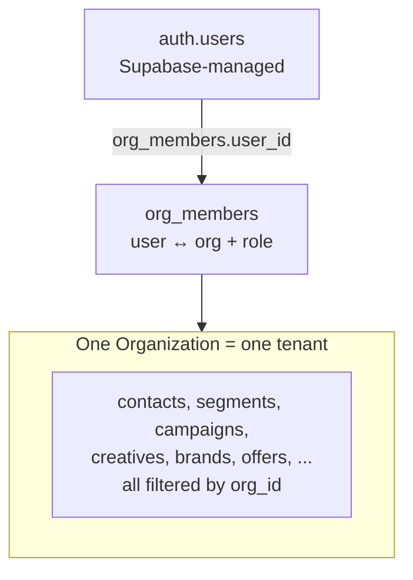

# 03 — Data Model

_Last updated: 2026-06-15_

Schema lives in a single file: [`db/schema.ts`](../db/schema.ts) (~1,880 lines, Drizzle). Migrations are **hand-authored** SQL in [`db/migrations/`](../db/migrations/) (`0001`…`0059`). `db/schema.ts` is the Drizzle representation; where it lags a migration, **the migration is the DB source of truth** (see the `is_in_contact_group` note below).

## Multi-tenant boundary

Every domain table carries `org_id UUID → organizations.id` and an index on it. **Every read/write filters by `org_id` in application code** (primary defense; RLS is secondary). The only tables without `org_id` are pure junctions whose parents are already org-scoped (`opt_out_brands`, `opt_out_providers`) and the external `auth.users` (Supabase-managed).

## Conventions (CLAUDE.md §6)

- **IDs:** small lookup/registry tables use `serial` integer PKs; high-volume tables (`contacts`, `stage_sends`) use `uuid`; `links`/`clicks`/`send_circuit_events`/`campaign_events` use `bigserial`. Most registry tables also carry a separate **text business id** (`brand_id`, `offer_id`, `segment_id`, …) that is unique and user-facing.
- Every domain table has `created_at TIMESTAMPTZ DEFAULT now()`. Most have `status TEXT` + `archived_at TIMESTAMPTZ` (soft-delete via `status='archived'`).
- **Money:** `NUMERIC(12,4)`. **Timestamps:** `TIMESTAMPTZ` (UTC), never naive.
- Foreign keys are always declared; cascades are explicit (`cascade` / `restrict` / `set null` chosen per relationship).

## Entity-relationship diagram

> Attributes shown are PKs, FKs, and a few defining columns — not every column. See `db/schema.ts` for the full set.

```mermaid
erDiagram
  organizations ||--o{ org_members : has
  organizations ||--o{ invites : has
  auth_users ||--o{ org_members : "is member"
  organizations ||--o{ brands : owns
  organizations ||--o{ affiliate_networks : owns
  organizations ||--o{ offers : owns
  organizations ||--o{ contacts : owns

  affiliate_networks ||--o{ offers : "network_id (restrict)"
  affiliate_networks ||--o{ utm_tags : "affiliate_network_id"

  sms_providers ||--o{ provider_phones : has
  sms_providers ||--o{ provider_credentials : "api keys"
  brands ||--o{ provider_credentials : "brand-scoped key"
  brands ||--o{ provider_phones : "brand_id (set null)"
  brands ||--o{ short_domains : "1 per brand"

  contacts ||--o{ contact_contact_groups : tagged
  contact_groups ||--o{ contact_contact_groups : tags
  contacts ||--o{ segment_contacts : "manual member"
  segments ||--o{ segment_contacts : contains
  segments ||--|| segment_stats : "cached counts"
  segments ||--o{ segment_rules : "filter rules"

  contacts ||--o{ opt_outs : suppressed
  opt_outs ||--o{ opt_out_brands : "scoped to brand"
  opt_outs ||--o{ opt_out_providers : "scoped to provider"
  brands ||--o{ opt_out_brands : ""
  contacts ||--o{ opt_ins : "opted in"
  contacts ||--o{ clickers : engaged
  brands ||--o{ clickers : "brand_id"

  creatives ||--o{ creative_offers : "M:N offers"
  offers ||--o{ creative_offers : ""
  creatives ||--o{ spam_scores : "cached via columns"

  campaigns ||--o{ campaign_stages : "ordered stages"
  brands ||--o{ campaigns : "brand_id (restrict)"
  offers ||--o{ campaigns : "offer_id (restrict)"
  routing_types ||--o{ campaigns : ""
  traffic_types ||--o{ campaigns : ""
  campaigns ||--o{ campaign_audience_pool : "frozen audience"
  contacts ||--o{ campaign_audience_pool : ""
  campaign_tracking_counters ||--o{ campaigns : "seq source"

  creatives ||--o{ campaign_stages : "creative_id (set null)"
  sms_providers ||--o{ campaign_stages : ""
  provider_phones ||--o{ campaign_stages : ""

  campaign_stages ||--o{ stage_results_imports : "import events"
  result_import_mappings ||--o{ stage_results_imports : "mapping used"
  stage_results_imports ||--o{ stage_result_rows : "per-row"
  stage_result_rows }o--|| opt_outs : "created_opt_out_id"
  stage_result_rows }o--|| clickers : "created_clicker_id"

  campaign_stages ||--o{ stage_sends : materialized
  campaigns ||--o{ links : minted
  campaign_stages ||--o{ links : ""
  short_domains ||--o{ links : ""
  link_destinations ||--o{ links : "deduped URL"
  contacts ||--o{ links : ""
  links ||--o{ clicks : "click log"
  stage_sends }o--|| links : "link_id (tracked mode)"

  sms_providers ||--o{ send_circuit_events : "pause/resume audit"
  provider_credentials ||--o{ texthub_inbound_events : "STOP intake"

  campaigns ||--o{ campaign_events : "activity log"
  campaign_stages ||--o{ campaign_events : "stage events"

  campaigns ||--o{ keitaro_stage_results : "poll rollup"
  campaign_stages ||--o{ keitaro_stage_results : "sub_id_3 = stage tracking id"
```

## Tables by domain

### Tenancy & access
| Table | Key columns | Notes |
|-------|------------|-------|
| `organizations` | `id uuid` | the tenant root |
| `org_members` | `user_id→auth.users`, `org_id`, `role` | UNIQUE(user_id, org_id); role CHECK in {owner,admin,manager,operator,viewer} |
| `invites` | `org_id`, `email`, `role`, `token` UNIQUE, `expires_at`, `accepted_at` | pending member invitations |

### Registry
| Table | Key columns | Notes |
|-------|------------|-------|
| `brands` | `brand_id` (text uniq), `website`, `short_link_base` (legacy) | brand↔short-domain mapping is in `short_domains` |
| `affiliate_networks` | `network_id` (text uniq) | |
| `offers` | `offer_id` (text uniq), `network_id` (NOT NULL, **restrict**), `payout_model` cpa/revshare, `payout_cpa`, `payout_revshare`, `sales_pages` jsonb | |
| `sms_providers` | `sms_provider_id` (text uniq), `supports_api_send`, send-window cols, circuit-breaker cols (`send_paused*`, `max_sends_per_*`) | |
| `provider_credentials` | `provider_id`, `brand_id` (NULL=default), `api_key` **plaintext**, `inbound_webhook_token` | UNIQUE(provider_id, brand_id); see [security-notes.md](security-notes.md) |
| `provider_phones` | `provider_id`, `brand_id` (set null), `phone_number`, `number_type` 10dlc/toll_free/short_code, `cost_per_sms` | UNIQUE(org_id, phone_number) |
| `routing_types`, `traffic_types` | `*_id` (text uniq), `name` | campaign metadata dimensions |
| `utm_tags` | `tag_id` (text uniq), `label`, `value_source`, `affiliate_network_id` | appended to stage Full URLs |

### Contacts & engagement
| Table | Key columns | Notes |
|-------|------------|-------|
| `contacts` | `id uuid`, `phone_number`, `is_archived` | UNIQUE(org_id, phone_number); millions-scale |
| `contact_groups` | `contact_group_id` (text uniq) | tags (renamed from `segment_groups` in 0031) |
| `contact_contact_groups` | PK(contact_id, contact_group_id) | M:N tag junction |
| `opt_outs` | `contact_id`, `reason` opt_out/scrubbed/bounced/suppressed, `source` | append-only; **any** reason excludes from future snapshots |
| `opt_out_brands` / `opt_out_providers` | (opt_out_id, brand_id/provider_id) | scope junctions; `opt_out` reason is brand-scoped, scrubbed/bounced/suppressed are universal |
| `opt_ins` | `contact_id`, `brand_id`, `provider_id`, `source` | single brand/provider per row |
| `clickers` | `contact_id`, `brand_id` (NOT NULL), `offer_id`, `provider_id`, `provider_phone_id` | engagement records |

### Segments
| Table | Key columns | Notes |
|-------|------------|-------|
| `segments` | `segment_id` (text uniq), `original_name`, `exclude_in_use_contacts` | audience = manual ∪ rules |
| `segment_contacts` | UNIQUE(segment_id, contact_id) | manual membership |
| `segment_stats` | PK segment_id; `total_count` (trigger), `rule_filtered_count` (on-demand) | cached counts |
| `segment_rules` | `rule_type`, `operator` is/is_not, `value` jsonb, `position`, `is_active`, `combinator` and/or | see [audience-segments.md](04-features/audience-segments.md) |

> **`is_in_contact_group` rule type:** the eval (`lib/segment-rules-eval.ts`) and migration `0031` support an `is_in_contact_group` rule type, but the `segment_rules_rule_type_check` CHECK list inlined in `db/schema.ts` omits it. The DB constraint (post-0031) is authoritative; treat `db/schema.ts`'s inline list as stale. `> [VERIFY]` the exact CHECK in the live DB if you touch rule types.
>
> **`in_use_in_campaign_last_period` rule type (migration `0059`):** widens `segment_rules_rule_type_check` to add this type. Because Postgres can't append a value to a CHECK, `0059` restates the full IN-list — including `is_in_contact_group` (which the generated snapshots never picked up). The generated `0059_snapshot.json` still mirrors `db/schema.ts`'s inline list (no `is_in_contact_group`); the **migration SQL** is authoritative for the live constraint.

### Creatives
| Table | Key columns | Notes |
|-------|------------|-------|
| `creatives` | `slug` (uniq), `creative_id` (uniq, optional), `text`, `quality`, `sequence_placement`, `applies_to_all_offers`, `spam_score`/`spam_label`/`spam_score_error` | spam columns mirrored from `spam_scores` on save |
| `creative_offers` | PK(creative_id, offer_id) | M:N |

### Campaigns & stages
| Table | Key columns | Notes |
|-------|------------|-------|
| `campaigns` | `slug` (uniq per org), `human_id`, `brand_id`/`offer_id` (**restrict**), `audience_segment_ids[]`, `audience_contact_group_ids[]`, `audience_filters` jsonb, `audience_cap`, `exclude_in_use_contacts` (default **true**), `status` draft/active/paused/completed/archived, `tracking_id`, `link_mode` manual/tracked | audience frozen at activation |
| `campaign_stages` | `stage_number` (trigger-assigned), `creative_id`, `sms_provider_id`, `provider_phone_id`, `short_url`/`full_url`/`utm_tag_ids`, `stop_text`, `scheduled_at`/`sent_at`/`schedule_missed_at`, `send_approved`, `split_index`/`split_total`, `tracking_id`, result counters | UNIQUE(campaign_id, stage_number) |
| `campaign_tracking_counters` | PK(org_id, brand_id, offer_id, date_et), `next_seq` | atomic seq for campaign tracking IDs |
| `campaign_audience_pool` | PK(campaign_id, contact_id), `was_clicker/opt_in/no_status_at_snapshot` | the frozen snapshot |

### Result imports
| Table | Key columns | Notes |
|-------|------------|-------|
| `result_import_mappings` | `sms_provider_id`, `mapping` jsonb, `status_value_map` jsonb, `is_default` | per-provider CSV templates |
| `stage_results_imports` | `campaign_id`, `stage_id`, `*_added` counters, `clicker_phase` day1/late, `reverted_at` | permanent audit (no hard delete) |
| `stage_result_rows` | UNIQUE(stage_id, phone_number), `outcome`, `created_opt_out_id`, `created_clicker_id` | per-row; dedup + cross-import preservation |

### Spam, links, sends
| Table | Key columns | Notes |
|-------|------------|-------|
| `spam_scores` | UNIQUE(org_id, text_hash, provider), `score` 0–100, `label` ham/suspicious/spam, `error` | append-only cache |
| `short_domains` | UNIQUE(org_id, domain), UNIQUE(brand_id) | required for `tracked` link mode |
| `link_destinations` | UNIQUE(org_id, url_hash) | deduped destination URLs |
| `links` | `id bigserial`, `code` **globally** uniq, UNIQUE(stage_id, contact_id, send_token), tracking-id columns NOT NULL | one minted link per recipient-message |
| `clicks` | `id bigserial`, `link_id`, `classification`, `asn`/`country`/`is_datacenter`, `bot_score`/`bot_reasons`, `scored_at` (NULL=pending) | append-only click log |
| `stage_sends` | `id uuid` (= send_token), `stage_id`, `contact_id`, `phone`, `link_id`, `rendered_text`, `status`, `texthub_message_id`, `attempts` | partial UNIQUE(stage_id, contact_id) WHERE status in (pending,sending) |
| `send_circuit_events` | `provider_id`, `event` paused/resumed, `reason`, `actor_user_id` | append-only breaker audit |
| `campaign_events` | `campaign_id`, `stage_id?`, `event_type` (free-text), `actor_user_id?` (NULL=system), `summary`, `metadata jsonb` | append-only campaign activity log (Activity tab timeline); migration 0060 |
| `texthub_inbound_events` | `credential_id`, `provider_message_id`, `matched_contact_id`, `result` | raw inbound STOP capture |
| `keitaro_stage_results` | UNIQUE(org_id, stage_id, stat_date), `stage_tracking_id`, `visit_clicks_raw`/`visit_clicks_clean` (Clickers), `redirect_clicks_raw`/`redirect_clicks_clean` (Offer Redirect), legacy `raw_clicks`/`clean_clicks` (= redirect, back-compat), `checkouts`/`sales`, `revenue`/`cost`/`epc`, `synced_at` | per-stage daily aggregate from the Keitaro 5-min poll; idempotent UPSERT (last-write-wins). `sub_id_3` = stage tracking id; campaign totals = SUM across stages. Clicks split by Keitaro campaign alias `gk-lp-visits` (visits) vs offer campaigns (redirects); visits ⊇ redirects, never summed. Migrations 0061 + 0062 |

## Triggers & DB-side logic (in migrations, not Drizzle)
- **`handle_new_user()`** (`0001`): on `auth.users` INSERT, creates an `organizations` row + an `owner` `org_members` row.
- **`current_org_id()`** (`0001`): SECURITY DEFINER, backs RLS policies.
- **`segment_contacts` AFTER INSERT/DELETE trigger**: keeps `segment_stats.total_count` in sync.
- **`campaign_stages` BEFORE INSERT trigger**: auto-assigns `stage_number`.
- RLS policies per table across the security migrations (`0001`, `0021`, `0025`, `0028`, `0030`, …).
