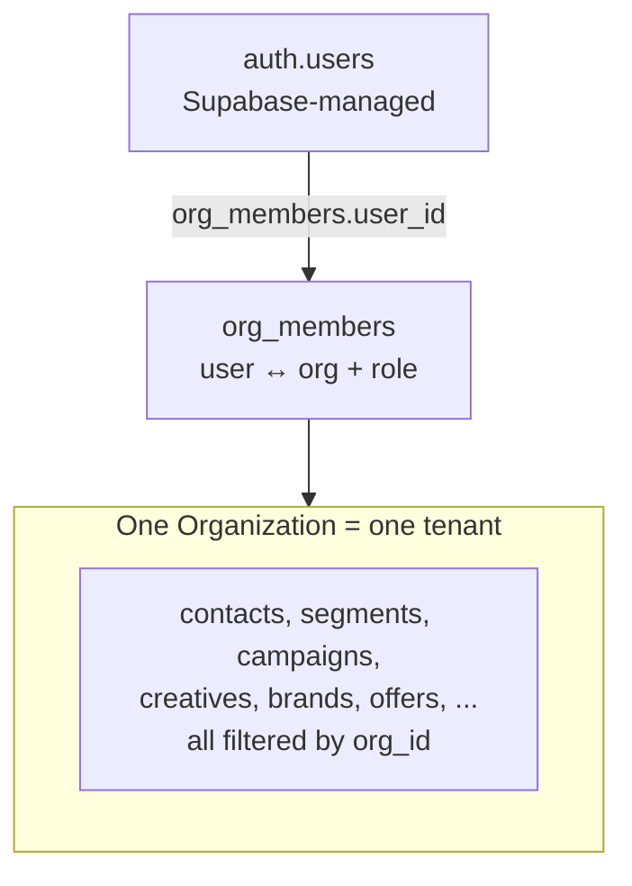

# 03 — Data Model

_Last updated: 2026-07-10_

Schema lives in a single file: [`db/schema.ts`](../db/schema.ts) (~1,880 lines, Drizzle). Migrations are **hand-authored** SQL in [`db/migrations/`](../db/migrations/) (`0001`…`0070`). `db/schema.ts` is the Drizzle representation; where it lags a migration, **the migration is the DB source of truth** (see the rule-type notes below).

## Multi-tenant boundary

Every domain table carries `org_id UUID → organizations.id` and an index on it. **Every read/write filters by `org_id` in application code** (primary defense; RLS is secondary). The only tables without `org_id` are pure junctions whose parents are already org-scoped (`opt_out_brands`, `opt_out_providers`) and the external `auth.users` (Supabase-managed).

> **Performance indexes (migration `0078`) — additive only, no behavior change.** Five indexes backing existing hot query paths: `opt_outs(org_id, contact_id)` (suppression `EXISTS` probes — compliance-critical table, index only, no suppression-logic change); `stage_result_rows(org_id, created_at)` (the only large domain table that had no `org_id` index); `contacts(org_id, created_at)` (default million-row list sort/paginate); a **partial** `campaign_stages(scheduled_at) WHERE sent_at IS NULL AND schedule_missed_at IS NULL` (the `*/15` scheduled-send cron's due-and-unfired scan, [`lib/sends/scheduled.ts`](../lib/sends/scheduled.ts)); `campaigns(org_id, status)` ("active campaigns for this org"); and partial `stage_sends(org_id) WHERE status='sending'` (the `/api/sends/state` stuck-row `count(*)` that runs on every protected page — `stage_sends` already had `(org_id, sent_at)` for breaker accounting but nothing for the `status='sending'` probe).

> **Trigram phone-search indexes (migration `0088`) — additive only, no behavior change.** `pg_trgm` GIN indexes on `phone_number` for `contacts`, `opt_outs`, `opt_ins`, `clickers`, so the list-view substring search (`ILIKE '%digits%'`) is index-served instead of a full org-partition scan. A plain btree cannot serve a leading-wildcard match, so before this the contacts search **and** its mandatory `COUNT(*)` seq-scanned the whole table — measured at ~820 ms on 752K contacts, now ~3 ms (bitmap index scan). `pg_trgm` lives in the `extensions` schema (Supabase convention; already on the role `search_path`), referenced as `extensions.gin_trgm_ops`. The four indexes are declared in [`db/schema.ts`](../db/schema.ts) but not represented in the drizzle snapshot (managed in SQL, like `stage_sends`'s indexes). Built with `CREATE INDEX CONCURRENTLY` in prod to avoid a write lock; the migration's plain `CREATE INDEX IF NOT EXISTS` then no-ops. Sub-3-char search terms fall back to a scan (trigrams need 3 chars) — fine for phone digits.

## Conventions (CLAUDE.md §6)

- **IDs:** small lookup/registry tables use `serial` integer PKs; high-volume tables (`contacts`, `stage_sends`) use `uuid`; `links`/`clicks`/`send_circuit_events`/`campaign_events` use `bigserial`. Most registry tables also carry a separate **text business id** (`brand_id`, `offer_id`, `segment_id`, …) that is unique and user-facing.
- Every domain table has `created_at TIMESTAMPTZ DEFAULT now()`. Most have `status TEXT` + `archived_at TIMESTAMPTZ` (soft-delete via `status='archived'`).
- **Money:** `NUMERIC(12,4)`. **Timestamps:** `TIMESTAMPTZ` (UTC), never naive.
- Foreign keys are always declared; cascades are explicit (`cascade` / `restrict` / `set null` chosen per relationship).

## Entity-relationship diagram

> Attributes shown are PKs, FKs, and a few defining columns — not every column. See `db/schema.ts` for the full set.

```mermaid
erDiagram
  organizations ||--o{ org_members : has
  organizations ||--o{ invites : has
  auth_users ||--o{ org_members : "is member"
  organizations ||--o{ brands : owns
  organizations ||--o{ affiliate_networks : owns
  organizations ||--o{ offers : owns
  organizations ||--o{ contacts : owns

  affiliate_networks ||--o{ offers : "network_id (restrict)"
  affiliate_networks ||--o{ utm_tags : "affiliate_network_id"

  sms_providers ||--o{ provider_phones : has
  sms_providers ||--o{ provider_credentials : "api keys"
  brands ||--o{ provider_credentials : "brand-scoped key"
  brands ||--o{ provider_phones : "brand_id (set null)"
  brands ||--o{ short_domains : "1 per brand"

  contacts ||--o{ contact_contact_groups : tagged
  contact_groups ||--o{ contact_contact_groups : tags
  contacts ||--o{ segment_contacts : "manual member"
  segments ||--o{ segment_contacts : contains
  segments ||--|| segment_stats : "cached counts"
  segments ||--o{ segment_rules : "filter rules"

  contacts ||--o{ opt_outs : suppressed
  opt_outs ||--o{ opt_out_brands : "scoped to brand"
  opt_outs ||--o{ opt_out_providers : "scoped to provider"
  brands ||--o{ opt_out_brands : ""
  contacts ||--o{ opt_ins : "opted in"
  contacts ||--o{ clickers : engaged
  brands ||--o{ clickers : "brand_id"

  creatives ||--o{ creative_offers : "M:N offers"
  offers ||--o{ creative_offers : ""
  creatives ||--o{ spam_scores : "cached via columns"

  campaigns ||--o{ campaign_stages : "ordered stages"
  brands ||--o{ campaigns : "brand_id (restrict)"
  offers ||--o{ campaigns : "offer_id (restrict)"
  routing_types ||--o{ campaigns : ""
  traffic_types ||--o{ campaigns : ""
  campaigns ||--o{ campaign_audience_pool : "frozen audience"
  contacts ||--o{ campaign_audience_pool : ""
  campaign_tracking_counters ||--o{ campaigns : "seq source"

  creatives ||--o{ campaign_stages : "creative_id (set null)"
  sms_providers ||--o{ campaign_stages : ""
  provider_phones ||--o{ campaign_stages : ""
  campaign_stages ||--o{ campaign_stages : "parent_stage_id (lane aliveness, cascade)"

  campaign_stages ||--o{ stage_results_imports : "import events"
  result_import_mappings ||--o{ stage_results_imports : "mapping used"
  stage_results_imports ||--o{ stage_result_rows : "per-row"
  stage_result_rows }o--|| opt_outs : "created_opt_out_id"
  stage_result_rows }o--|| clickers : "created_clicker_id"

  campaign_stages ||--o{ stage_sends : materialized
  campaigns ||--o{ links : minted
  campaign_stages ||--o{ links : ""
  short_domains ||--o{ links : ""
  link_destinations ||--o{ links : "deduped URL"
  contacts ||--o{ links : ""
  links ||--o{ clicks : "click log"
  stage_sends }o--|| links : "link_id (tracked mode)"

  sms_providers ||--o{ send_circuit_events : "pause/resume audit"
  stage_sends ||--o{ send_attempts : "per-attempt evidence"
  provider_credentials ||--o{ texthub_inbound_events : "STOP intake"
  opt_outs ||--o| opt_out_attributions : "STOP → latest-stage credit (1 row)"
  campaign_stages ||--o{ opt_out_attributions : "inbound STOPs"
  stage_sends ||--o{ opt_out_attributions : "triggering send"

  campaigns ||--o{ campaign_events : "activity log"
  campaign_stages ||--o{ campaign_events : "stage events"
  campaign_stages ||--o{ stage_manual_sales : "dated manual-sales ledger"

  organizations ||--o| org_settings : "send master switch"
  organizations ||--o{ org_setting_events : "settings audit"

  campaigns ||--o{ keitaro_stage_results : "poll rollup"
  campaign_stages ||--o{ keitaro_stage_results : "sub_id_3 = stage tracking id"
  stage_sends ||--o| stage_sends : "sale stamped by sub_id_1 = id"

  offers ||--o{ offer_payouts : "effective-dated CPA history"

  contacts ||--o{ creative_exposures : "saw creative (hard-rule ledger)"
  creatives ||--o{ creative_exposures : "creative_id"
  campaigns ||--o{ creative_exposures : "first sender"
  contacts ||--o{ offer_exposures : "got offer"
  offers ||--o{ offer_exposures : "offer_id"
  campaigns ||--o{ offer_exposures : "first sender"
  offers ||--|| offer_exposure_counts : "precomputed distinct-lead count"
```

> **Per-recipient sale attribution** (migration 0067): the Keitaro conversions poll
> stamps `stage_sends.sale_status` / `sale_revenue` / `converted_at` /
> `keitaro_conversion_id` by matching a conversion's `sub_id_1` (= the recipient's
> `stage_sends.id`, injected into the tracked link as the `sub_id1` URL param at
> redirect time) back to the row. `sub_id_1` is the per-recipient counterpart of
> `sub_id_3` (the per-stage join key for `keitaro_stage_results`).

> **Offer group report (migration 0093):** the reporting layer is not in the ERD
> above — `offer_report_campaign_econ` (plain view) and `offer_group_report_mv` /
> `offer_report_org_summary_mv` (materialized views) are **derived**, not base
> tables. They read across `campaigns`, `campaign_stages`, `stage_sends`,
> `stage_manual_sales`, `keitaro_stage_results`, `opt_out_attributions`, and
> `contact_contact_groups`/`contact_groups` rather than declaring their own FKs.
> See the "Reporting" subsection below and
> [04-features/offer-group-report.md](04-features/offer-group-report.md).

## Tables by domain

### Tenancy & access
| Table | Key columns | Notes |
|-------|------------|-------|
| `organizations` | `id uuid` | the tenant root |
| `org_members` | `user_id→auth.users`, `org_id`, `role` | UNIQUE(user_id, org_id); role CHECK in {owner,admin,manager,operator,viewer} |
| `invites` | `org_id`, `email`, `role`, `token` UNIQUE, `expires_at`, `accepted_at` | pending member invitations |
| `org_settings` | `org_id` PK, `sends_enabled` (default false), `sends_enabled_updated_by/_at`, `sends_paused` (default false), `sends_paused_at/_by` | per-org singleton; DB master switch for live SMS sending (migration 0063). `sends_paused` (migration 0080) is the dedicated **emergency hard-stop** flipped one-click from the Today's sends screen — independent of `sends_enabled`, halts the drain mid-run. Distinct from the `SEND_ENABLED` env backstop |
| `org_setting_events` | `org_id`, `setting_key`, `old_value`, `new_value`, `actor_user_id` | append-only audit of settings flips (migration 0063) |

### Registry
| Table | Key columns | Notes |
|-------|------------|-------|
| `brands` | `brand_id` (text uniq), `website`, `short_link_base` (legacy) | brand↔short-domain mapping is in `short_domains` |
| `affiliate_networks` | `network_id` (text uniq) | |
| `offers` | `offer_id` (text uniq), `network_id` (NOT NULL, **restrict**), `payout_model` cpa/revshare, `payout_cpa`, `payout_revshare`, `sales_pages` jsonb | `payout_cpa` is the **current-rate cache only** — never used to compute historical revenue (that's `keitaro_stage_results.revenue`); rate history lives in `offer_payouts` |
| `offer_payouts` | `offer_id` (→offers, cascade), `payout_cpa` (NOT NULL), `effective_from`, `effective_to` (NULL=current), partial UNIQUE(offer_id) WHERE effective_to IS NULL | effective-dated CPA history (migration 0083). The offers write path closes the current row (`effective_to=now()`) and opens a new one on every CPA change instead of overwriting. For display/audit of "the rate that applied when" — NOT for recomputing earnings |
| `sms_providers` | `sms_provider_id` (text uniq), `supports_api_send`, send-window cols, circuit-breaker cols (`send_paused*`, `max_sends_per_run` / `_minute` / `_24h` volume caps) | per-second rate lives on `provider_phones` (0073), not here |
| `provider_credentials` | `provider_id`, `brand_id` (NULL=default), `api_key` **plaintext**, `inbound_webhook_token` | UNIQUE(provider_id, brand_id); see [security-notes.md](security-notes.md) |
| `provider_phones` | `provider_id`, `brand_id` (set null), `phone_number`, `number_type` 10dlc/toll_free/short_code, `cost_per_sms`, `max_sends_per_second` (0073 — hard per-second send rate the drain paces to; carrier limit, differs by number type) | UNIQUE(org_id, phone_number) |
| `routing_types`, `traffic_types` | `*_id` (text uniq), `name` | campaign metadata dimensions |
| `utm_tags` | `tag_id` (text uniq), `label`, `value_source`, `affiliate_network_id` | appended to stage Full URLs |

### Contacts & engagement
| Table | Key columns | Notes |
|-------|------------|-------|
| `contacts` | `id uuid`, `phone_number`, `is_archived` | UNIQUE(org_id, phone_number); millions-scale |
| `contact_groups` | `contact_group_id` (text uniq) | tags (renamed from `segment_groups` in 0031) |
| `contact_contact_groups` | PK(contact_id, contact_group_id) | M:N tag junction |
| `opt_outs` | `contact_id`, `reason` opt_out/scrubbed/bounced/suppressed, `source` | append-only; **any** reason excludes from future snapshots |
| `opt_out_brands` / `opt_out_providers` | (opt_out_id, brand_id/provider_id) | scope junctions; `opt_out` reason is brand-scoped, scrubbed/bounced/suppressed are universal |
| `opt_ins` | `contact_id`, `brand_id`, `provider_id`, `source` | single brand/provider per row |
| `clickers` | `contact_id`, `brand_id` (NOT NULL), `offer_id`, `provider_id`, `provider_phone_id` | engagement records |

### Segments
| Table | Key columns | Notes |
|-------|------------|-------|
| `segments` | `segment_id` (text uniq), `original_name`, `exclude_in_use_contacts` | audience = manual ∪ rules |
| `segment_contacts` | UNIQUE(segment_id, contact_id) | manual membership |
| `segment_stats` | PK segment_id; `total_count` (trigger), `rule_filtered_count` (on-demand) | cached counts |
| `segment_rules` | `rule_type`, `operator` is/is_not, `value` jsonb, `position`, `is_active`, `combinator` and/or | see [audience-segments.md](04-features/audience-segments.md) |

> **`made_purchase` / `made_purchase_for_brand` / `made_purchase_for_offer` rule types (migration `0069`):** engagement Level 3 — match contacts with ≥1 `stage_sends` row where `sale_status = 'sale'` (`'lead'`/`'rejected'` excluded). Brand/offer scoping joins `stage_sends → campaigns`. `0069` restates the full `segment_rules_rule_type_check` IN-list (Postgres can't append to a CHECK) and, this time, **`db/schema.ts`'s inline list was updated to match** — including the previously-stale `is_in_contact_group` — so as of `0069` the schema text and the live constraint agree. Empty until real sales accumulate.
>
> **`reached_offer` / `reached_offer_for_brand` / `reached_offer_for_offer` rule types + `stage_sends.offer_reached_at` / `offer_reach_event_id` (migration `0070`):** engagement Level 2 — match contacts with ≥1 `stage_sends` row where `offer_reached_at IS NOT NULL` (an OFFER-campaign click, not the `gk-lp-visits` landing campaign). `offer_reached_at` is the earliest such click (monotonic, never cleared); `offer_reach_event_id` is the Keitaro click `event_id` dedup key. Stamped by [`lib/keitaro/poll-offer-reaches.ts`](../features/keitaro-poll.md). `0070` adds the two nullable columns + a partial index and restates the rule-type CHECK to add the three types. Empty until real sends accumulate. "Reached but didn't buy" = `reached_offer` is + `made_purchase` is_not.
>
> **`in_use_in_campaign_last_period` rule type (migration `0059`):** widened `segment_rules_rule_type_check` to add this type. Historical note: through `0068` the generated snapshots and `db/schema.ts`'s inline list omitted `is_in_contact_group` (added live by `0031`); the migration SQL was authoritative. `0069` reconciled the schema text + snapshot with the live constraint.
>
> **`in_use_in_offer` rule type (migration `0092`):** widened `segment_rules_rule_type_check` to add this type. Value shape `offer_id`; matches contacts in a `campaign_audience_pool` for a campaign with that `offer_id` that is `active`/`paused`/`completed` with ≥1 live stage (same live-campaign definition as `in_use_in_campaign_last_period`, minus the time window). Eval in [`lib/segment-rules-eval.ts`](../../lib/segment-rules-eval.ts).

### Creatives
| Table | Key columns | Notes |
|-------|------------|-------|
| `creatives` | `slug` (uniq), `creative_id` (uniq, optional), `text`, `quality`, `sequence_placement`, `funnel_stage`, `applies_to_all_offers`, `spam_score`/`spam_label`/`spam_score_error` | spam columns mirrored from `spam_scores` on save. `funnel_stage` (migration `0076`) is manual metadata — `start`/`clicked`/`checkout`/`ignored`/`unknown` (default `unknown`), like `quality` |
| `creative_offers` | PK(creative_id, offer_id) | M:N |

### Campaigns & stages
| Table | Key columns | Notes |
|-------|------------|-------|
| `campaigns` | `slug` (uniq per org), `human_id`, `brand_id`/`offer_id` (**restrict**), `audience_segment_ids[]`, `audience_contact_group_ids[]`, `audience_filters` jsonb, `audience_cap`, `exclude_in_use_contacts` (default **true**), `status` draft/active/paused/completed/archived, `tracking_id`, `link_mode` manual/tracked | audience frozen at activation |
| `campaign_stages` | `stage_number` (trigger-assigned), `creative_id`, `sms_provider_id`, `provider_phone_id`, `short_url`/`full_url`/`utm_tag_ids`, `stop_text`, `scheduled_at`/`sent_at`/`materialized_at`/`schedule_missed_at`, `send_approved`, `split_index`/`split_total`, `behavioral_tier`/`parent_stage_id` (behavioral lane), `tracking_id`, result counters, `materialized_at` (0089 — set only when EVERY recipient row exists; the completeness signal for windowed/resumable materialization: the scheduler resumes stages with it NULL and drains only stages with it set, so a half-built audience can't be sent), `total_cost`/`total_cost_manual` (0081 — `total_cost` auto-derives as `cost_per_sms × (sends + opt_out_count)` from the assigned provider phone, where `sends = GREATEST(sms_count, accepted stage_sends)`, **only once the stage is sent** (`sent_at` set or hand-entered `sms_count > 0`; $0 before), unless `total_cost_manual` is set; see [conventions](07-conventions.md)) | UNIQUE(campaign_id, stage_number); behavioral-lane CHECK: both NULL (ordinary) or `behavioral_tier IN (0,1,2)` + `parent_stage_id` set; self-FK `parent_stage_id → campaign_stages.id` ON DELETE CASCADE |
| `campaign_tracking_counters` | PK(org_id, brand_id, offer_id, date_et), `next_seq` | atomic seq for campaign tracking IDs |
| `campaign_audience_pool` | PK(campaign_id, contact_id), `was_clicker/opt_in/no_status_at_snapshot` | the frozen snapshot |

### Result imports
| Table | Key columns | Notes |
|-------|------------|-------|
| `result_import_mappings` | `sms_provider_id`, `mapping` jsonb, `status_value_map` jsonb, `is_default` | per-provider CSV templates |
| `stage_results_imports` | `campaign_id`, `stage_id`, `*_added` counters, `reverted_at` | permanent audit (no hard delete) |
| `stage_result_rows` | UNIQUE(stage_id, phone_number), `outcome`, `created_opt_out_id`, `created_clicker_id` | per-row; dedup + cross-import preservation |

### Spam, links, sends
| Table | Key columns | Notes |
|-------|------------|-------|
| `spam_scores` | UNIQUE(org_id, text_hash, provider), `score` 0–100, `label` ham/suspicious/spam, `error` | append-only cache |
| `short_domains` | UNIQUE(org_id, domain), UNIQUE(brand_id) | required for `tracked` link mode |
| `link_destinations` | UNIQUE(org_id, url_hash), CHECK `link_destinations_guidekn_url_shape` (0094, NOT VALID) | deduped destination URLs; CHECK rejects malformed guidekn `/lp/…?sub_id3=` URLs, non-guidekn URLs unaffected |
| `links` | `id bigserial`, `code` **globally** uniq, UNIQUE(stage_id, contact_id, send_token), tracking-id columns NOT NULL | one minted link per recipient-message |
| `clicks` | `id bigserial`, `link_id`, `classification`, `asn`/`country`/`is_datacenter`, `bot_score`/`bot_reasons`, `scored_at` (NULL=pending) | append-only click log |
| `stage_sends` | `id uuid` (= send_token), `stage_id`, `contact_id`, `phone`, `link_id`, `rendered_text`, `status`, `texthub_message_id`, `attempts`, `sale_status`/`sale_revenue`/`converted_at`/`keitaro_conversion_id` | partial UNIQUE(stage_id, contact_id) WHERE status in (pending,sending). `status ∈ (pending,sending,sent,failed,rejected,filtered,skipped_duplicate)`; `filtered` = TextHub-suppressed rejection (migration 0065, label-only — not opted out, not skipped). `skipped_duplicate` (migration 0090) = excluded by the global 1-hour send-dedup gate (phone already messaged within 1h, any campaign) — terminal, not sent, not opted-out, not auto-retried; backed by partial index `stage_sends(org_id, phone, sent_at) WHERE status='sent'`. **Sale attribution (migration 0067):** `sale_status ∈ (lead,sale,rejected)` stamped per recipient by the Keitaro conversions poll when a conversion's `sub_id_1` matches `id`; `keitaro_conversion_id` (Keitaro `event_id`) is the dedup key. One sale per recipient, latest wins (NOT cumulative). NULL for manual-mode rows and recipients with no conversion |
| `send_circuit_events` | `provider_id`, `event` paused/resumed, `reason`, `actor_user_id` | append-only breaker audit |
| `send_attempts` | `stage_send_id`, `attempt_number`, `request_redacted`, `http_status`, `raw_body`, `ok`, `message_id`, `classification` | append-only per-attempt evidence (migration 0064). Verbatim TextHub body + classification (`accepted`/`mine_transport`/`theirs_rejected`/`indeterminate`); api_key never stored. `stage_sends` is current state, this is immutable history |
| `campaign_events` | `campaign_id`, `stage_id?`, `event_type` (free-text), `actor_user_id?` (NULL=system), `summary`, `metadata jsonb` | append-only campaign activity log (Activity tab timeline); migration 0060 |
| `texthub_inbound_events` | `credential_id`, `provider_message_id`, `matched_contact_id`, `matched_stage_send_id`, `provider_received_at`, `result` | raw inbound STOP capture. `matched_stage_send_id`/`provider_received_at` added migration 0075 (attribution debugging + window anchor) |
| `opt_out_attributions` | `opt_out_id`, `stage_send_id` (SET NULL), `stage_id`, `campaign_id`, UNIQUE(opt_out_id, stage_id) | inbound STOP → campaign/stage credit (migration 0075). **One row per opt_out** — the single most-recent stage that sent to the number within 72h of the reply (`OPT_OUT_ATTRIBUTION_WINDOW_HOURS`; latest-stage-only since 2026-06-24, was one-row-per-stage before). `stage_id`/`campaign_id` denormalized so a pruned send keeps the credit. Drives `campaign_stages.inbound_opt_out_count` (Reports "Opt-outs" + campaign "Inbound STOPs"). Additive — the org-wide `opt_outs` row is the suppression of record |
| `stage_manual_sales` | `org_id`, `campaign_id`, `stage_id`, `delta` (signed), `entered_by?` (NULL=system/backfill), `created_at` | dated per-entry ledger of the operator's manual sales (migration 0079). Each manual-results save writes the signed CHANGE in `campaign_stages.sales_count`, dated to the save; `SUM(delta)` per stage == `sales_count`. **Read by [`lib/reporting/attribution.ts`](../lib/reporting/attribution.ts)** — the `/reports` tab AND the dashboard stats/daily-activity attribute manual sales by this **entry date** (in-range `SUM(delta)` combined with Keitaro conversions via `combineSales`). Pre-ledger totals were backfilled by 0079 as one delta dated `now()`; **migration 0084 re-dated those backfill rows** (`entered_by IS NULL`) to each stage's effective send day so historical manual sales spread across the calendar instead of lumping on one date |
| `keitaro_stage_results` | UNIQUE(org_id, stage_id, stat_date), `stage_tracking_id`, `visit_clicks_raw`/`visit_clicks_clean` (Clickers), `redirect_clicks_raw`/`redirect_clicks_clean` (Offer Redirect), legacy `raw_clicks`/`clean_clicks` (= redirect, back-compat), `checkouts`/`sales`, `revenue`/`payout_at_conversion`/`cost`/`epc`, `synced_at` | per-stage daily aggregate from the Keitaro 5-min poll; idempotent UPSERT (last-write-wins). `sub_id_3` = stage tracking id; campaign totals = SUM across stages. **`cost` is ALWAYS 0 — do NOT use it for ROI/EPC/profit**: it's Keitaro ad-platform spend (we don't buy Keitaro traffic). Real stage cost = `campaign_stages.total_cost`; the `/reports` route folds this column in but overwrites it with `total_cost` before computing profit. `epc` is revenue-derived (`revenue / redirect raw clicks`), not cost-derived. **`revenue` is the REVENUE SOURCE OF TRUTH** (real summed per-conversion payout at sync time) — every reported revenue figure SUMs this, never `sales × offers.payout_cpa`. `payout_at_conversion` (migration 0083) = `revenue / NULLIF(sales,0)` frozen at sync, so a later CPA edit can't retro-change a row's rate. Clicks split by Keitaro campaign **name** `gk-lp-visits` (visits) vs offer campaigns (redirects); visits ⊇ redirects, never summed. Migrations 0061 + 0062 + 0083 |

### Content dedup & offer exposure (migration 0086)
| Table | Key columns | Notes |
|-------|------------|-------|
| `creative_exposures` | `id bigserial`, UNIQUE(org_id, contact_id, creative_id), `campaign_id` (**nullable, SET NULL**), `first_sent_at`; INDEX(org_id, creative_id, contact_id) | **hard-rule ledger**: the same `creatives.id` is recorded against a `contacts.id` exactly once. `campaign_id` = the FIRST campaign that sent it (first-write-wins via `ON CONFLICT DO NOTHING`) — load-bearing for the in-campaign-reuse exception in the send-time anti-join, hence `ON DELETE SET NULL` (a hard-deleted campaign must NOT cascade-delete the row and re-expose the contact). Phase 2 clause: `(campaign_id IS NULL OR campaign_id <> currentCampaignId)`. **Org-scoped, spans brands by design** (creatives/contacts are brand-agnostic). Populated write-time by the `stage_sends`→`sent` trigger |
| `offer_exposures` | `id bigserial`, UNIQUE(org_id, contact_id, offer_id), `campaign_id` (**nullable, SET NULL**), `first_sent_at`; INDEX(org_id, offer_id, contact_id) | one row per (contact, offer); first campaign (`campaign_id` SET NULL on campaign hard-delete, same rationale as `creative_exposures`). Offer resolved from `campaigns.offer_id` (NEVER `creative_offers`). Feeds the optional per-campaign include/exclude filter (Phase 2) + the offer counter |
| `offer_exposure_counts` | PK(org_id, offer_id), `distinct_contacts bigint` | precomputed "N distinct leads used for this offer" — the offer page reads this single row, never a `COUNT(DISTINCT …)`. Maintained by an AFTER INSERT trigger on `offer_exposures` (distinct by construction, since those inserts are `ON CONFLICT DO NOTHING`) |

> **Phase 2 (migration 0087):** `campaigns.exclude_prior_offer_contacts` (boolean, NOT NULL DEFAULT false) — the per-campaign opt-in for LAYER 3 (offer-level exclusion). The send-time eligibility anti-join (`lib/sends/eligibility.ts`, wired into `stageRecipientsSql` for send + export) now actively suppresses; `reconcile.ts` gained an `excluded_dedup` bucket. See [`docs/04-features/content-dedup.md`](04-features/content-dedup.md) §6.

> Both ledgers count a lead as **used** = a `stage_sends` row that reached `status='sent'` (the only per-recipient success marker). Pure external-CSV campaigns create no `stage_sends` rows → known, accepted blind spot. Backfill: [`scripts/backfill-content-dedup-exposures.ts`](../scripts/backfill-content-dedup-exposures.ts) (idempotent, earliest `sent_at` wins the `campaign_id`). The send-time eligibility anti-join + offer-page counter UI + per-campaign exclude toggle land in **Phase 2** — see [`docs/04-features/content-dedup.md`](04-features/content-dedup.md).

### Reporting (migration 0093)
| Table/View | Key columns | Notes |
|-------|------------|-------|
| `report_refresh_log` | `view_name text` PK, `refreshed_at timestamptz` | one bookkeeping row per matview below, seeded `NULL` at migration time; stamped `now()` by the refresh cron on every successful run |
| `offer_report_campaign_econ` (plain **view**) | `campaign_id`, `org_id`, `offer_id`, `group_ids int[]` (= `campaigns.audience_contact_group_ids`), `sends`, `revenue numeric(12,4)`, `sales`, `clicks`, `cost numeric(12,4)`, `optouts` | per-campaign economics for every campaign of an offer with ≥1 sent stage (tracked **and** manual); shared source for both matviews below — see the locked metric definitions in [04-features/offer-group-report.md](04-features/offer-group-report.md) |
| `offer_group_report_mv` (**materialized**) | UNIQUE(`org_id`, `offer_id`, `group_id`); `group_name`, `sends`, `revenue`, `sales`, `clicks`, `cost`, `optouts`, `sent_7d`, `sent_30d`, `sent_90d`, `fresh_pool` | per org×offer×group rollup of `offer_report_campaign_econ` (`unnest(group_ids)`) — a campaign targeting multiple groups is counted FULLY in each one, not split. `sent_7d`/`sent_30d`/`sent_90d`/`fresh_pool` are derived from per-recipient `stage_sends` across **all** offers and **both** link modes |
| `offer_report_org_summary_mv` (**materialized**) | UNIQUE(`org_id`); `sends`, `revenue`, `sales`, `clicks`, `cost`, `optouts` | de-duplicated org-wide benchmark — each campaign counted **once** (no group unnest), so it does NOT equal the sum of `offer_group_report_mv`'s group rows when multi-group campaigns exist |

> **Matviews carry no RLS.** Postgres materialized views cannot have row-level security policies. `offer_group_report_mv` and `offer_report_org_summary_mv` are read only through the server-side helper [`lib/reporting/offer-group-report.ts`](../lib/reporting/offer-group-report.ts), which explicitly filters `WHERE org_id = ${orgId}`; the API route (`GET /api/offers/[id]/report`) never exposes them directly. Same primary-defense posture as CLAUDE.md §3 — here there is simply no RLS layer to add, so the application-level filter is the *only* defense (not defense-in-depth-plus-RLS as with base tables).

> **New indexes (migration 0093):** `stage_sends (sent_at, contact_id)` and `contact_contact_groups (contact_group_id, contact_id)` — support the twice-daily refresh's list-pressure/fresh-pool joins. The pre-existing `contact_contact_groups` PK is `(contact_id, contact_group_id)`, the wrong column order for "all contacts in a group."

## Triggers & DB-side logic (in migrations, not Drizzle)
- **`handle_new_user()`** (`0001`): on `auth.users` INSERT, creates an `organizations` row + an `owner` `org_members` row.
- **`current_org_id()`** (`0001`): SECURITY DEFINER, backs RLS policies.
- **`segment_contacts` AFTER INSERT/DELETE trigger**: keeps `segment_stats.total_count` in sync.
- **`campaign_stages` BEFORE INSERT trigger**: auto-assigns `stage_number`.
- RLS policies per table across the security migrations (`0001`, `0021`, `0025`, `0028`, `0030`, …).
- **RLS enabled on every `public` table.** `geoip_cache` (infra cache, no `org_id`, server-only) has RLS enabled with **no policies** (migration `0066`) — the direct postgres-js connection and `service_role` bypass RLS, so server reads/writes keep working while anon/authenticated access is denied. Clears the Supabase advisor `rls_disabled_in_public`.
- **`stage_manual_sales` + `opt_out_attributions` RLS** (migration `0085`): both are tenant tables (`org_id`) written only by the privileged server connection but read org-scoped by the Reports tab, so each gets an `org_id = current_org_id()` **SELECT** policy and no write policies — mirroring `stage_sends` (`0050`). Second `rls_disabled_in_public` remediation after `geoip_cache`.
- **`record_exposure_on_sent()` + two `stage_sends` triggers** (migration `0086`): `AFTER INSERT WHEN status='sent'` and `AFTER UPDATE OF status WHEN status='sent' AND OLD.status IS DISTINCT FROM 'sent'` — share one SECURITY DEFINER function that resolves the creative (via stage) + offer (via campaign) and inserts into `creative_exposures` / `offer_exposures` (`ON CONFLICT DO NOTHING`). Fires from every path that sets `'sent'`, so no send path can bypass the ledger.
- **`bump_offer_exposure_count()` + `offer_exposures` AFTER INSERT trigger** (migration `0086`): upserts `offer_exposure_counts.distinct_contacts += 1`. Fires only on genuinely-new (org, contact, offer) rows. Same junction-trigger shape as `segment_stats.total_count`.
- **`creative_exposures` / `offer_exposures` / `offer_exposure_counts` RLS** (migration `0086`): tenant tables written only by the server connection / SECURITY DEFINER triggers; each gets an `org_id = current_org_id()` SELECT policy and no write policies (0085 precedent).
