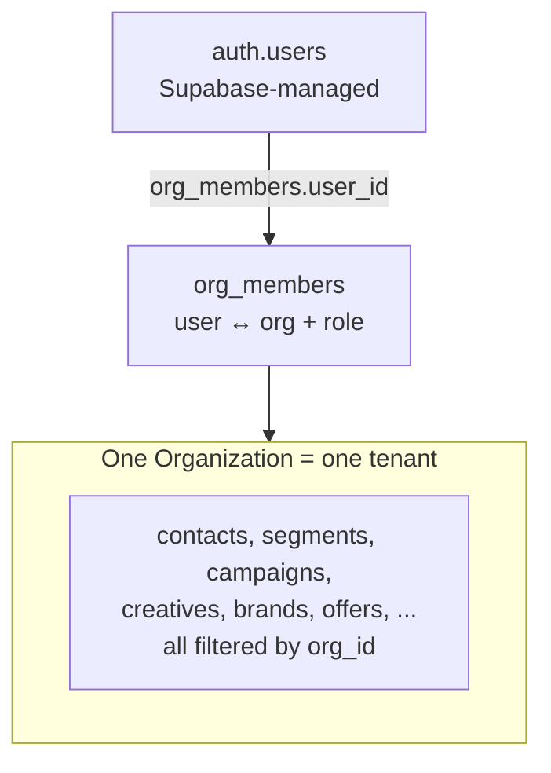

# 03 — Data Model

_Last updated: 2026-09-04_

Schema lives in a single file: [`db/schema.ts`](../db/schema.ts) (~1,880 lines, Drizzle). Migrations are **hand-authored** SQL in [`db/migrations/`](../db/migrations/) (`0001`…`0070`). `db/schema.ts` is the Drizzle representation; where it lags a migration, **the migration is the DB source of truth** (see the rule-type notes below).

## Multi-tenant boundary

Every domain table carries `org_id UUID → organizations.id` and an index on it. **Every read/write filters by `org_id` in application code** (primary defense; RLS is secondary). The only tables without `org_id` are pure junctions whose parents are already org-scoped (`opt_out_brands`, `opt_out_providers`) and the external `auth.users` (Supabase-managed).

> **Performance indexes (migration `0078`) — additive only, no behavior change.** Five indexes backing existing hot query paths: `opt_outs(org_id, contact_id)` (suppression `EXISTS` probes — compliance-critical table, index only, no suppression-logic change); `stage_result_rows(org_id, created_at)` (the only large domain table that had no `org_id` index); `contacts(org_id, created_at)` (default million-row list sort/paginate); a **partial** `campaign_stages(scheduled_at) WHERE sent_at IS NULL AND schedule_missed_at IS NULL` (the `*/15` scheduled-send cron's due-and-unfired scan, [`lib/sends/scheduled.ts`](../lib/sends/scheduled.ts)); `campaigns(org_id, status)` ("active campaigns for this org"); and partial `stage_sends(org_id) WHERE status='sending'` (the `/api/sends/state` stuck-row `count(*)` that runs on every protected page — `stage_sends` already had `(org_id, sent_at)` for breaker accounting but nothing for the `status='sending'` probe).

> **Trigram phone-search indexes (migration `0088`) — additive only, no behavior change.** `pg_trgm` GIN indexes on `phone_number` for `contacts`, `opt_outs`, `opt_ins`, `clickers`, so the list-view substring search (`ILIKE '%digits%'`) is index-served instead of a full org-partition scan. A plain btree cannot serve a leading-wildcard match, so before this the contacts search **and** its mandatory `COUNT(*)` seq-scanned the whole table — measured at ~820 ms on 752K contacts, now ~3 ms (bitmap index scan). `pg_trgm` lives in the `extensions` schema (Supabase convention; already on the role `search_path`), referenced as `extensions.gin_trgm_ops`. The four indexes are declared in [`db/schema.ts`](../db/schema.ts) but not represented in the drizzle snapshot (managed in SQL, like `stage_sends`'s indexes). Built with `CREATE INDEX CONCURRENTLY` in prod to avoid a write lock; the migration's plain `CREATE INDEX IF NOT EXISTS` then no-ops. Sub-3-char search terms fall back to a scan (trigrams need 3 chars) — fine for phone digits.

> **Telnyx Number Lookup — carrier/line-type enrichment (migrations `0095`–`0098`).** Five new tables + `contacts`/`stage_sends` columns. See [04-features/phone-lookup-carrier.md](04-features/phone-lookup-carrier.md).
> - **`phone_lookups`** — GLOBAL cache (no `org_id`; carrier is a fact about a number). PK `phone` (E.164 `+1XXXXXXXXXX`, matches `contacts.phone_number`). Columns: `line_type` (`mobile`/`landline`/`voip`/`toll_free`/`unknown`), `carrier_raw`, `carrier_norm` (six buckets + `Unmapped`), `normalized_carrier` (Telnyx's own network-normalized name — chain step 1, migration 0104), `ocn`, `spid`, `ported`, `ported_date`, `source` (`telnyx`/`csv_import`/`manual_edit`/`dlr_inferred`), `lookup_status`, `retry_count`, `raw_response` (jsonb audit). Partial indexes: failed-retry sweep, unmapped queue.
> - **`carrier_mappings`** — global, seeded. PK `raw_name` → `carrier_norm` bucket (`mapped_by` records provenance: `seed`/`ai`/`human`/`admin`). Admin/AI assign unmapped strings; assignment retroactively updates `phone_lookups` + `contacts` (v2: on the normalized key, fixing all suffix variants).
> - **`carrier_patterns`** _(migration 0104)_ — global regex rules (`pattern`, `brand`, `priority`, `is_active`) matched against the normalized carrier key; resolver chain step 3 (fallback after exact mapping). Seeded with the majors.
> - **`carrier_classify_queue`** _(migration 0105)_ — distinct unresolved normalized carrier strings (PK `match_key`, `raw_example`, `status` ∈ `pending`/`ai_resolved`/`needs_human`/`human_resolved`, `confidence`, `attempts`, `last_error`) awaiting async AI triage. `contact_count` derived on read (never stored).
> - **`lookup_settings`** — account-global single row (boolean PK fixed `true`): `lookup_paused`, `lookup_daily_cap`, `lookup_rate_base`, `lookup_rate_mobile`, `lookup_concurrency_rps`, `worker_lease_until`, `carrier_resolver_v2` (chain feature flag, default false), `carrier_ai_run_cap` (triage per-run API-call breaker, default 200). Rates admin-editable (Telnyx has no pricing API).
> - **`carrier_norm_backfill_snapshot`** — created on demand by the v2 backfill (`scripts/backfill-carrier-v2.ts --apply`) to snapshot `contacts.carrier_norm` before recompute (rollback source).
> - **`lookup_group_stats_cache`** _(migration 0106)_ — per-org cache for the Lookup Stats Panel (PK `org_id`, `data` jsonb = the whole `{summary, groups[]}` blob, `computed_at`). The ~2s full-population coverage/suppression aggregate is cached here; the panel reads it in ~46ms. Written atomically (single upsert) so a failed refresh leaves the prior row intact. RLS: own-org SELECT (`current_org_id()`), server-only writes. Reversible/additive.
> - **`lookup_batches`** (org-scoped, reporting only) + **`lookup_queue`** (worker state, no `org_id`, claimed `FOR UPDATE SKIP LOCKED`).
> - **`contacts`** gains `line_type`, `carrier_norm` (default `Unidentified` = no `phone_lookups` row yet; migration 0099 split the former `Unknown` into `Unidentified` vs looked-up-but-`Unknown`), and `messaging_status` (`eligible`/`not_applicable`). `messaging_status` is the DB-enforced landline hard stop, derived by trigger `contacts_derive_messaging_status` (`line_type='landline' ⇒ not_applicable`, else `eligible`). Trigger, not a generated column, so `ADD COLUMN` is metadata-only (no rewrite at scale). Four **eligible-partial** indexes `(org_id[, …]) WHERE messaging_status='eligible'` back the hot paths (built concurrently via `scripts/apply-eligible-indexes-concurrent.ts`, 0088 pattern); the pre-existing non-partial indexes stay for the Contacts admin screen (the one place landlines remain visible). Every audience/segment/send query adds `AND messaging_status='eligible'`.
> - **`stage_sends`** gains `carrier_norm` (stamped at send time; future per-carrier analytics; no report reads it yet).
> - **`stage_sends`** gains `provider_phone_id` + `cost_per_sms` _(migration 0112)_ — durable reporting snapshots stamped at materialization from the stage's phone/rate, so per-number attribution and per-send cost survive later stage edits. **`provider_phone_id` was backfilled 2026-08-12** (`scripts/backfill-stage-send-provider-phone.ts`, idempotent) — 1,008,689 pre-0112 rows stamped from their `campaign_stages.provider_phone_id`, 0 NULLs remain; post-backfill per-phone totals matched the pre-backfill read-time `COALESCE` figures exactly, confirming it resolved the same way [`lib/reporting/rollup.ts`](../lib/reporting/rollup.ts) does. `provider_phone_id` is now fully populated org-wide — NULL only for rows that predate a future column change. `cost_per_sms` was **not** touched by this backfill; the reports rollup's `COALESCE(send snapshot, stage live value)` fallback still applies to it.
> - **RLS**: `phone_lookups`/`carrier_mappings`/`carrier_patterns`/`carrier_classify_queue`/`lookup_settings`/`lookup_queue` enabled **policy-less** (server-only, no org to scope — geoip_cache/`0066` pattern); `lookup_batches` org-scoped SELECT, no write policies (`0085` pattern).

```mermaid
graph TD
  subgraph tenant[One Organization = one tenant]
    direction LR
    A[contacts, segments, campaigns,<br/>creatives, brands, offers, ...<br/>all filtered by org_id]
  end
  AU[auth.users<br/>Supabase-managed] -->|org_members.user_id| OM[org_members<br/>user ↔ org + role]
  OM --> tenant
```

## Conventions (CLAUDE.md §6)

- **IDs:** small lookup/registry tables use `serial` integer PKs; high-volume tables (`contacts`, `stage_sends`) use `uuid`; `links`/`clicks`/`send_circuit_events`/`campaign_events` use `bigserial`. Most registry tables also carry a separate **text business id** (`brand_id`, `offer_id`, `segment_id`, …) that is unique and user-facing.
- Every domain table has `created_at TIMESTAMPTZ DEFAULT now()`. Most have `status TEXT` + `archived_at TIMESTAMPTZ` (soft-delete via `status='archived'`).
- **Money:** `NUMERIC(12,4)`. **Timestamps:** `TIMESTAMPTZ` (UTC), never naive.
- Foreign keys are always declared; cascades are explicit (`cascade` / `restrict` / `set null` chosen per relationship).

## Entity-relationship diagram

> Attributes shown are PKs, FKs, and a few defining columns — not every column. See `db/schema.ts` for the full set.

```mermaid
erDiagram
  organizations ||--o{ org_members : has
  organizations ||--o{ invites : has
  auth_users ||--o{ org_members : "is member"
  organizations ||--o{ audit_log : "account/authz events (0175)"
  organizations ||--o{ deletion_requests : "approval queue (0175)"
  organizations ||--o{ provider_route_aliases : "Route A/B/C (0175)"
  auth_users ||--o{ audit_log : "actor_user_id (set null)"
  auth_users ||--o{ deletion_requests : "requested_by / decided_by (set null)"
  auth_users ||--o{ campaign_stages : "created_by_user_id (set null, 0175)"
  sms_providers ||--o{ provider_route_aliases : "aliased as"
  provider_credentials ||--o{ provider_route_aliases : "per-account alias"
  org_members ||--o{ api_tokens : "personal bearer tokens (0176)"
  api_tokens ||--o{ api_token_usage : "hourly counters (0176)"
  auth_users ||--o{ api_tokens : "created_by_user_id (set null)"
  organizations ||--|| audience_fresh_counts : "fresh-lead rollup (0176)"
  organizations ||--o{ brands : owns
  organizations ||--o{ affiliate_networks : owns
  organizations ||--o{ offers : owns
  organizations ||--o{ contacts : owns

  affiliate_networks ||--o{ offers : "network_id (restrict)"
  affiliate_networks ||--o{ utm_tags : "affiliate_network_id"

  sms_providers ||--o{ provider_phones : has
  sms_providers ||--o{ provider_credentials : "api keys"
  provider_credentials ||--o{ provider_phones : "credential_id (set null)"
  brands ||--o{ provider_credentials : "brand-scoped key"
  brands ||--o{ provider_phones : "brand_id (set null)"
  brands ||--o{ short_domains : "1 per brand"

  contacts ||--o{ contact_contact_groups : tagged
  contacts ||--o| contact_attributes : "attributes (1:1, 0147)"
  offers ||--o{ offer_landing_pages : "landing pages (0150)"
  offer_landing_pages ||--o{ campaign_stages : "landing_page_id (nullable, 0150)"
  organizations ||--o{ contact_attribute_import_mappings : "CSV mappings (0149)"
  contact_groups ||--o{ contact_contact_groups : tags
  contacts ||--o{ segment_contacts : "manual member"
  segments ||--o{ segment_contacts : contains
  segments ||--|| segment_stats : "cached counts"
  segments ||--o{ segment_rules : "filter rules"

  contacts ||--o{ opt_outs : suppressed
  opt_outs ||--o{ opt_out_brands : "scoped to brand"
  opt_outs ||--o{ opt_out_providers : "scoped to provider"
  brands ||--o{ opt_out_brands : ""
  contacts ||--o{ opt_ins : "opted in"
  contacts ||--o{ clickers : engaged
  brands ||--o{ clickers : "brand_id"

  creatives ||--o{ creative_offers : "M:N offers"
  offers ||--o{ creative_offers : ""
  creatives ||--o{ spam_scores : "cached via columns"

  campaigns ||--o{ campaign_stages : "ordered stages"
  brands ||--o{ campaigns : "brand_id (restrict)"
  offers ||--o{ campaigns : "offer_id (restrict)"
  routing_types ||--o{ campaigns : ""
  traffic_types ||--o{ campaigns : ""
  campaigns ||--o{ campaign_audience_pool : "frozen audience"
  contacts ||--o{ campaign_audience_pool : ""
  campaign_tracking_counters ||--o{ campaigns : "seq source"
  provider_phones ||--o{ campaigns : "default_provider_phone_id (set null, prefill only)"

  creatives ||--o{ campaign_stages : "creative_id (set null)"
  sms_providers ||--o{ campaign_stages : ""
  provider_phones ||--o{ campaign_stages : ""
  campaign_stages ||--o{ campaign_stages : "parent_stage_id (P4 slip anchor, cascade)"
  campaign_stage_split_groups ||--o{ campaign_stages : "split_group_id (0174, set null)"
  campaigns ||--o{ campaign_stage_split_groups : "behavioural splits"
  campaign_stages ||--o| campaign_stage_split_groups : "anchor_stage_id (cascade)"

  campaign_stages ||--o{ stage_results_imports : "import events"
  result_import_mappings ||--o{ stage_results_imports : "mapping used"
  stage_results_imports ||--o{ stage_result_rows : "per-row"
  stage_result_rows }o--|| opt_outs : "created_opt_out_id"
  stage_result_rows }o--|| clickers : "created_clicker_id"

  campaign_stages ||--o{ stage_sends : materialized
  campaigns ||--o{ links : minted
  campaign_stages ||--o{ links : ""
  short_domains ||--o{ links : ""
  link_destinations ||--o{ links : "deduped URL"
  contacts ||--o{ links : ""
  links ||--o{ clicks : "click log"
  stage_sends }o--|| links : "link_id (tracked mode)"

  sms_providers ||--o{ send_circuit_events : "send-posture audit (pause/resume + api-send gate)"
  campaigns ||--o{ campaign_circuit_events : "campaign pause/resume audit"
  stage_sends ||--o{ send_attempts : "per-attempt evidence"
  provider_credentials ||--o{ texthub_inbound_events : "STOP intake"
  provider_credentials ||--o{ ahoi_dlr_events : "DLR capture"
  provider_credentials ||--o{ ahoi_inbound_events : "inbound capture"
  provider_credentials ||--o{ textrequest_dlr_events : "DLR capture"
  provider_credentials ||--o{ textrequest_inbound_events : "opt-out signal capture"
  provider_credentials ||--o{ tells_webhook_events : "DLR + inbound capture (one table)"
  opt_outs ||--o| opt_out_attributions : "STOP → latest-stage credit (1 row)"
  campaign_stages ||--o{ opt_out_attributions : "inbound STOPs"
  stage_sends ||--o{ opt_out_attributions : "triggering send"

  campaigns ||--o{ campaign_events : "activity log"
  campaign_stages ||--o{ campaign_events : "stage events"
  campaign_stages ||--o{ stage_manual_sales : "dated manual-sales ledger"

  organizations ||--o| org_settings : "send master switch"
  organizations ||--o{ org_setting_events : "settings audit"

  campaigns ||--o{ keitaro_stage_results : "poll rollup"
  campaign_stages ||--o{ keitaro_stage_results : "sub_id_3 = stage tracking id"
  stage_sends ||--o| stage_sends : "sale stamped by sub_id_1 = id"
  campaign_stages ||--o{ report_stage_hour : "hourly rollup (send-hour ET)"
  campaign_stages ||--o{ report_group_hour : "hourly rollup × group"
  contact_groups ||--o{ report_group_hour : "group dimension"

  offers ||--o{ offer_payouts : "effective-dated CPA history"

  contacts ||--o{ creative_exposures : "saw creative (hard-rule ledger)"
  creatives ||--o{ creative_exposures : "creative_id"
  campaigns ||--o{ creative_exposures : "first sender"
  contacts ||--o{ offer_exposures : "got offer"
  offers ||--o{ offer_exposures : "offer_id"
  campaigns ||--o{ offer_exposures : "first sender"
  offers ||--|| offer_exposure_counts : "precomputed distinct-lead count"
```

> **Per-recipient sale attribution** (migration 0067): the Keitaro conversions poll
> stamps `stage_sends.sale_status` / `sale_revenue` / `converted_at` /
> `keitaro_conversion_id` by matching a conversion's `sub_id_1` (= the recipient's
> `stage_sends.id`, injected into the tracked link as the `sub_id1` URL param at
> redirect time) back to the row. `sub_id_1` is the per-recipient counterpart of
> `sub_id_3` (the per-stage join key for `keitaro_stage_results`).

> **Offer group report (migrations 0093, 0132):** the reporting layer is not in
> the ERD above — `offer_report_campaign_econ` / `offer_report_tracked_campaigns`
> (plain views) and `offer_group_report_mv` / `offer_report_offer_totals_mv` /
> `offer_report_org_summary_mv` (materialized views) are **derived**, not base
> tables. They read across `campaigns`, `campaign_stages`, `stage_sends`,
> `stage_manual_sales`, `keitaro_stage_results`, `opt_out_attributions`, and
> `contact_contact_groups`/`contact_groups` rather than declaring their own FKs.
> See the "Reporting" subsection below and
> [04-features/offer-group-report.md](04-features/offer-group-report.md).

## Tables by domain

### Tenancy & access
| Table | Key columns | Notes |
|-------|------------|-------|
| `organizations` | `id uuid` | the tenant root |
| `org_members` | `user_id→auth.users`, `org_id`, `role`, `is_active`, `last_login_at`, `last_login_ip`, `invited_email`, `invited_at` | UNIQUE(user_id, org_id); role CHECK in {owner,admin,manager,operator,viewer}. **`is_active` (migration 0175, default true)** is the deactivation switch, re-read on EVERY request inside the query that already resolves org_id + role, so it costs no extra round-trip and cuts access at the next request instead of at token expiry. `last_login_ip` is `text`, not `inet`: `x-forwarded-for` is a comma-separated list behind more than one proxy, which `inet` rejects. `invited_email`/`invited_at` are an audit record written at acceptance — they are NOT the invite mechanism, because `user_id` is NOT NULL with an FK to `auth.users`, so an `org_members` row cannot exist before the user does. Pending invites live in `invites` |
| `invites` | `org_id`, `email`, `role`, `token` UNIQUE, `expires_at`, `accepted_at` | pending member invitations. Dormant until 0175 — the table shipped in `0001` but no application code read or wrote it. Under Google sign-in **the row IS the authorization**: there is no password to set and no token for the invitee to carry, so `resolveAllowlist` simply looks for an open row matching the verified address. `token` is still populated (NOT NULL UNIQUE) so an emailed-link flow stays possible without a migration. `invites_role_check` excludes `owner`, so an invite can never mint one |
| `org_members` (0176 column) | `api_enabled` boolean NOT NULL DEFAULT **false** | per-user API on/off switch, INDEPENDENT of `is_active`: off 401s every one of that member's tokens on their next request and leaves the browser session untouched. Defaults FALSE — unlike `is_active` (which defaulted TRUE to preserve existing behaviour), this column CREATES a capability, so nobody gets it merely by having the migration applied. `lib/auth/deactivate.ts` also forces it false, so reactivating an account does not silently restore API access |
| `org_settings` | `org_id` PK, `sends_enabled` (default false), `sends_enabled_updated_by/_at`, `sends_paused` (default false), `sends_paused_at/_by` | per-org singleton; DB master switch for live SMS sending (migration 0063). `sends_paused` (migration 0080) is the dedicated **emergency hard-stop** flipped one-click from the Today's sends screen — independent of `sends_enabled`, halts the drain mid-run. Distinct from the `SEND_ENABLED` env backstop |
| `org_setting_events` | `org_id`, `setting_key`, `old_value`, `new_value`, `actor_user_id` | append-only audit of settings flips (migration 0063) |
| `notification_settings` | `org_id` PK, 4 type toggles (`daily_report_enabled`, `hourly_report_enabled`, `stall_alert_enabled`, `unjoinable_alert_enabled`), `daily_report_hour` (Warsaw, 0–23, default 10), `hourly_window_from`/`to` (Warsaw, **default 16/1 — the window wraps midnight**), `hourly_interval_hours` (1/2/3, default 1), `active_weekdays` smallint[] (ISO 1=Mon…7=Sun, **default 1–6; Sunday out**, and it gates the hourly window only — the daily summary is never weekday-gated) | per-org singleton (migration 0173); loaded by the Telegram-report cron every tick. Missing row → cron falls back to hard-coded defaults in `lib/reporting/telegram-report-format.ts`, which are a transcription of the pre-0173 hard-coded schedule, so the table ships inert. A midnight-spanning window belongs to the day it STARTED on (`hourlyOwningDow`), which is what reproduces the old "no Sunday evening, no Monday 00:00–01:59" pair from one weekday set. API: `GET/PUT /api/settings/notifications` (manager+) |
| `audit_log` | `org_id`, `actor_user_id` (set null), `action`, `entity_type`, `entity_id` text, `summary`, `metadata` jsonb, `ip`, `user_agent`, `created_at` | account / authz / compliance events (migration 0175). **Not a second `campaign_events`** — that one keeps owning campaign-scoped history and is written by 19 routes; this owns events with no campaign to hang off (logins, activation, role changes, cap hits, deletion requests). `actor_user_id` is nullable + ON DELETE SET NULL so a row survives the deletion of the user it describes, and because some rows have no human actor. `entity_id` is `text` because the table spans entities whose PKs are variously serial, uuid and text. Writes are **best-effort and never throw** (`lib/audit.ts`) — an audit failure must not break the action being audited. Indexes: `(org_id, created_at)`, `(org_id, actor_user_id, created_at)`, `(org_id, action, created_at)` — the last supports the "login from a new IP" lookup |
| `deletion_requests` | `org_id`, `entity_type`, `entity_id` text, `entity_label`, `reason`, `requested_by`, `status`, `decided_by`, `decided_at`, `decision_note` | Owner approval queue (migration 0175, **Phase 3** — ships empty with no reader). `status` CHECK in {pending, approved, rejected, cancelled}. A partial UNIQUE on `(org_id, entity_type, entity_id) WHERE status='pending'` allows exactly one OPEN request per entity while leaving decided rows unconstrained, so an entity can be re-requested after a rejection. `entity_label` is denormalized so the queue can still name what it points at after the entity is archived or renamed |
| `provider_route_aliases` | `org_id`, `sms_provider_id`, `credential_id` (nullable), `alias`, `created_at` | stable "Route A / B / C…" label per provider account (migration 0175, **Phase 2** — ships empty). Owner sees provider name + alias; Operator sees the alias only. **Two partial uniques, not one composite**: a plain `UNIQUE (org_id, sms_provider_id, credential_id)` would let unlimited rows through when `credential_id IS NULL`, because NULL never equals NULL in a unique index — so uniqueness is split on the null-ness. `UNIQUE (org_id, alias)` keeps the alias an identifier |
| `api_tokens` | `org_id`, `org_member_id` (cascade), `token_hash` UNIQUE, `token_prefix`, `name`, `read_only` (default true), `expires_at`, `last_used_at`, `revoked_at`, `created_by_user_id` (set null), `created_at` | personal bearer tokens (migration 0176, ClickUp 869evpmbz). **FK is `org_member_id`, not `user_id`** — the token's authority IS the membership, so removing someone from the org takes their tokens with it by CASCADE, and the auth resolver reads token + org + role + `is_active` + `api_enabled` in ONE join (matching the single round-trip a session costs). `token_hash` is SHA-256 hex and **the only copy** — the plaintext is shown once at creation and is not recoverable. Not bcrypt/argon2: the secret is 256 random bits, so there is nothing to stretch, and a slow KDF on a polled endpoint burns CPU seconds per wall-clock second. `token_prefix` is the non-secret leading characters, for telling two tokens apart in the UI. **Revoke is a stamp, not a delete** — the row survives so the usage history stays readable. `read_only` exists for a future write-capable token; nothing sets it false today, because WHAT a token may reach is decided by the `token` allowlist in `lib/authz/route-map.ts`, not by HTTP method |
| `api_token_usage` | `org_id`, `api_token_id` (cascade), `window_kind` ∈ {request, denied}, `window_start` (UTC hour), `count` | per-token hourly counters (migration 0176). Modelled on `partner_key_usage`. **The rate-limit guard lives on the `DO UPDATE` (`WHERE count + 1 <= limit`), not in application code** — an unconditional increment means rejected requests burn quota, so a bad retry loop would extend its own lockout for the rest of the hour. `denied` increments unconditionally by contrast: it is a counter, not a gate, and must keep counting past the alert threshold so the burst alert reports the real figure. UNIQUE `(api_token_id, window_kind, window_start)`; index `(org_id, window_start)` drives the per-user drill-in |
| `audience_fresh_counts` | `org_id` PK, `counts` jsonb, `computed_at`, `duration_ms`, `updated_at` | one-row-per-org rollup behind `GET /api/audience/fresh-counts` (migration 0176). Mirrors `contact_org_stats.carrier_breakdown`: a JSONB blob refreshed on a cron plus the timestamp the reader needs to state its own staleness. **The blob holds exactly what the endpoint returns — group NAMES and integers, no ids, no phones, no contact fields** — so nothing is stripped at the response boundary, because there is nothing there to strip. `computed_at` NULL means the cron has never run and the endpoint answers 503 rather than a misleading zero |

### Registry
| Table | Key columns | Notes |
|-------|------------|-------|
| `brands` | `brand_id` (text uniq), `website`, `short_link_base` (legacy) | brand↔short-domain mapping is in `short_domains` |
| `affiliate_networks` | `network_id` (text uniq) | |
| `offers` | `offer_id` (text uniq), `network_id` (NOT NULL, **restrict**), `payout_model` cpa/revshare, `payout_cpa`, `payout_revshare`, `sales_pages` jsonb | `payout_cpa` is the **current-rate cache only** — never used to compute historical revenue (that's `keitaro_stage_results.revenue`); rate history lives in `offer_payouts` |
| `offer_payouts` | `offer_id` (→offers, cascade), `payout_cpa` (NOT NULL), `effective_from`, `effective_to` (NULL=current), partial UNIQUE(offer_id) WHERE effective_to IS NULL | effective-dated CPA history (migration 0083). The offers write path closes the current row (`effective_to=now()`) and opens a new one on every CPA change instead of overwriting. For display/audit of "the rate that applied when" — NOT for recomputing earnings |
| `sms_providers` | `sms_provider_id` (text uniq — the row IDENTITY), `adapter_code` (the CONNECTION TYPE, 0134; NULL = no API adapter), `supports_api_send`, `sends_enabled` + `opt_out_footer` (0138), send-window cols, circuit-breaker cols (`send_paused*`, `max_sends_per_run` / `_minute` / `_24h` volume caps) | per-second rate lives on `provider_phones` (0073), not here. `adapter_code` answers "what kind of provider"; `sms_provider_id` answers "which row" — breakers, windows and reporting stay per-ROW. Capability (`supports_api_send`) / posture (`sends_enabled`) / latch (`send_paused`) are three separate questions — see 0138 below |
| `provider_credentials` | `provider_id`, `brand_id` (NULL=default), `label`, `api_key` (legacy plaintext, nullable), `api_key_encrypted`, `api_key_last4`, `inbound_webhook_token` | **N accounts per provider** as of migration `0110` — a row IS an account (`label` distinguishes them). Both single-account unique indexes dropped (`provider_credentials_provider_brand_uniq`, `provider_credentials_provider_default_uniq`); `api_key` DROP NOT NULL (encrypted-only writes now allowed). See [security-notes.md](security-notes.md) and [07-conventions.md](07-conventions.md) |
| `provider_phones` | `provider_id`, `brand_id` (set null), `phone_number`, `number_type` 10dlc/toll_free/short_code, `cost_per_sms`, `max_sends_per_second` (0073 — hard per-second send rate the drain paces to; carrier limit, differs by number type), `credential_id` (→provider_credentials, set null, migration `0110` — which account this number sends through; number→account→key resolution, see [07-conventions.md](07-conventions.md)), `dashboard_id` (text, nullable, migration `0120` — **Text Request only**: the dashboard this number sends through, TR being dashboard-scoped 1:1 per number; resolved stage→phone→dashboard at send time in Phase 2; NULL for every other provider) | UNIQUE(org_id, phone_number) |
| `routing_types`, `traffic_types` | `*_id` (text uniq), `name` | campaign metadata dimensions |
| `utm_tags` | `tag_id` (text uniq), `label`, `value_source`, `affiliate_network_id` | appended to stage Full URLs |

> **Multi-account provider credentials + encryption at rest (migration `0110`, applied 2026-07-16).** `provider_credentials` moved from one key per (provider, brand) to N accounts per provider — a row IS an account (`label`, `api_key_encrypted`, `api_key_last4`). `provider_phones.credential_id` (nullable FK, `ON DELETE SET NULL`) binds a sending number to the account it sends through; send-time key resolution walks number → account → key (`resolveKeyForStage`, [lib/sends/provider-credential.ts](../lib/sends/provider-credential.ts)). `api_key_encrypted` is AES-256-GCM ciphertext (`lib/crypto/secret-box.ts`), blob format `v1.<iv>.<ciphertext>.<authTag>`, keyed by env `PROVIDER_CREDENTIALS_KEY`. Plaintext `api_key` is retained, now nullable, for a **dual-read window** — `decryptCredentialKey` prefers the encrypted blob, falls back to plaintext — until a later, separately-gated migration `0112` drops the column (after `0111` tightens the new columns to `NOT NULL`; neither is applied yet). Backfill (`scripts/backfill-provider-credentials-encryption.ts`, applied 2026-07-16, idempotent) encrypted the 2 existing rows and linked each provider's phones to its sole credential. See [security-notes.md](security-notes.md) and [07-conventions.md](07-conventions.md).

> **Ahoi provider seed (migration `0107`)** — no schema change, a new `sms_providers` row (`sms_provider_id='ahoi'`, `supports_api_send=true`), seeded additively/idempotently via `ON CONFLICT (sms_provider_id) DO NOTHING` against the single `organizations` row. The approved number (`provider_phones`) and provider-default credential (`provider_credentials`, `brand_id IS NULL`) are seeded separately by `scripts/seed-ahoi-number-credential.ts` (reads `AHOI_API_TOKEN`, run after 0107 applies) since they carry env secrets and don't belong in a committed migration. Part of Section 1 of the Ahoi provider build (adapter registry + drain integration); `SEND_ENABLED` stays off and no Ahoi send code ships in this section — see `docs/superpowers/specs/2026-07-14-ahoi-sms-provider-phase-1-design.md`.

> **Text Request provider seed + `dashboard_id` (migration `0120`, Phase 1 skeleton).** Seeds the `txr` `sms_providers` row (`sms_provider_id='txr'`, `name='Text Request'`, `supports_api_send=false`, `max_sends_per_minute=1500`, `max_sends_per_24h=30000`) additively/idempotently via `ON CONFLICT (sms_provider_id) DO NOTHING` against the single `organizations` row (mirrors `0107`). Adds nullable `provider_phones.dashboard_id text` — Text Request is dashboard-scoped (one dashboard per sending number), resolved stage→phone→dashboard at send time in Phase 2. Number + credential + the per-number 25 MPS TFN rate (`max_sends_per_second`) are set via the UI, not the migration (secrets/numbers stay out of committed migrations — same rule as Ahoi). See [07-conventions.md](07-conventions.md).

> **Text Request send + intake (migrations `0121`–`0124`, Phases 2–4).** `0121` adds nullable `send_attempts.segments_count`. `0122` creates `textrequest_dlr_events` (per-message `status_callback` capture + reconcile). `0123` adds the poll-only partial unique index that makes the messages-poll backstop idempotent. `0124` creates `textrequest_inbound_events` (the six-channel opt-out signal capture). All four are **additive** — new tables, one nullable column, one partial index — and inert while `supports_api_send=false`. Note the FK-lock consideration when applying: `0122`/`0124` reference `contacts` and `stage_sends`, so `CREATE TABLE` takes a `ShareRowExclusiveLock` on those hot tables; apply when the drain is idle (a test fixture that did this mid-drain deadlocked against live traffic, which is why `scripts/_txr-migration-fixture.ts` sets a short `lock_timeout`).

> **`supports_api_send` go-live gate moved off the bulk form (migration `0131`, ClickUp 869ehjwtf).** Widens the `send_circuit_events_event_check` CHECK to add `api_send_enabled` / `api_send_disabled`. Purely additive — writes no rows, and inert until the new `POST /api/providers/[providerId]/api-send` endpoint ships alongside it. No lock concern: the constraint is on `send_circuit_events`, not on a hot send path. Mirrors `0049`, which widened the clicks classification CHECK the same way. **Why:** the flag gates whether a provider may send live SMS at all, but was editable from the provider form, which submits every field on every save with no concurrency check — so a stale page wrote back a `true` that a deliberate act had cleared. See the "go-live gates" rule in [07-conventions.md](07-conventions.md).

> **Short domains: `pending` status + DB-enforced per-brand default (migration `0140`, B1).** Adds `'pending'` to the `short_domains_status_check` vocabulary and `is_default boolean NOT NULL DEFAULT false`, with partial unique index `short_domains_one_default_per_brand (org_id, brand_id) WHERE is_default`. Provisions `g.guidekn.com` (brand 8), `g.lumzen.co` (142) and `g.fitsyou.net` (143) as **`pending`** — matched by `brands.brand_id`, never a numeric id, and idempotent via `ON CONFLICT (org_id, domain) DO NOTHING`, so a re-run can never flip an activated row back. **Nothing mints under a pending row**: every layer of `resolveShortDomainForSend` requires `status='active'`, so even a pending row assigned as a per-number override falls *through* to the brand rather than failing the send. The `is_default` backfill flags the domain the pre-0140 rule already picked (`DISTINCT ON … ORDER BY created_at, id`, active only), so resolution is byte-identical — asserted across the full 108-pair (phone × brand) matrix by [`scripts/verify-brand-domain-resolution.ts`](../scripts/verify-brand-domain-resolution.ts) against a separately transcribed copy of the old rule. The index enforces **at most** one default per brand; "exactly one" is delivered by resolution falling back to oldest-active, because a brand with zero domains cannot be given a default (brands 142/143 are in that state until activated). ⚠️ Activating `g.lumzen.co` / `g.fitsyou.net` **enables tracked sending for those brands for the first time** — brand 142 and 143 have no active domain at all today.

> **`sends_enabled` audit verbs (migration `0139`, R4).** Widens `send_circuit_events_event_check` with `sends_enabled_on` / `sends_enabled_off`, so the `/settings/providers` toggle writes an audit row naming the actor — `sms_providers` has no `updated_at`, and without this the switch would be unattributable (the hole that made the 2026-08-13 `supports_api_send` reversion undiagnosable). **New verbs, not the breaker's `paused`/`resumed`:** those mean the latching circuit breaker tripped or a human cleared it, and reusing them would make an automated trip and an operator decision indistinguishable when reading the history back — the one thing this table exists to keep apart. The CHECK now carries three pairs for three questions: did a breaker trip, may this account API-send at all, does the operator want it sending right now. Additive, writes no rows, same shape as `0131`.

> **`links.short_domain_id` index (migration `0144`).** Non-partial btree, restoring the per-domain minted-link count on `/settings/short-domains` that #88 removed for cost. Measured on brand 8's three domains: **12,574 ms → 623 ms** in-database (`Seq Scan on links`, 3.28M rows, once per domain → `Index Only Scan`). Non-partial because the count must include a domain in ANY status — a `pending` host with links is exactly the case Delete must refuse, and a partial index would silently under-count. **Built `CONCURRENTLY` via [scripts/apply-links-short-domain-index-concurrent.ts](../scripts/apply-links-short-domain-index-concurrent.ts) BEFORE `db:migrate`**: `links` is written on every tracked send, so a plain `CREATE INDEX` would block minting for the whole build. The cost scales with LINK VOLUME, not domain count — gdkn.org alone carries 3,277,863 links — so if it becomes slow again, cap the count (exact up to N, "N+" beyond) rather than removing it a second time.

> **Per-carrier daily-cap index (migration `0143`, Q5).** Partial index `stage_sends (provider_phone_id, carrier_norm, sent_at) WHERE status = 'sent'`, supporting the once-per-batch cap counter. Without it the counter sequentially scans a 1.4M-row table on **every batch of every drain**, capped or not; with it the plan is an Index Only Scan. **Built `CONCURRENTLY` via [scripts/apply-carrier-day-index-concurrent.ts](../scripts/apply-carrier-day-index-concurrent.ts) BEFORE `db:migrate`** - `stage_sends` is large and hot, a plain `CREATE INDEX` takes `ACCESS EXCLUSIVE` and would block live sending, and `CONCURRENTLY` cannot run inside drizzle-kit's migration transaction. The migration file carries the plain `CREATE INDEX IF NOT EXISTS`, which then no-ops. Same pattern as `0101` / `0109`. The `daily_limit` column itself shipped with `0142`; this migration adds no column and writes no rows.

> **Per-number carrier policy (migration `0142`, Q4).** New table `phone_carrier_limits` — one row per `(org_id, provider_phone_id, carrier_norm)` carrying `allowed` and `daily_limit` (NULL = uncapped; the cap itself is Q5) — plus `provider_phones.allow_unknown_carrier boolean NOT NULL DEFAULT true`. **MACHINERY ONLY: the table ships EMPTY and the boolean true on all 35 numbers**, and because an ABSENT ROW MEANS ALLOWED AND UNCAPPED that state is a byte-for-byte no-op — asserted as an acceptance test. Enforced at **materialization** (the shared recipients builder), never as a skip at drain, so an excluded contact never becomes a `stage_sends` row. ANDs with the campaign-level `carrier_filter`, which is frozen into the pool at activation: each can only narrow, and the number's NO wins over the campaign's YES. RLS enabled with an org-scoped SELECT policy. See [07-conventions.md](07-conventions.md).

> **Per-NUMBER opt-out footer (migration `0141`, Q3).** `provider_phones.opt_out_footer text` — the most specific level of the footer chain (number > account > stage > `'Stop to END'`). Strictly additive, **ships NULL on all 35 numbers**, and has **no UI this run** (per-number editing lands with Q4/Q5); the column exists so the chain has no hole in its most specific slot. COMPLIANCE-BEARING: whatever wins the chain is the opt-out language that ships, and the kickoff gate validates the winner rather than any single field — so a value set here must contain a STOP keyword or the stage is refused (`missing_opt_out_language`).

> **Per-provider sending posture + STOP text (migration `0138`, R1).** `sms_providers.sends_enabled boolean NOT NULL DEFAULT true` and `sms_providers.opt_out_footer text`. Strictly additive and **inert on arrival** — nothing read either column in the deploy that introduced them (asserted by `scripts/verify-provider-sends-enabled-migration.ts`, which scans the seven send-path modules for a provider-qualified reference); R2 wires enforcement, R4 the admin panel. All 8 rows land `sends_enabled = true` / `opt_out_footer = NULL`, so behaviour is byte-identical. **Three flags on this table mean three different things and must never be collapsed:** `supports_api_send` = CAPABILITY (can this row send over an API at all — the go-live gate, audited); `sends_enabled` = POSTURE (should it, right now — a human's decision); `send_paused` = LATCH (an automated breaker tripped; needs a conscious human resume). Merging posture into the latch would make a breaker trip and an operator decision indistinguishable in the audit trail. `opt_out_footer` was inert on arrival and is **LIVE since Q3** — it is the ACCOUNT level of the opt-out footer chain (`provider_phones.opt_out_footer` > this > `campaign_stages.stop_text` > `'Stop to END'`), resolved by `resolveOptOutFooter` and validated by the kickoff gate as the text that actually ships. A value set here replaces the stage's STOP text on every message sent through the account, and must contain a STOP keyword or those stages are refused.

> **Per-phone short domain (migration `0137`).** `provider_phones.short_domain_id`, a nullable FK to `short_domains` with `ON DELETE SET NULL`. NULL - every pre-0137 row - means "no override, use the campaign brand's domain", which is exactly what kickoff did before. Resolution order is **phone override then brand default**, and the override must be org-owned **and** `status='active'`, so a `pending` domain can never be minted under. `SET NULL` rather than `CASCADE` is deliberate: removing a short domain must never delete an externally-provisioned sending number.

> **Short domains: one per brand limit removed (migration `0136`).** `short_domains_brand_id_uniq` (0052) enforced exactly one short domain per brand; it is replaced by a plain `short_domains_brand_id_idx`. Removing a restriction, not data: the single existing row and all 3,197,988 `links` rows are untouched. The cross-brand `short_domains_org_id_domain_unique (org_id, domain)` **stays** — two brands must never share a hostname, or the per-brand reporting split becomes meaningless and one brand's reputation damage bleeds into another's deliverability. Behaviour is unchanged until an operator adds a second domain: `lib/sends/kickoff.ts` picks `WHERE brand_id = … AND status = 'active' ORDER BY created_at, id LIMIT 1`, which is deterministic and already excludes non-active rows.

> **`sms_providers.adapter_code` (migration `0134`).** Splits the adapter lookup key out of `sms_provider_id`. That column is UNIQUE, so a second TextHub account could not reuse `txh` and became its own row under the invented code `txh2`, which the adapter registry special-cased back to the TextHub adapter. `adapter_code` carries the connection type (`txh2` → `'txh'`); `sms_provider_id` keeps being the row identity. Strictly additive: one nullable column plus a per-row backfill, no DROP, nothing rewritten. NULL means "no API adapter" — a real state, not missing data (`snx`, `smpl`). Cutover was staged: migration first, then `scripts/verify-adapter-code.ts` proving adapter resolution is object-identical via both columns for all 7 rows, then the drain switched to read `adapter_code`, and only then the registry alias removed.

> **Tells.co webhook capture (migration `0130`, Phase 1).** Creates `tells_webhook_events` and nothing else — additive, and inert until the Phase 3 routes exist. **The same FK-lock consideration as `0122`/`0124` applies**: it references `contacts` and `stage_sends`, so `CREATE TABLE` takes a `ShareRowExclusiveLock` on both hot tables — apply when the drain is idle. No provider-seed migration accompanies it: the `tls` `sms_providers` row (id 855) and its number/credential were created through the UI during Phase 0, so unlike `txr`/`ahi` there is no seeding SQL to point at. Design: `docs/superpowers/specs/2026-08-12-tells-provider-design.md`.

### Contacts & engagement
| Table | Key columns | Notes |
|-------|------------|-------|
| `contacts` | `id uuid`, `phone_number`, `is_archived` | UNIQUE(org_id, phone_number); millions-scale |
| `contact_groups` | `contact_group_id` (text uniq) | tags (renamed from `segment_groups` in 0031) |
| `contact_contact_groups` | PK(contact_id, contact_group_id) | M:N tag junction |
| `contact_attributes` | **PK `contact_id`** (1:1), `org_id`, name/address/`state`/`country`/`email`, `gender`, `income_band`, `kids`, `married`, `dob`, `interest_tag`, `partner_slug`, `source`, `extra jsonb` | migration 0147. Everything about a PERSON that is not their phone. **No column added to `contacts`.** **Age is NEVER stored** — derived from a `dob` RANGE at query time (ET calendar date). `email` has **no unique constraint** — phone is the identity. Starts empty; **no backfill**. |
| `contact_attribute_import_mappings` | `org_id`, `name`, `mapping jsonb`, `is_default`, `created_by` | migration 0149. Saved column→field templates for attribute CSV imports. Mirrors `result_import_mappings` minus `sms_provider_id` (no provider dimension) and `status_value_map`. **One default per org** via a partial unique index; `(org_id, lower(name))` unique. `created_by` is `ON DELETE SET NULL` — a mapping outlives its author. |
| `opt_outs` | `contact_id`, `reason` opt_out/scrubbed/bounced/suppressed, `source` | append-only; **any** reason excludes from future snapshots |
| `opt_out_brands` / `opt_out_providers` | (opt_out_id, brand_id/provider_id) | scope junctions; `opt_out` reason is brand-scoped, scrubbed/bounced/suppressed are universal |
| `opt_ins` | `contact_id`, `brand_id`, `provider_id`, `source` | single brand/provider per row |
| `clickers` | `contact_id`, `brand_id` (NOT NULL), `offer_id`, `provider_id`, `provider_phone_id` | engagement records |

### Segments
| Table | Key columns | Notes |
|-------|------------|-------|
| `segments` | `segment_id` (text uniq), `original_name`, `exclude_in_use_contacts` | audience = manual ∪ rules |
| `segment_contacts` | UNIQUE(segment_id, contact_id) | manual membership |
| `segment_stats` | PK segment_id; `total_count` (trigger), `rule_filtered_count` (on-demand) | cached counts |
| `segment_rules` | `rule_type`, `operator` is/is_not, `value` jsonb, `position`, `is_active`, `combinator` and/or | see [audience-segments.md](04-features/audience-segments.md) |

> **`made_purchase` / `made_purchase_for_brand` / `made_purchase_for_offer` rule types (migration `0069`):** engagement Level 3 — match contacts with ≥1 `stage_sends` row carrying a non-rejected conversion, `sale_status IN ('lead','sale')` (shared definition: `purchasedClause()` in [`lib/sale-attribution.ts`](../../lib/sale-attribution.ts)). **`'lead'` counts** — the network pays out on `lead` postbacks; only `'rejected'` is excluded. Until 2026-08-19 these rules tested `= 'sale'` and returned 2 buyers against 835 real ones. Brand/offer scoping joins `stage_sends → campaigns`. `0069` restates the full `segment_rules_rule_type_check` IN-list (Postgres can't append to a CHECK) and, this time, **`db/schema.ts`'s inline list was updated to match** — including the previously-stale `is_in_contact_group` — so as of `0069` the schema text and the live constraint agree. Empty until real sales accumulate.
>
> **`reached_offer` / `reached_offer_for_brand` / `reached_offer_for_offer` rule types + `stage_sends.offer_reached_at` / `offer_reach_event_id` (migration `0070`):** engagement Level 2 — match contacts with ≥1 `stage_sends` row where `offer_reached_at IS NOT NULL` (an OFFER-campaign click, not the `gk-lp-visits` landing campaign). `offer_reached_at` is the earliest such click (monotonic, never cleared); `offer_reach_event_id` is the Keitaro click `event_id` dedup key. Stamped by [`lib/keitaro/poll-offer-reaches.ts`](../features/keitaro-poll.md). `0070` adds the two nullable columns + a partial index and restates the rule-type CHECK to add the three types. Empty until real sends accumulate. "Reached but didn't buy" = `reached_offer` is + `made_purchase` is_not.
>
> **`in_use_in_campaign_last_period` rule type (migration `0059`):** widened `segment_rules_rule_type_check` to add this type. Historical note: through `0068` the generated snapshots and `db/schema.ts`'s inline list omitted `is_in_contact_group` (added live by `0031`); the migration SQL was authoritative. `0069` reconciled the schema text + snapshot with the live constraint.
>
> **`in_use_in_offer` rule type (migration `0092`):** widened `segment_rules_rule_type_check` to add this type. Value shape `offer_id`; matches contacts in a `campaign_audience_pool` for a campaign with that `offer_id` that is `active`/`paused`/`completed` with ≥1 live stage (same live-campaign definition as `in_use_in_campaign_last_period`, minus the time window). Eval in [`lib/segment-rules-eval.ts`](../../lib/segment-rules-eval.ts).
>
> **`sent_from_provider_phone` rule type + `stage_sends_org_provider_phone_sent_idx` index (migration `0129`, applied 2026-08-12):** widened `segment_rules_rule_type_check` to add this type. Value shape `provider_phone_set` (`{provider_id, phone_ids[]}`, scoped to a single provider) — matches contacts with ≥1 `stage_sends` row where `status='sent'` AND `provider_phone_id` is one of the chosen numbers. `status='sent'` is the same "accepted by the provider" definition [`lib/reporting/rollup.ts`](../lib/reporting/rollup.ts) and the send circuit breakers use, so the rule agrees with the reports. No time window. Eval in [`lib/segment-rules-eval.ts`](../../lib/segment-rules-eval.ts). Backed by a new partial index `stage_sends_org_provider_phone_sent_idx (org_id, provider_phone_id) INCLUDE (contact_id) WHERE status='sent'` — an index-only scan on the selective phone (86,762 rows) measured **80.9 ms** versus an **8,480 ms** two-seq-scan baseline for the read-time-`COALESCE` approach that was rejected in design. The org's two dominant numbers each match roughly a third to a half of its entire contact base (462,569 and 334,150 contacts measured) — that breadth is a property of the data, not a defect. It is not a timeout risk: the worst case measured **1,806 ms** (index-only scan over 1,645,898 rows, `HashAggregate` spilling ~47 MB), clearing both the preview endpoint's 10s ceiling and `snapshotAudience`'s 60s activation budget with wide margin. This work also fixed a latent bug from migration `0098`: `phone_type`/`carrier` set-shaped values were rejected at creation by `verifyValueOwnership` and would have been silently dropped by `isRuleComplete` — production had zero rows of either type because they could not be created. See [07-conventions.md](07-conventions.md) for the four-place registration convention this established.

### Creatives
| Table | Key columns | Notes |
|-------|------------|-------|
| `creatives` | `slug` (uniq), `creative_id` (uniq, optional), `text`, `quality`, `sequence_placement`, `funnel_stage`, `applies_to_all_offers`, `allow_multi_segment`, `spam_score`/`spam_label`/`spam_score_error` | spam columns mirrored from `spam_scores` on save. `funnel_stage` (migration `0076`) is manual metadata — `start`/`clicked`/`checkout`/`ignored`/`unknown` (default `unknown`), like `quality`. `allow_multi_segment` (migration `0108`) — per-creative override for the single-segment-only send policy; enforced at kickoff preflight, see `docs/07-conventions.md` G8 |
| `creative_offers` | PK(creative_id, offer_id) | M:N |

### Campaigns & stages
| Table | Key columns | Notes |
|-------|------------|-------|
| `offer_landing_pages` | `org_id`, `offer_id`, `title`, `kind` slug\|external_url, `slug`, `external_url`, `is_default`, `status` | migration 0150. WHICH PAGE a stage points at, not which URL. `kind='slug'` builds `https://<brands.landing_host>/lp/<slug>` **at mint time from the campaign's brand**, so re-branding a campaign self-corrects its links. Partial unique `(offer_id, slug) WHERE kind='slug'` (kept on disable, so old links keep their meaning); one default per offer. Slug CHECK `^[a-z0-9]+$` — an underscore is the 0094 path-glue signature. `campaign_stages.landing_page_id` is nullable, `ON DELETE SET NULL`; **NULL = today's behaviour, no backfill**. |
| `campaigns` | `slug` (uniq per org), `human_id`, `brand_id`/`offer_id` (**restrict**), `audience_segment_ids[]` (**include** set), `audience_exclude_segment_ids[]` (migration 0114 — **exclude** set, disjoint from include; subtracted from the base), `audience_contact_group_ids[]`, `audience_filters` jsonb, `audience_cap`, `exclude_in_use_contacts` (default **true**), `default_provider_phone_id` (migration 0115, nullable FK → `provider_phones`, **ON DELETE SET NULL**), `status` draft/active/paused/completed/archived, `send_paused`/`send_paused_reason`/`send_paused_at` (migration 0119 — per-campaign latching send breaker, **orthogonal** to `status`), `tracking_id`, `link_mode` manual/tracked | audience frozen at activation |
| `campaign_stages` | `stage_number` (trigger-assigned), `creative_id`, `sms_provider_id`, `provider_phone_id`, `short_url`/`full_url`/`utm_tag_ids`, `stop_text`, `scheduled_at`/`sent_at`/`materialized_at`/`schedule_missed_at`, `send_approved`, `split_index`/`split_total`, `behavioral_tier`/`parent_stage_id` (behavioural lane; since 0174 `parent_stage_id` on a grouped lane is the **P4 slip anchor**, not the audience source), `split_group_id` (0174 — NULL = legacy single-parent semantics, never backfilled), `skipped_empty_at` (0174 — terminal marker for a lane that resolved to zero recipients; a PIPELINE marker like `schedule_missed_at`, NOT a `status` value), `slip_original_scheduled_at`/`slip_count`/`slip_hold_at`/`slip_hold_reason` (0117 — parent-complete gate + bounded slip for lane children: a child is re-dated to `parent_complete + original_offset` while its parent is still sending, capped at 24h past the original then HELD; NULL/0 for non-lane stages; see [conventions](07-conventions.md)), `preflight_result` jsonb/`preflight_computed_at`/`preflight_notified_at`/`preflight_aborted_at` (0118 — P5/P6 preflight: the send-preflight cron persists a stage's resolved-audience + exclusion breakdown ~15 min before it materializes for the Telegram digest + `/sends/autopilot` view; `preflight_notified_at` is the post-once marker; `preflight_aborted_at` holds the stage out of Phase A; NULL for non-scheduled stages), `tracking_id`, result counters, `materialized_at` (0089 — set only when EVERY recipient row exists; the completeness signal for windowed/resumable materialization: the scheduler resumes stages with it NULL and drains only stages with it set, so a half-built audience can't be sent), `total_cost`/`total_cost_manual` (0081 — `total_cost` auto-derives as `cost_per_sms × (sends + opt_out_count)` from the assigned provider phone, where `sends = GREATEST(sms_count, accepted stage_sends)`, **only once the stage is sent** (`sent_at` set or hand-entered `sms_count > 0`; $0 before), unless `total_cost_manual` is set; see [conventions](07-conventions.md)) | UNIQUE(campaign_id, stage_number); behavioral-lane CHECK: both NULL (ordinary) or `behavioral_tier IN (0,1,2)` + `parent_stage_id` set; self-FK `parent_stage_id → campaign_stages.id` ON DELETE CASCADE |
| `campaign_tracking_counters` | PK(org_id, brand_id, offer_id, date_et), `next_seq` | atomic seq for campaign tracking IDs |
| `campaign_stage_split_groups` | `id` uuid PK, `org_id`, `campaign_id`, `anchor_stage_id` (FK stages, cascade), `source_stage_ids int[]`, `state`, `recomputed_at`, `last_error` | **0174.** The unit that owns one behavioural split's three tier lanes. `source_stage_ids` is the campaign's COMPLETED stages, written at RECOMPUTE time (T-15 via the send-preflight cron, or lazily at Phase A) and NOT at split creation -- a stage finishing in between must be included. `state` CHECK `pending`/`materializing`/`materialized`/`failed`; Phase B releases a grouped lane only when the whole group is `materialized`. `anchor_stage_id` is the P4 slip anchor only. |
| `campaign_audience_pool` | PK(campaign_id, contact_id), `was_clicker/opt_in/no_status_at_snapshot` | the frozen snapshot |

> **Campaign default send-from number (migration `0115`).** `campaigns.default_provider_phone_id` is a **prefill convenience only** — there is no campaign-level provider (provider + phone both live on each stage), so this cannot be "the campaign's sender." When a NEW stage is created under a campaign with this set, the stage's `sms_provider_id`/`provider_phone_id` are pre-filled from it (operator can override). Send-time resolution stays **stage-only**: the drain always reads `campaign_stages.provider_phone_id`, never the campaign default. See [04-features/campaigns-stages-creatives.md](04-features/campaigns-stages-creatives.md) and [04-features/sms-send-pipeline.md](04-features/sms-send-pipeline.md).

### Result imports
| Table | Key columns | Notes |
|-------|------------|-------|
| `result_import_mappings` | `sms_provider_id`, `mapping` jsonb, `status_value_map` jsonb, `is_default` | per-provider CSV templates |
| `stage_results_imports` | `campaign_id`, `stage_id`, `*_added` counters, `reverted_at` | permanent audit (no hard delete) |
| `stage_result_rows` | UNIQUE(stage_id, phone_number), `outcome`, `created_opt_out_id`, `created_clicker_id` | per-row; dedup + cross-import preservation |

### Spam, links, sends
| Table | Key columns | Notes |
|-------|------------|-------|
| `spam_scores` | UNIQUE(org_id, text_hash, provider), `score` 0–100, `label` ham/suspicious/spam, `error` | append-only cache |
| `short_domains` | UNIQUE(org_id, domain), UNIQUE(brand_id) | required for `tracked` link mode |
| `link_destinations` | UNIQUE(org_id, url_hash), CHECK `link_destinations_guidekn_url_shape` (0094; widened to allow digit slugs in 0111, NOT VALID) | deduped destination URLs; CHECK rejects malformed guidekn `/lp/…?sub_id3=` URLs (slug `[a-z0-9]+`), non-guidekn URLs unaffected |
| `links` | `id bigserial`, `code` **globally** uniq, UNIQUE(stage_id, contact_id, send_token), tracking-id columns NOT NULL | one minted link per recipient-message |
| `clicks` | `id bigserial`, `link_id`, `classification`, `asn`/`country`/`is_datacenter`, `bot_score`/`bot_reasons`, `scored_at` (NULL=pending) | append-only click log |
| `stage_sends` | `id uuid` (= send_token), `stage_id`, `contact_id`, `phone`, `link_id`, `rendered_text`, `status`, `texthub_message_id`, `attempts`, `sale_status`/`sale_revenue`/`converted_at`/`keitaro_conversion_id`, `provider_phone_id`/`cost_per_sms` (0112 reporting snapshots) | partial UNIQUE(stage_id, contact_id) WHERE status in (pending,sending). `status ∈ (pending,sending,sent,failed,rejected,filtered,skipped_duplicate,skipped_opted_out)`; `filtered` = TextHub-suppressed rejection (migration 0065, label-only — not opted out, not skipped). `skipped_duplicate` (migration 0090) = excluded by the global 1-hour send-dedup gate (phone already messaged within 1h, any campaign) — terminal, not sent, not opted-out, not auto-retried; backed by partial index `stage_sends(org_id, phone, sent_at) WHERE status='sent'`. `skipped_opted_out` (migration 0116) = contact opted out AFTER materialization; suppressed at dispatch by the drain's send-time opt_outs re-check, or proactively by the opt-out ingester cascade-cancel — terminal, `last_error='opt_out_cancel'`, a distinct bucket from provider rejects and manual recalls. **Sale attribution (migration 0067):** `sale_status ∈ (lead,sale,rejected)` stamped per recipient by the Keitaro conversions poll when a conversion's `sub_id_1` matches `id`; `keitaro_conversion_id` (Keitaro `event_id`) is the dedup key. One sale per recipient, latest wins (NOT cumulative). NULL for manual-mode rows and recipients with no conversion |
| `send_circuit_events` | `provider_id`, `event` (`paused`/`resumed`/`api_send_enabled`/`api_send_disabled`/`sends_enabled_on`/`sends_enabled_off`), `reason`, `actor_user_id` | append-only per-provider **send-posture** audit. Migration 0131 widened the CHECK from the original two values so the `supports_api_send` go-live gate is audited here too, rather than in a second table — both answer "may this provider send right now, who changed that, and when". Distinct verbs so the breaker and the gate can never be confused when reading history back. Before 0131 the gate had NO audit trail at all and `sms_providers` has no `updated_at`, which is why a silent reversion could not be attributed (ClickUp 869ehjwtf) |
| `campaign_circuit_events` | `campaign_id`, `event` paused/resumed, `reason`, `actor_user_id` | append-only per-campaign breaker audit (migration 0119; mirror of `send_circuit_events` at campaign scope) |
| `send_attempts` | `stage_send_id`, `attempt_number`, `request_redacted`, `http_status`, `raw_body`, `ok`, `message_id`, `classification`, `segments_count` (0121) | append-only per-attempt evidence (migration 0064). `segments_count` (migration 0121) = the provider-reported segment count for that attempt, nullable/additive — Text Request returns it on every send; TextHub/Ahoi leave it NULL. Verbatim TextHub body + classification (`accepted`/`mine_transport`/`theirs_rejected`/`indeterminate`); api_key never stored. `stage_sends` is current state, this is immutable history |
| `campaign_events` | `campaign_id`, `stage_id?`, `event_type` (free-text), `actor_user_id?` (NULL=system), `summary`, `metadata jsonb` | append-only campaign activity log (Activity tab timeline); migration 0060 |
| `texthub_inbound_events` | `credential_id`, `provider_message_id`, `matched_contact_id`, `matched_stage_send_id`, `provider_received_at`, `result` | raw inbound STOP capture. `matched_stage_send_id`/`provider_received_at` added migration 0075 (attribution debugging + window anchor) |
| `ahoi_dlr_events` | `provider_id`, `provider_uuid`, `send_status`, `status`, `smpp_status`, `smpp_code`, `matched_stage_send_id`, `result` | append-only DLR capture + reconcile (migration 0109). NAMING DEBT: reconciles against `stage_sends.texthub_message_id`, which also holds Ahoi's send-time uuid (see `docs/07-conventions.md`) |
| `ahoi_inbound_events` | `provider_id`, `source` (channel: webhook/cdr), `source_number`, `destination_number`, `provider_uuid`, `matched_contact_id`, `matched_stage_send_id`, `result` | append-only inbound (STOP-carrying) capture from TWO channels (migration 0109); `matched_*`/`result`/`processed_at` are filled by Section 4's `processAhoiInboundOptOut` (`lib/sends/ahoi-optout.ts`) — `result` also takes `'duplicate'` for a cross-channel repeat of an already-suppressed STOP (CARRY 1) |
| `textrequest_dlr_events` | `provider_id`, `message_id` (TR GUID), `status`, `error_code`, `stage_send_id` (from the callback URL's `?ss=`), `matched_stage_send_id`, `result`, `method` (`POST` webhook / `poll`) | append-only Text Request delivery capture + reconcile (migration 0122). Reconcile prefers `?ss=` (a DIRECT stage_send id — TR's advantage over Ahoi's uuid-guessing), else `message_id` → `stage_sends.texthub_message_id`. Intentionally NOT unique on `message_id`: TR POSTs several callbacks per message as it transitions states. Migration 0123 adds partial UNIQUE(`provider_id`,`message_id`,`status`) **WHERE `method='poll'`** so the polled backstop is idempotent (a state CHANGE still lands; a re-read of the same state does not) — the poll therefore never inserts a NULL `status` |
| `tells_webhook_events` | `kind` (`dlr` \| `inbound` — ONE table, not two), `provider_message_id`, `status`, `error_message`, `from_number`, `to_number`, `body`, `metadata_raw`, `provider_date`/`provider_timezone` (TEXT, never cast), `dedup_key`, `duplicate_count`/`last_duplicate_at`, `matched_stage_send_id`, `matched_contact_id`, `result`, `processed_at`, `process_attempts` | append-only Tells.co webhook capture (migration 0130). **One table with a `kind` discriminator, deliberately unlike the two-table `ahoi_*`/`textrequest_*` pattern above:** Tells has no replay and no reconciliation API, so this table is the only copy of an event AND the only retry surface. Capture is persist-first — one committed INSERT, then best-effort inline processing, then ack, with a cron sweeper over `processed_at IS NULL`. Partial UNIQUE(`provider_id`,`dedup_key`) WHERE NOT NULL makes capture idempotent; a redelivery bumps `duplicate_count` via `ON CONFLICT DO UPDATE` rather than erroring (an INSERT that can fail is an event that can be lost). Dedup key is `dlr:<Id>:<Status>` / `in:<From>:<To>:<sha256(Body)>:<Date>`. **⚠️ Three traps from the live probe** (spec §5.1): Tells DOES retry a failed callback 4× at 60s and then abandons the message's remaining statuses; `provider_date` is the delivery-ATTEMPT time and advances on every retry, so it must never enter the dedup key; and the INBOUND body carries the **full live API key** in `Key`, which must be redacted from `raw_body` before persist (spec §4.6). A successful message emits 2 rows (`sent`,`delivered`), a failed one emits 1 (`undelivered`) |
| `textrequest_inbound_events` | `provider_id`, `source` (channel, SIX values), `source_number` (contact, 11-digit TR format), `destination_number`, `message`, `provider_uuid` (TR message GUID), `opted_out_utc`, `matched_contact_id`, `matched_stage_send_id`, `result` | append-only Text Request opt-out signal capture (migration 0124). `source ∈ (webhook_msg_received, webhook_contact_updated, poll_messages, poll_contacts, dlr, send_reject)` — four structurally different signals that all assert "do not text this number", each with a real-time and a polled flavor. `result ∈ (ignored, invalid_phone, duplicate, already_opted_out, suppressed)`, filled by `processTextrequestOptOut` ([lib/sends/textrequest-optout.ts](../lib/sends/textrequest-optout.ts)). Partial UNIQUE(`provider_id`,`provider_uuid`) WHERE NOT NULL makes capture idempotent **across channels** — the webhook and the poll carry the SAME message GUID, so whichever arrives second is dropped (Ahoi can't do this; its webhook payload has no uuid, hence its message-text dedup window). Contact-shaped signals carry NULL `provider_uuid` and are deduped by the 45-min window + the already-opted-out check |
| `opt_out_attributions` | `opt_out_id`, `stage_send_id` (SET NULL), `stage_id`, `campaign_id`, UNIQUE(opt_out_id, stage_id) | inbound STOP → campaign/stage credit (migration 0075). **One row per opt_out** — the single most-recent stage that sent to the number within 72h of the reply (`OPT_OUT_ATTRIBUTION_WINDOW_HOURS`; latest-stage-only since 2026-06-24, was one-row-per-stage before). `stage_id`/`campaign_id` denormalized so a pruned send keeps the credit. Drives `campaign_stages.inbound_opt_out_count` (Reports "Opt-outs" + campaign "Inbound STOPs"). Additive — the org-wide `opt_outs` row is the suppression of record |
| `stage_manual_sales` | `org_id`, `campaign_id`, `stage_id`, `delta` (signed), `entered_by?` (NULL=system/backfill), `created_at` | dated per-entry ledger of the operator's manual sales (migration 0079). Each manual-results save writes the signed CHANGE in `campaign_stages.sales_count`, dated to the save; `SUM(delta)` per stage == `sales_count`. **Read by [`lib/reporting/attribution.ts`](../lib/reporting/attribution.ts)** — the `/reports` tab AND the dashboard stats/daily-activity attribute manual sales by this **entry date** (in-range `SUM(delta)` combined with Keitaro conversions via `combineSales`). Pre-ledger totals were backfilled by 0079 as one delta dated `now()`; **migration 0084 re-dated those backfill rows** (`entered_by IS NULL`) to each stage's effective send day so historical manual sales spread across the calendar instead of lumping on one date |
| `counted_clickers` | PK(`stage_id`,`contact_id`), `org_id`, `campaign_id`, `creative_id`, `first_click_at`, `rescued_by_conversion` | **The EPC denominator for the whole platform** (migration 0125). One row per (stage, contact) counted clicker = a contact with ≥1 click scored `human`, OR a conversion (Rule F). Stores the deduplicated MEMBERSHIP, not counts — deduplicated counts are not additive across grains OR over time, so a count cache could not produce a lifetime figure by summing. `first_click_at` doubles as the click-date basis for period EPC. Rebuilt WHOLESALE daily with no watermark (a watermark makes a derived table un-repairable when its source is corrected — see `clickers`); an additive incremental pass rides the Keitaro poll so numerator and denominator advance together. See [04-features/epc-denominator.md](04-features/epc-denominator.md) |
| `keitaro_stage_results` | UNIQUE(org_id, stage_id, stat_date), `stage_tracking_id`, `visit_clicks_raw`/`visit_clicks_clean` (Clickers), `redirect_clicks_raw`/`redirect_clicks_clean` (Offer Redirect), legacy `raw_clicks`/`clean_clicks` (= redirect, back-compat), `checkouts`/`sales`, `revenue`/`payout_at_conversion`/`cost`, `synced_at` | per-stage daily aggregate from the Keitaro 5-min poll; idempotent UPSERT (last-write-wins). `sub_id_3` = stage tracking id; campaign totals = SUM across stages. **`cost` is ALWAYS 0 — do NOT use it for ROI/EPC/profit**: it's Keitaro ad-platform spend (we don't buy Keitaro traffic). Real stage cost = `campaign_stages.total_cost`; the `/reports` route folds this column in but overwrites it with `total_cost` before computing profit. **`epc` was DROPPED 2026-08-11** — it stored a third EPC definition (`revenue / redirect RAW clicks`) that nothing read, while every screen now divides by counted clickers (`counted_clickers`, migration 0125). Pre-drop snapshot: `docs/snapshots/keitaro_stage_results_epc_2026-08-11.csv`. **`revenue` is the REVENUE SOURCE OF TRUTH** (real summed per-conversion payout at sync time) — every reported revenue figure SUMs this, never `sales × offers.payout_cpa`. `payout_at_conversion` (migration 0083) = `revenue / NULLIF(sales,0)` frozen at sync, so a later CPA edit can't retro-change a row's rate. Clicks split by Keitaro campaign **name** `gk-lp-visits` (visits) vs offer campaigns (redirects); visits ⊇ redirects, never summed. Migrations 0061 + 0062 + 0083 |

### Content dedup & offer exposure (migration 0086)
| Table | Key columns | Notes |
|-------|------------|-------|
| `creative_exposures` | `id bigserial`, UNIQUE(org_id, contact_id, creative_id), `campaign_id` (**nullable, SET NULL**), `first_sent_at`; INDEX(org_id, creative_id, contact_id) | **hard-rule ledger**: the same `creatives.id` is recorded against a `contacts.id` exactly once. `campaign_id` = the FIRST campaign that sent it (first-write-wins via `ON CONFLICT DO NOTHING`) — load-bearing for the in-campaign-reuse exception in the send-time anti-join, hence `ON DELETE SET NULL` (a hard-deleted campaign must NOT cascade-delete the row and re-expose the contact). Phase 2 clause: `(campaign_id IS NULL OR campaign_id <> currentCampaignId)`. **Org-scoped, spans brands by design** (creatives/contacts are brand-agnostic). Populated write-time by the `stage_sends`→`sent` trigger |
| `offer_exposures` | `id bigserial`, UNIQUE(org_id, contact_id, offer_id), `campaign_id` (**nullable, SET NULL**), `first_sent_at`; INDEX(org_id, offer_id, contact_id) | one row per (contact, offer); first campaign (`campaign_id` SET NULL on campaign hard-delete, same rationale as `creative_exposures`). Offer resolved from `campaigns.offer_id` (NEVER `creative_offers`). Feeds the optional per-campaign include/exclude filter (Phase 2) + the offer counter |
| `offer_exposure_counts` | PK(org_id, offer_id), `distinct_contacts bigint` | precomputed "N distinct leads used for this offer" — the offer page reads this single row, never a `COUNT(DISTINCT …)`. Maintained by an AFTER INSERT trigger on `offer_exposures` (distinct by construction, since those inserts are `ON CONFLICT DO NOTHING`) |

> **Phase 2 (migration 0087):** `campaigns.exclude_prior_offer_contacts` (boolean, NOT NULL DEFAULT false) — the per-campaign opt-in for LAYER 3 (offer-level exclusion). The send-time eligibility anti-join (`lib/sends/eligibility.ts`, wired into `stageRecipientsSql` for send + export) now actively suppresses; `reconcile.ts` gained an `excluded_dedup` bucket. See [`docs/04-features/content-dedup.md`](04-features/content-dedup.md) §6.

> Both ledgers count a lead as **used** = a `stage_sends` row that reached `status='sent'` (the only per-recipient success marker). Pure external-CSV campaigns create no `stage_sends` rows → known, accepted blind spot. Backfill: [`scripts/backfill-content-dedup-exposures.ts`](../scripts/backfill-content-dedup-exposures.ts) (idempotent, earliest `sent_at` wins the `campaign_id`). The send-time eligibility anti-join + offer-page counter UI + per-campaign exclude toggle land in **Phase 2** — see [`docs/04-features/content-dedup.md`](04-features/content-dedup.md).

### Reporting (migration 0093)
| Table/View | Key columns | Notes |
|-------|------------|-------|
| `report_refresh_log` | `view_name text` PK, `refreshed_at timestamptz` | one bookkeeping row per matview below, seeded `NULL` at migration time; stamped `now()` by the refresh cron on every successful run |
| `offer_report_campaign_econ` (plain **view**) | `campaign_id`, `org_id`, `offer_id`, `group_ids int[]` (= `campaigns.audience_contact_group_ids`), `sends`, `revenue numeric(12,4)`, `sales`, `clicks`, `cost numeric(12,4)`, `optouts`, `has_manual_stages` | per-campaign economics for every campaign with ≥1 sent stage (tracked **and** manual); sole source of **sends, revenue, sales, cost, and optouts** on the offer total (`offer_report_offer_totals_mv`) and org benchmark rows — clicks come from `counted_clickers`/`keitaro_stage_results` directly and the offer total's `attributable_*` come from `stage_sends` directly; see the locked metric definitions in [04-features/offer-group-report.md](04-features/offer-group-report.md) |
| `offer_report_tracked_campaigns` (plain **view**, migration `0132`) | `id`, `org_id`, `offer_id`, `gids int[]` (= `audience_contact_group_ids`) | the group-row attribution universe: campaigns with an offer, `link_mode='tracked'`, and ≥1 sent stage. `offer_group_report_mv` and `offer_report_offer_totals_mv` both select from it so their campaign sets cannot drift apart |
| `offer_group_report_mv` (**materialized**) | UNIQUE(`org_id`, `offer_id`, `group_id`); `group_name`, `sends`, `revenue`, `sales`, `clicks`, `cost`, `optouts`, `sent_7d`, `sent_30d`, `sent_90d`, `fresh_pool` | per org×offer×group rollup, built **directly per-recipient** (migration `0132`) from `stage_sends` joined to `contact_contact_groups`, restricted to `offer_report_tracked_campaigns` — no longer derived from `offer_report_campaign_econ`/`unnest(group_ids)`. `sent_7d`/`sent_30d`/`sent_90d` share that same tracked-only, this-offer scope; `fresh_pool` is unchanged — across **all** offers and **both** link modes, no opt-out filter. Lost `has_manual_stages`/`offer_clicks`/`offer_has_manual` (moved to `offer_report_offer_totals_mv` — a row here can never mix units, since a manual-mode campaign can't reach a group row at all) |
| `offer_report_offer_totals_mv` (**materialized**, migration `0132`) | UNIQUE(`org_id`, `offer_id`); `sends`, `revenue`, `sales`, `clicks`, `cost`, `optouts`, `has_manual_stages`, `attributable_sends`, `attributable_revenue`, `attributable_sales`, `unattributed_sends` | the offer-grain footer, sourced from `offer_report_campaign_econ` (tracked + manual, unchanged basis) — read directly, never summed from `offer_group_report_mv`'s rows. `attributable_*` are the same per-recipient basis as the group rows, deduplicated at offer grain (an `EXISTS` membership test, not a join, so a recipient in several targeted groups still counts once); `unattributed_sends = sends - attributable_sends`. Exists for every offer with a sent campaign — including offers whose sends were 100% recorded outside the app — so the footer renders with zero group rows. `attributable_revenue`/`attributable_sales` sit beside `revenue`/`sales` to make the per-recipient coverage gap measurable (~97% of revenue, ~90% of the `GREATEST(keitaro, manual)` sales basis org-wide) — **not** a whole-and-part pair with `revenue`/`sales`; never subtract them to derive an "unattributed" revenue/sales figure |
| `offer_report_org_summary_mv` (**materialized**) | UNIQUE(`org_id`); `sends`, `revenue`, `sales`, `clicks`, `cost`, `optouts`, `has_manual_stages` | de-duplicated org-wide benchmark — each campaign counted **once** (no group unnest), so it does NOT equal the sum of `offer_group_report_mv`'s group rows when multi-group campaigns exist. Unchanged by migration `0132` |

> **Matviews carry no RLS.** Postgres materialized views cannot have row-level security policies. All three matviews above are read only through the server-side helper [`lib/reporting/offer-group-report.ts`](../lib/reporting/offer-group-report.ts), which explicitly filters `WHERE org_id = ${orgId}`; the API route (`GET /api/offers/[id]/report`) never exposes them directly. Same primary-defense posture as CLAUDE.md §3 — here there is simply no RLS layer to add, so the application-level filter is the *only* defense (not defense-in-depth-plus-RLS as with base tables).

> **New indexes (migration 0093):** `stage_sends (sent_at, contact_id)` and `contact_contact_groups (contact_group_id, contact_id)` — support the twice-daily refresh's list-pressure/fresh-pool joins. The pre-existing `contact_contact_groups` PK is `(contact_id, contact_group_id)`, the wrong column order for "all contacts in a group."

> **Per-recipient group attribution (migration `0132`).** Before this migration, `offer_group_report_mv` built its rows by `unnest`-ing `offer_report_campaign_econ.group_ids` — a campaign targeting 12 groups contributed its WHOLE sends/revenue/sales/cost/optouts to all 12 rows, and the API route's `offerTotals` (summed from those same rows) inherited the same inflation, reading 10.2x the true total on one measured offer. `0132` rebuilds the group rows directly from `stage_sends ⋈ contact_contact_groups`, restricted to `offer_report_tracked_campaigns` (`link_mode='tracked'` only — a manual campaign's `sms_count` has no per-recipient row to attribute), and moves the footer to its own matview (`offer_report_offer_totals_mv`) read at offer grain instead of summed from the rows. The columns still don't foot — a contact in three groups is one send and three group-sends — but the non-additivity is now the correct, deliberate kind (the same rule migration `0128` applied to clicks) rather than an unbounded fan-out. See [04-features/offer-group-report.md](04-features/offer-group-report.md) and [07-conventions.md](07-conventions.md).

### Reports rollup (migration 0112)

Two pre-aggregated **hourly-bucket** fact tables feeding five reports (by number / offer / sequence message / hourly / group) over one shared metric set. Unlike the `0093` matviews (full `REFRESH CONCURRENTLY`), these are plain tables maintained by a **bounded 14-day rolling-window UPSERT** ([`lib/reporting/rollup.ts`](../lib/reporting/rollup.ts)). All bucketing is by the **SEND hour in America/New_York**; EPC / profit / rates are derived at READ time, never stored. See [04-features/reports-rollup.md](04-features/reports-rollup.md).

| Table | Grain / keys | Notes |
|---|---|---|
| `report_stage_hour` (Fact A) | PK(`org_id`, `stage_id`, `bucket_start_utc`) | one row per (org, stage, ET send-hour). Denormalized dims (`offer_id`, `brand_id`, `provider_credential_id`, `provider_phone_id`, `sms_provider_id`, `stage_number`, `behavioral_tier`, `funnel_stage`, `creative_id`) + counters (`sent_count`, `opt_out_count`, `click_count`, `offer_redirect_count`, `sales_count`, `revenue`, `cost`) + `settled`/`refreshed_at`. Feeds reports #1–#4; **grand totals always come from here.** ~302 rows all-time |
| `report_group_hour` (Fact B) | PK(`org_id`, `contact_group_id`, `stage_id`, `bucket_start_utc`) | same shape + `contact_group_id`. Feeds report #5. **Fans out** over `contact_contact_groups` (avg 1.34 groups/contact) — per-group numbers are truthful per group but sum to MORE than the true total by design (matches `offer_group_report_mv`). Never sum groups for a total. ~2,024 rows all-time |

> **Metric sources** (bucketed by the send's hour): sent = `stage_sends` (`status='sent'`); opt-outs = `opt_out_attributions` (via `stage_send_id`); clickers = clean human `clicks` (`classification='human' AND scored_at IS NOT NULL`, via `stage_sends.link_id`) — a DIFFERENT population than the Keitaro visit counter on `campaign_stages.click_count`; offer redirects = `stage_sends.offer_reached_at`; sales/revenue = **per-recipient** `stage_sends.converted_at`/`sale_revenue` (~93% of the authoritative `keitaro_stage_results` daily aggregate — the read layer surfaces the reconciliation delta); cost = `cost_per_sms × (sent + optouts)` per bucket. Number/cost resolve `COALESCE(stage_sends snapshot, stage live value)` for pre-0112 history.

> **Identity FKs only** (`org_id`/`stage_id`/`campaign_id`/`contact_group_id`, all `ON DELETE CASCADE`). Denormalized dimension keys are snapshots — deliberately NOT FK'd (same as `stage_sends.carrier_norm` and the `0093` matviews). No RLS on the fact tables; reads go through a server-side helper that filters `org_id` (same posture as the `0093` matviews). Partial index `(bucket_start_utc) WHERE settled=false` keeps the rolling-window settle sweep cheap at scale.

### Partner lead intake (migrations 0152–0154, Drip Phase 2)

Raw capture for partner-submitted leads. **Nothing consumes these tables yet** — Phase 2 stores and returns; the Phase 3 enrichment worker is the only thing that will move a row out of `status='received'`. See [04-features/partner-lead-intake.md](04-features/partner-lead-intake.md).

| Table | Grain / keys | Notes |
|---|---|---|
| `partner_keys` | PK(`id`), UNIQUE(`token`), UNIQUE(`org_id`,`partner_slug`) | One credential per partner. `token` is **plaintext and indexed** (addressing — it is resolved by equality before any org context exists); `secret_hash` is a **one-way SHA-256** (authentication). `sandbox` defaults **true**. Carries the per-key contract: `rate_per_sec`, `rate_per_day`, `max_payload_bytes`, `field_mapping` JSONB, `interest_tag` + `interest_tag_mode` (`force`/`default`). RLS + SELECT-only org policy. **Signed report links (0172):** `report_token_hash` (SHA-256, partial UNIQUE `WHERE NOT NULL` — the plaintext is returned once at issue and is unrecoverable), `report_token_issued_at`, `report_token_expires_at`, `report_show_revenue` (default **false**) |
| `lead_inbox` | PK(`id`), partial UNIQUE(`partner_key_id`,`dedup_key`) `WHERE dedup_key IS NOT NULL` | The raw payload in `raw` JSONB, plus addressing columns (`phone_e164`, `interest_tag`, `sandbox`). `normalized` stays NULL until Phase 3. `status` ∈ `received`/`processed`/`rejected`/`landline`/`duplicate`; index `(status, received_at)` is the worker's queue scan. `partner_slug` is denormalized and the FK is **ON DELETE RESTRICT** so provenance survives a rename and a key with leads cannot be deleted. RLS + SELECT-only org policy |
| `partner_key_usage` | PK(`partner_key_id`,`window_kind`,`window_start`) | Rate-limit counters. **Units differ by `window_kind`**: `sec` counts REQUESTS, `day` counts LEADS, `auth_fail` counts failed secret checks on a resolved token. `day`/`auth_fail` windows start at the **ET** calendar day. RLS + SELECT-only org policy |
| `alert_state` | PK(`alert_key`) | Generic state-transition gate for alerts (`ok`/`firing`). **Infra table: RLS on, NO policies**, same posture as `cron_locks`/`geoip_cache` |

> **⚠️ `alert_state.last_notified_at` is the DELIVERY marker, not a detection timestamp.**
> `state='firing' AND last_notified_at IS NULL` means *breach recorded, notification not yet
> delivered* — the next tick retries the send. It is stamped only after Telegram confirms
> receipt. No schema change was needed to introduce this: the column already existed, nothing
> reads it, and the previous code always stamped it on transition, so no historical row can sit
> in the pending state and be misread. See [lib/alerts/alert-state.ts](../lib/alerts/alert-state.ts).

> **⚠️ `dedup_key` is nullable by design.** The key is `(partner_key_id, phone, received_minute)` and phone is exactly what a malformed payload lacks; `NOT NULL` would make such a lead impossible to insert, rejecting the leads most worth capturing. Phone-less leads are stored with `status='rejected'` and a populated `error`.

> **⚠️ The rate-limit upsert carries a `WHERE` on its `DO UPDATE`**, so a refusal touches nothing and `RETURNING` yields no row. The bare counter shape (`campaign_tracking_counters`) increments unconditionally, which would let rejected retries burn a partner's daily quota. The `INSERT` branch is **not** covered by that guard, so the route pre-checks batch size — see [07-conventions.md](07-conventions.md).

### Drip lead enrichment (migrations 0155-0158, Phase 3)

The consumer side of [partner intake](#partner-lead-intake-migrations-01520154-drip-phase-2). See [04-features/drip-lead-enrichment.md](04-features/drip-lead-enrichment.md).

| Table | Grain / keys | Notes |
|---|---|---|
| `lead_events` | PK(`id`), partial UNIQUE(`inbox_id`) `WHERE inbox_id IS NOT NULL` | One row per lead that became a contact — WHEN it arrived, FROM WHOM, under WHICH tag. Backs the ">1 week in the system re-qualifies" rule and Phase 7 reporting. **`inbox_id` is `ON DELETE SET NULL`, not cascade**: landline leads are deleted from `lead_inbox` and a cascade would destroy the evidence. The partial UNIQUE makes the sweeper crash-safe |
| `lead_intake_daily` | PK(`org_id`, `partner_key_id`, `day_et`, `interest_tag`) *(widened, 0171)* | Per-partner, per-**tag**, per-**ET**-day outcome counters: `received`, `mobile`, `voip`, `unknown`, `landline`, `rejected`, `duplicate`, `sandbox`, `lookups_spent`. Exists because **the rows do not survive** — written in the same transaction as the delete. `sandbox` is **exclusive** of every other column; `lookups_spent` counts Telnyx **calls**, not leads. ⚠️ `interest_tag` is `NOT NULL DEFAULT ''` — rows written before 0171 sit under `''` even where their sends carry a real tag, which is why the partner report keys off a UNION of both sources rather than coalescing one onto the other |

Also: `lead_inbox.status` gains `awaiting_lookup`; `lookup_batches.trigger` gains `drip_intake`; `lookup_settings` gains `drip_daily_cap` (ET day) + `balance_floor_usd`; `lookup_queue` gains `priority` (default 0 = today's ordering).

> **⚠️ Two day boundaries.** The account-global lookup cap resets at **Warsaw** midnight = **18:00 ET**, inside the drip window; the drip sub-cap resets at ET midnight. Anything showing either must say which.

### Drip campaigns + routing (migrations 0159-0163, Phase 4)

See [04-features/drip-campaigns-routing.md](04-features/drip-campaigns-routing.md).

| Table | Grain / keys | Notes |
|---|---|---|
| `campaigns.type` | — | `'regular'` (default) or `'drip'`. The **only** column this phase adds to `campaigns`, so "regular is unaffected" stays small enough to prove. A missing/unreadable value can never read as drip |
| `drip_campaign_configs` | PK(`campaign_id`) | 1:1 with a drip campaign. `interest_tag` (required), optional `partner_key_id`, hard `[start_at, end_at)`, `priority` (lower wins), demographic `filters` JSONB. **Three caps over three windows**: `campaign_cap` (lifetime journeys, live), `routing_daily_admission_cap` (per ET day, live), `daily_cap` (sends per ET day, **inert until P5**) |
| `drip_journeys` | PK(`id`), UNIQUE(`lead_event_id`), **partial UNIQUE(`org_id`,`contact_id`) WHERE state IN ('routed','active')** | The partial unique makes "one campaign per contact" a **database invariant**, not a property of the routing code — the worker treats `23505` as "lost the race, skip". `campaign_id` is **NULL only for `unroutable`** (0163). `reason` JSONB records why it won and what was skipped |
| `org_settings.drip_enabled` / `drip_paused` | — | Posture and latch (G9), mirroring `sends_enabled`/`sends_paused`. **Posture also gates whether the drip branch is emitted into the in-use CTEs**, which is what keeps R14 identical-by-construction |

> **⚠️ "In use" is now defined in one shared builder** ([lib/drip/in-use.ts](../lib/drip/in-use.ts)) used by BOTH `iu_set` (campaign flag) and `applyInUseExclusion` (segment flag). They were independent definitions that agreed only by coincidence.

## Triggers & DB-side logic (in migrations, not Drizzle)
- **`handle_new_user()`** (`0001`): on `auth.users` INSERT, creates an `organizations` row + an `owner` `org_members` row.
- **`current_org_id()`** (`0001`): SECURITY DEFINER, backs RLS policies.
- **`segment_contacts` AFTER INSERT/DELETE trigger**: keeps `segment_stats.total_count` in sync.
- **`campaign_stages` BEFORE INSERT trigger**: auto-assigns `stage_number`.
- RLS policies per table across the security migrations (`0001`, `0021`, `0025`, `0028`, `0030`, …).
- **RLS enabled on every `public` table.** `geoip_cache` (infra cache, no `org_id`, server-only) has RLS enabled with **no policies** (migration `0066`) — the direct postgres-js connection and `service_role` bypass RLS, so server reads/writes keep working while anon/authenticated access is denied. Clears the Supabase advisor `rls_disabled_in_public`.
- **`stage_manual_sales` + `opt_out_attributions` RLS** (migration `0085`): both are tenant tables (`org_id`) written only by the privileged server connection but read org-scoped by the Reports tab, so each gets an `org_id = current_org_id()` **SELECT** policy and no write policies — mirroring `stage_sends` (`0050`). Second `rls_disabled_in_public` remediation after `geoip_cache`.
- **`record_exposure_on_sent()` + two `stage_sends` triggers** (migration `0086`): `AFTER INSERT WHEN status='sent'` and `AFTER UPDATE OF status WHEN status='sent' AND OLD.status IS DISTINCT FROM 'sent'` — share one SECURITY DEFINER function that resolves the creative (via stage) + offer (via campaign) and inserts into `creative_exposures` / `offer_exposures` (`ON CONFLICT DO NOTHING`). Fires from every path that sets `'sent'`, so no send path can bypass the ledger.
- **`bump_offer_exposure_count()` + `offer_exposures` AFTER INSERT trigger** (migration `0086`): upserts `offer_exposure_counts.distinct_contacts += 1`. Fires only on genuinely-new (org, contact, offer) rows. Same junction-trigger shape as `segment_stats.total_count`.
- **`creative_exposures` / `offer_exposures` / `offer_exposure_counts` RLS** (migration `0086`): tenant tables written only by the server connection / SECURITY DEFINER triggers; each gets an `org_id = current_org_id()` SELECT policy and no write policies (0085 precedent).
