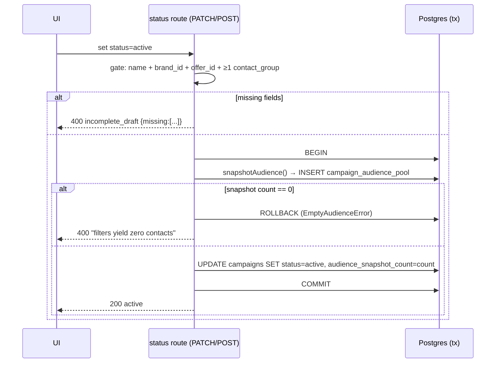

# Feature — Audience Snapshot (freeze-at-activation)

_Last updated: 2026-06-10_

## 1. Purpose
A campaign's audience is **computed and frozen** the moment it transitions `draft → active`, into `campaign_audience_pool`. The whole point: adding a contact to a referenced segment later does **not** retroactively expand a live campaign's reach. Drafts carry only the *recipe* (segment ids, group ids, filters, cap); the *contacts* are materialized once.

## 2. Key concepts / entities
- Recipe on `campaigns`: `audience_segment_ids[]`, `audience_contact_group_ids[]`, `audience_filters` (jsonb), `audience_cap`, `exclude_in_use_contacts` (default **true**).
- Frozen result: `campaign_audience_pool` (PK campaign_id+contact_id, plus `was_clicker/opt_in/no_status_at_snapshot` booleans).
- Logic in [`lib/audience-snapshot.ts`](../../lib/audience-snapshot.ts).

## 3. How it works

### Recipe composition
1. Per-segment audience clauses (`buildSegmentAudienceClause`, see [audience-segments.md](audience-segments.md)) are UNION'd across `audience_segment_ids` (the segment side); direct `contact_contact_groups` members for `audience_contact_group_ids` are UNION'd into the group side. The two dimensions then **INTERSECT** when both are populated — a contact must be in a selected segment **AND** a selected group — yielding the candidate pool. When only one dimension is filled, that side stands alone (the empty dimension is ignored, not treated as "match nothing"). Composition lives in `buildAudienceSourceClause`; the preview path applies the same intersection via a `membership_ok` flag so it can still report each side's pre-intersection contribution.
2. Each candidate is LEFT JOINed against `opt_ins` / `clickers` to compute status flags, and `audience_filters` (`include_no_status`, `include_opt_in`, `include_clickers`, `include_not_clicked`) select which status buckets qualify (OR logic — any matching include flag keeps the contact).
3. Contacts with **any** `opt_outs` row are excluded (live exclusion).
4. **`exclude_in_use_contacts` (campaign-level, default true):** drops any contact already snapshotted into another `status='active'` campaign's pool — applied to the **whole** candidate pool (i.e. the segment∩group intersection, or the single populated side), which the per-segment flag can't reach for a group-only audience. Both flags compose (idempotent — they EXCEPT the same active-pool set).
5. **`audience_cap`:** random-sample (`ORDER BY RANDOM() LIMIT cap`) from the remaining pool. `min(cap, available)` — a cap larger than the pool is a no-op; with exclusion on, it samples from the unused pool only.

### Key functions
| Function | Role |
|----------|------|
| `previewAudience(input)` | SELECT-only; returns counts: `count` (post-cap), `total_matching` (the **intersected** audience when both dimensions are selected), `from_segments` / `from_groups` (each side's eligible pool — see the perf note: when both dimensions are selected `from_segments` is evaluated **within** the group set, so it equals `overlap`/`total_matching`), `overlap`, `excluded_for_optout`, `in_use_in_other_campaigns`. Powers the editor preview & "N excluded" UI. |
| `buildQualifyingContactsSql(input)` | builds the candidate-with-flags CTE shared by preview + snapshot. |
| `snapshotAudience(input, tx?)` | INSERTs the frozen rows into `campaign_audience_pool`; returns `{ count, total_matching }`. Runs inside the activation transaction. |
| `computeStageAudienceCount(campaignId, orgId, filters)` | reads the **frozen** pool for an active campaign + applies stage-level filters + live opt-out exclusion. |
| `computeStageAudienceCountForDraft(campaign, filters)` | recomputes live from the recipe for draft-stage previews (no frozen pool yet). |

### Activation transaction (`draft → active`)
Runs in [`app/api/campaigns/[campaignId]/status/route.ts`](../../app/api/campaigns/[campaignId]/status/route.ts):

The snapshot runs in the **same transaction** as the status flip — a stale draft can't slip through, and an empty snapshot rolls the whole thing back.

### Performance (preview + snapshot)
Two optimizations keep the live preview fast even at ~750K contacts (the same SQL shape is shared by preview, snapshot, and the draft stage count):
1. **Group-restricted `is_not` universe.** A near-universal `is_not` rule (e.g. "in use in the last month" negated) would otherwise compute `all_contacts EXCEPT inner` — a full seqscan + disk-spilling set-ops over ~all contacts — *before* the segment∩group intersection narrows it down. When both dimensions are selected, the contact-group set is handed to `buildSegmentAudienceClause(…, restrictUniverse)` as the `is_not` universe, so the negation only spans the (small) group. Provably equivalent: the outer INTERSECT against the same group already constrains the result. Measured ~9s → ~0.4s on a 750K-contact org with a 35K group.
2. **Hash-joined status flags.** Opt-out / opt-in / clicker / in-use membership is computed by LEFT JOINing four deduped CTEs (`flagSetCtes` + `flagJoins`) instead of four correlated `EXISTS (…)` per candidate row, so each set is hashed once rather than probed per row.

## 4. Data it reads/writes
- Reads: `segments`/`segment_rules`/`segment_contacts`, `contact_contact_groups`, `opt_ins`, `clickers`, `opt_outs`, other campaigns' `campaign_audience_pool`.
- Writes: `campaign_audience_pool`, `campaigns.audience_snapshot_count` / `status`.

## 5. UI surface
- The audience composition card in the campaign editor ([`components/campaigns/campaign-editor-page.tsx`](../../components/campaigns/campaign-editor-page.tsx)): total contacts, a will-send-vs-above-cap progress bar, breakdown (from segments / from groups / overlap / excluded opt-outs), filter chips, and the "Exclude in-use" switch.
- `POST /api/campaigns/audience-preview` backs the live preview.

## 6. Rules & edge cases
- **Activation gate (code-authoritative):** name + `brand_id` + `offer_id` + **≥1 contact group**. **Segments are optional.** ⚠️ This differs from CLAUDE.md §10b, which says "≥1 segment" — the code requires a contact group. See [07-conventions.md](../07-conventions.md).
- Once `active`, the audience is **locked**: PATCH rejects changes to `audience_segment_ids`, `audience_contact_group_ids`, `audience_filters`, `audience_cap`, `exclude_in_use_contacts` with `details.reason = 'audience_locked_after_draft'`.
- Frozen pools are never recomputed when underlying segments/rules/opt-outs change later — stage exports apply live opt-out exclusion on top of the frozen pool at query time.

## 7. Extension points / limitations
- No re-snapshot / refresh-audience action by design.
- Random sampling is `ORDER BY RANDOM()` — fine at current scale; revisit for very large pools.
