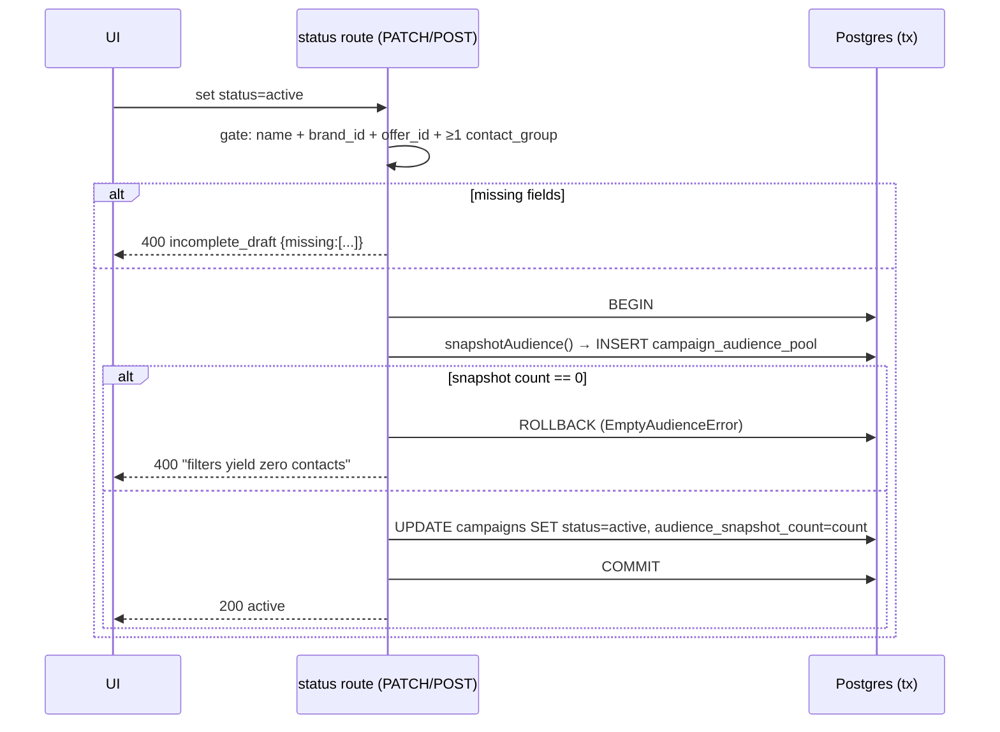

# Feature — Audience Snapshot (freeze-at-activation)

_Last updated: 2026-09-30_

## 1. Purpose
A campaign's audience is **computed and frozen** the moment it transitions `draft → active`, into `campaign_audience_pool`. The whole point: adding a contact to a referenced segment later does **not** retroactively expand a live campaign's reach. Drafts carry only the *recipe* (segment ids, group ids, filters, cap); the *contacts* are materialized once.

## 2. Key concepts / entities
- Recipe on `campaigns`: `audience_segment_ids[]`, `audience_contact_group_ids[]`, `audience_filters` (jsonb), `audience_cap`, `exclude_in_use_contacts` (default **true**).
- Frozen result: `campaign_audience_pool` (PK campaign_id+contact_id, plus `was_clicker/opt_in/no_status_at_snapshot` booleans).
- Logic in [`lib/audience-snapshot.ts`](../../lib/audience-snapshot.ts).

## 3. How it works

### Recipe composition
1. Per-segment audience clauses (`buildSegmentAudienceClause`, see [audience-segments.md](audience-segments.md)) are **INTERSECT'd** across `audience_segment_ids` (the **include** segment side) — a contact must be in **every** selected segment; direct `contact_contact_groups` members for `audience_contact_group_ids` are UNION'd into the group side. The two dimensions then **INTERSECT** when both are populated — a contact must be in every selected segment **AND** a selected group — yielding the positive base `P`. When only one dimension is filled, that side stands alone (the empty dimension is ignored, not treated as "match nothing"). Composition lives in `buildAudienceSourceClause`; the preview path applies the same rule via a `membership_ok` flag (with a `segments_matched = <n>` test mirroring the INTERSECT chain) so it can still report each side's pre-intersection contribution.

   **Segments AND together (changed 2026-08-17; was UNION).** Each additional include-segment can only *narrow* the audience. The old UNION broke on "filter-shaped" segments — e.g. a segment whose only rule is `in_use_in_campaign_last_period` `is_not`, which matches nearly the whole org. OR-ing that in *grew* a 44K audience to 508K instead of trimming it, and because `buildAudienceSourceClause` is shared with `snapshotAudience`, activating such a campaign would have frozen and sent to the inflated pool — not just displayed it. To OR two audiences together, model it as rules inside **one** segment (rule combinator `or`); that layer still unions. `previewAudience` and `buildAudienceSourceClause` are separate implementations of this rule and **must stay in lockstep** — if they drift, the preview stops predicting what activation freezes ([`scripts/test-segment-intersect-and-optout.ts`](../../scripts/test-segment-intersect-and-optout.ts) asserts both paths land on the same count).
1b. **Per-segment exclude (migration 0114).** `audience_exclude_segment_ids` holds segments whose members are **subtracted** from the positive base: `final = P EXCEPT (union of exclude segments)`. A segment is include XOR exclude (disjoint, enforced by the validator). Exclude is inert only when there is no positive base (no group and no include segment). The exclude union is evaluated against the group universe when a group is present (final ⊆ group — same `restrictUniverse` perf lever as the include side). `previewAudience` reports `excluded_by_segments` (contacts in `P` removed by an exclude segment) so the UI can show "N excluded by segment". Existing campaigns default to `'{}'` (no excludes) — behavior unchanged.
2. Each candidate is LEFT JOINed against `opt_ins` / `clickers` to compute status flags, and `audience_filters` (`include_no_status`, `include_opt_in`, `include_clickers`, `include_not_clicked`) select which status buckets qualify (OR logic — any matching include flag keeps the contact).
3. Contacts with **any** `opt_outs` row are excluded (live exclusion).
4. **`exclude_in_use_contacts` (campaign-level, default true):** drops any contact already snapshotted into another `status='active'` campaign's pool — applied to the **whole** candidate pool (i.e. the segment∩group intersection, or the single populated side), which the per-segment flag can't reach for a group-only audience. Both flags compose (idempotent — they EXCEPT the same active-pool set).
4b. **`exclude_prior_offer_contacts` (content-dedup LAYER 3, default false; as of 2026-07-21):** when on AND the campaign has an offer, drops contacts already in `offer_exposures` for that offer (they received it in a previous campaign). Baked into the frozen pool here — the same exclusion `previewAudience` shows — so the pool equals the previewed will-send and the stage doesn't surprise-filter at materialization. Re-checked at send time as a live safety net (post-activation exposures + pre-2026-07-21 pools). See [content-dedup.md §6b](content-dedup.md).
5. **`audience_cap`:** random-sample (`ORDER BY RANDOM() LIMIT cap`) from the remaining pool. `min(cap, available)` — a cap larger than the pool is a no-op; with exclusion(s) on, it samples from the already-narrowed (unused / non-prior-offer) pool only.

### Key functions
| Function | Role |
|----------|------|
| `previewAudience(input)` | SELECT-only; returns counts: `count` (post-cap), `total_matching` (the **intersected** audience when both dimensions are selected), `from_segments` / `from_groups` (each side's eligible pool — see the perf note: when both dimensions are selected `from_segments` is evaluated **within** the group set, so it equals `overlap`/`total_matching`), `overlap`, `excluded_for_optout`, `in_use_in_other_campaigns`, `got_offer_in_prior_campaign` (content-dedup LAYER 3 — in-audience leads who already received the campaign's offer; subtracted from `total_matching` only when `exclude_prior_offer_contacts` is on, and a point-in-time estimate — see [content-dedup.md §6b](content-dedup.md)). Powers the editor preview & "N excluded" UI. |
| `buildAudienceSourceSql(input)` | composes the raw candidate set (segment ∩ group, before status filters). |
| `buildQualifierFromRelation(input, rel)` | wraps a candidate relation with the status-flag joins + filter WHERE, projecting the snapshot booleans. Also applies content-dedup LAYER 3 (`exclude_prior_offer_contacts` + `offerId`) so the frozen pool matches `previewAudience`. |
| `snapshotAudience(input, tx?)` | materializes the candidate set into a temp table, ANALYZEs it, then INSERTs the frozen rows into `campaign_audience_pool`; returns `{ count, total_matching }`. **Must** run inside a transaction (uses `ON COMMIT DROP` temp tables). |
| `computeStageAudienceCount(campaignId, orgId, filters)` | reads the **frozen** pool for an active campaign + applies stage-level filters + live opt-out exclusion. One stage. Used by the audience-count / audience-preview routes. |
| `computeStageAudienceCountForDraft(campaign, filters)` | recomputes live from the recipe for draft-stage previews (no frozen pool yet). One stage. |
| `computeStageAudienceCountsBatch(campaignId, orgId, stages[])` | **batched** equivalent of `computeStageAudienceCount` for MANY non-lane stages in one pass → `Map<stageId, count>`. Used by the stages-list endpoint to avoid an N+1. Numerically identical to the per-stage function (proven before ship). |
| `computeStageAudienceCountsBatchForDraft(campaign, stages[])` | **batched** equivalent of `computeStageAudienceCountForDraft` (draft projection) in one pass. Builds the segment∩group source **once** (the per-stage version rebuilt it per stage) and `MATERIALIZED`s it so the source set-ops evaluate exactly once. |

### Activation transaction (`draft → active`)
Runs in [`app/api/campaigns/[campaignId]/status/route.ts`](../../app/api/campaigns/[campaignId]/status/route.ts):

```mermaid
sequenceDiagram
  participant UI
  participant API as status route (PATCH/POST)
  participant DB as Postgres (tx)
  UI->>API: set status=active
  API->>API: gate: name + brand_id + offer_id + ≥1 contact_group
  alt missing fields
    API-->>UI: 400 incomplete_draft {missing:[...]}
  else
    API->>DB: BEGIN
    API->>DB: snapshotAudience() → INSERT campaign_audience_pool
    alt snapshot count == 0
      API->>DB: ROLLBACK (EmptyAudienceError)
      API-->>UI: 400 "filters yield zero contacts"
    else
      API->>DB: UPDATE campaigns SET status=active, audience_snapshot_count=count
      API->>DB: COMMIT
      API-->>UI: 200 active
    end
  end
```
The snapshot runs in the **same transaction** as the status flip — a stale draft can't slip through, and an empty snapshot rolls the whole thing back.

### Performance (preview + snapshot)
Five optimizations keep this fast even at ~750K contacts:
1. **Group-restricted `is_not` universe.** A near-universal `is_not` rule (e.g. "in use in the last month" negated) would otherwise compute `all_contacts EXCEPT inner` — a full seqscan + disk-spilling set-ops over ~all contacts — *before* the segment∩group intersection narrows it down. When both dimensions are selected, the contact-group set is handed to `buildSegmentAudienceClause(…, restrictUniverse)` as the `is_not` universe, so the negation only spans the (small) group. Provably equivalent: the outer INTERSECT against the same group already constrains the result. Measured ~9s → ~0.4s on a 750K-contact org with a 35K group.
2. **Hash-joined status flags.** Opt-out / opt-in / clicker / in-use membership is computed by LEFT JOINing four deduped CTEs (`flagSetCtes` + `flagJoins`) instead of four correlated `EXISTS (…)` per candidate row, so each set is hashed once rather than probed per row.
3. **Materialize + ANALYZE the candidate set (snapshot path).** The candidate set is built from `UNION`/`INTERSECT`/`EXCEPT` set ops whose output cardinality Postgres cannot estimate — it defaults to **~200 rows**. At real scale (a campaign over a 150K-member contact group) that misestimate makes the planner pick **nested-loop anti-joins** for the opt-out / in-use exclusions (≈ candidates × active-pool comparisons), which never finish → `statement timeout (57014)` and a failed activation. `snapshotAudience` therefore writes the candidate set into a `ON COMMIT DROP` temp table and `ANALYZE`s it before the flag joins, giving the planner true row counts so the exclusions hash-join. The qualified rows go into a second temp table so the count + the `ORDER BY random()` cap sample share one evaluation. Measured: **>180s (timeout) → ~8.5s** for a 150K-candidate / 5K-cap activation. Because temp tables need a transaction, `snapshotAudience` must be called with the activation `tx` (both callers do), and the routes that snapshot set `maxDuration = 60`. *Not applied to `previewAudience` / the single-stage `computeStageAudienceCountForDraft`, which run outside a transaction.*
4. **Prior-offer exclusion is its own statement (snapshot path).** Content-dedup LAYER 3 (`exclude_prior_offer_contacts`) is applied by `DELETE … WHERE EXISTS (offer_exposures …)` against the *materialized + ANALYZEd* `audience_qualified` temp table — **not** as an `oe_set` anti-join inside the qualifier. Folded in, two independent misestimates line up: the qualifier's outer estimate collapses to `rows=1` (a chain of anti-joins over the candidate temp table), and `offer_id` for a newer/small offer is missing from the column's MCV list so `offer_exposures` is estimated at 1 row as well. The planner then picks a **Nested Loop Anti Join** and re-scans `offer_exposures` once per candidate. Measured 2026-07-31 on a real recipe (36K candidates, 23K qualified, offer with 5K exposures): **23,139 loops × 5,000 rows = 115.7M heap fetches, ~84s** — past the route's `maxDuration = 60`, so campaign create returned Vercel's `Task timed out after 60 seconds` and the transaction rolled back (four burned campaign IDs that day). Splitting it out gives the planner the real cardinality of the qualified set, so it hash-anti-joins: **67.5s → 4.2s, byte-identical rows out.** The failure is *data-shape dependent* — the same recipe planned fine hours earlier and campaigns on high-frequency offers never tripped it, which is why it surfaced as an intermittent "sometimes I can't create a campaign". `previewAudience` aggregates over a different shape and does **not** hit this (measured 3.9–5.9s on the same recipes), so it keeps the inline `oe_set` join.
4b. **…and when the Y/N offer rules are on, that statement must be UNCORRELATED (2026-09-28).** Splitting the exclusion out (item 4) is what lets the *permanent* `offer_exposures` rule hash-anti-join. It does **nothing** for the `offer_rules_enabled` branch, because that predicate carries `GROUP BY … HAVING count(*) >= N OR max(last_sent_at) > …` — and Postgres cannot pull a **grouped** subquery up into a semi-join at all. Written as `WHERE EXISTS (… AND coc.contact_id = q.contact_id GROUP BY …)` it stays a `SubPlan` re-executed **once per surviving candidate**, so the cost grows linearly with the audience — the same nested-loop failure item 4 fixed, reintroduced by a new branch sitting in the already-split-out position. Measured on production (campaign 1485, offer 123, 95,166 candidates): `GroupAggregate … loops=95166`, **5,317 ms server-side warm** and far worse cold — **27.5s of a 39s activation**, its single dominant cost. Written as `WHERE q.contact_id IN (SELECT … GROUP BY … HAVING …)` the offer's rows are grouped **once** and hash semi-joined: **1,173 ms**, and bounded by the *offer's* exposure rows instead of by the audience. Semantics are unchanged — correlating on `contact_id` made each group exactly one contact's rows, so grouping globally under the same `HAVING` yields the same set (verified on production: both forms excluded the identical **1,012 of 95,166**). This is also the shape [lib/sends/eligibility.ts](../../lib/sends/eligibility.ts) already uses for the same two rules, so the freeze and the send now read alike. End-to-end activation for that campaign: **39–48s → 4.2–11.2s**, same audience out (2,500 of 62,762 matching).

4c. **The lifecycle exclusions run at SELECTION time, before the cap (2026-09-28).** `suppressed`, `bought_offer` and `freeze_not_due` used to be a send-time overlay — reported by the preview, left inside `total_matching`, subtracted only on the day. That is wrong whenever a cap is set, because **the cap samples the pool first**: campaign 1501 targeted the freeze cohort across four Weight Loss groups, where only ~2% of the 69,185 freeze contacts were past their 14-day rest period. Capped at 1,500 it drew 1,500 at random from all 69,185 and its stage could send to **28** (`1,500 × 1,371/69,185 = 30`). The other 1,472 were then locked out of every other campaign by `exclude_in_use_contacts` while the campaign holding them could not message them. `buildQualifierFromRelation` now anti-joins the same layers `lib/sends/eligibility.ts` builds, so the frozen pool contains only contacts that can actually receive the message — measured on the same recipe: **1,340 sendable** (1,371 due − 31 in use) instead of 1,500 of which 28 were. The send-time layers STAY, so nothing the old code blocked can now slip through; the accepted cost is that the pool reflects activation day, so a contact who becomes due tomorrow belongs to tomorrow's campaign. The offer rules are deliberately NOT part of this anti-join — they remain the separate post-`ANALYZE` DELETE, for the planner reasons in items 4 and 4b.

4d. **The create-mode preview's 60s timeouts were CONCURRENCY, not one slow query (2026-09-30).** The reported symptom was "Could not preview audience" plus `Vercel Runtime Timeout Error: Task timed out after 60 seconds`. A single preview over the three biggest contact groups (646,339 candidates) costs **18–35s** on an idle database — heavy, but under the limit. What tipped it over was that `pg_stat_activity` showed **four `with unionized as (…)` preview queries running at once, the oldest 49s**. The form debounced at 400ms but only *ignored* superseded results (`let cancelled = false`); the HTTP request and its Postgres query ran to completion regardless, and **an abandoned request does not cancel the query** — Vercel kills the function at 60s while Postgres keeps going. Each edit stacked another ~24GB-of-buffers query onto the same instance and they starved each other, so the one the operator was actually waiting for was the one that died. Two fixes, neither of them to the SQL: the effect now holds an `AbortController` and aborts on cleanup, so only the newest preview is in flight; and `previewAudience` runs inside a transaction with `SET LOCAL statement_timeout = '30s'` as a backstop for everything a client abort cannot reach (a bookmarked tab, a retry, a second operator on the same groups). The route maps Postgres `57014` to a 400 naming the fix ("narrow the selection") rather than a 500 or Vercel's timeout page. ⚠️ **Materialising the preview's source into a temp table the way `snapshotAudience` does (items 3–4) was tried and REVERTED** — a controlled interleaved A/B on a quiet database measured it *slower* (old 33.6s/18.5s vs materialised 35.1s/27.8s, identical 25,267 out). An earlier 36.8s→25.5s reading compared runs taken under different load and did not survive the controlled test. Don't re-derive it here without an interleaved measurement. One real SQL win did land: `offerRuleLayers` omits its `campaign_id <> …` carve-out when there is no current campaign (the preview passes `-1`), because `campaign_id` is not in `contact_offer_campaigns_org_offer_contact_idx` so the tautology forced a heap fetch per row — **3,602ms → 1,909ms** on offer 62's 575,178 rows, index-only.

4e. **…and they run as SEPARATE DELETEs, never as joins in the qualifier (2026-09-30).** PR #246 first applied them as `LEFT JOIN lx_<key> … WHERE lx_<key>.contact_id IS NULL` inside `buildQualifierFromRelation`. That timed activation out at **over 300 s** — past even a raised statement timeout, never mind the route's 60 s. ⚠️ **The failure is an ESTIMATE CASCADE, not the cost of the layers.** Postgres estimates `LEFT JOIN x … WHERE x IS NULL` as removing half the rows, so chaining three of them in front of the existing opt-out / opt-in / in-use anti-joins walked the estimate `130,080 → 65,040 → 32,520 → … → rows=1`, and on that estimate the planner switched the opt-out and **in-use** exclusions from hash anti-joins to nested loops with a join filter (`Nested Loop Anti Join (rows=1) Join Filter: (p.contact_id = cand.contact_id)`). The candidate temp table protects the cardinality going *in*; nothing protects the estimate once a chain of anti-join filters feeds itself. Measured on campaign 1538 (Weight Loss ∩ cold, 130,080 candidates): **>300 s → 12.1–16.4 s**, same pool out (2,500 of 3,377). Split out, each runs against the materialized + `ANALYZE`d `audience_qualified` with real stats and `contact_id IN (…)` hash semi-joins. `suppressed` and `bought_offer` are index scans (46 ms / 51 ms); `freeze_not_due` is the expensive one because its predicate is **not sargable** — `last_sent_at > now() - make_interval(days => freeze_cadence_days)` compares a column to an expression over *another column of the same row*, so no index can serve it (7,606 ms standalone) — but it is paid once rather than per candidate. ⭐ **A results-only bar cannot catch this**: the join form and the DELETE form return byte-identical rows, and the cross-path bar stayed green throughout. `scripts/test-preview-matches-snapshot.ts` PART G asserts the structure instead — the qualifier must not mention `lx_` at all — and is red-proved against the #246 code. Note the PREVIEW still joins them, deliberately: it needs the per-contact flags to report the exclusion buckets, and its plan uses hash joins throughout.

5. **Batched per-stage counts (stages-list endpoint).** `GET /api/campaigns/[campaignId]/stages` needs `audience_count` for every stage. Computing it one query per stage was an N+1 that dominated the page (the slowest in the app). `computeStageAudienceCountsBatch` / `…ForDraft` collapse all non-lane stages into a **single** pass — the pool/source is scanned once and per-stage filters + the split bucket (`ROW_NUMBER() PARTITION BY stage_id ORDER BY contact_id`) are applied via conditional aggregation. Behavioral-lane stages keep their own per-lane `countStageRecipients` (live tier + aliveness) unchanged. Proven numerically identical to the per-stage functions across all real campaigns (active, mid-send, lane, and forced-draft cases) before shipping. The draft batch CTE is `MATERIALIZED`: without it the planner re-evaluated the expensive segment-rule source once *per stage inside one statement* (nested loop), which tripped `statement_timeout` where the old N-separate-statements path did not — `MATERIALIZED` forces one source evaluation. The route sets `maxDuration = 30`.

## 4. Data it reads/writes
- Reads: `segments`/`segment_rules`/`segment_contacts`, `contact_contact_groups`, `opt_ins`, `clickers`, `opt_outs`, other campaigns' `campaign_audience_pool`.
- Writes: `campaign_audience_pool`, `campaigns.audience_snapshot_count` / `status`.

## 5. UI surface
- The audience composition card in the campaign editor ([`components/campaigns/campaign-editor-page.tsx`](../../components/campaigns/campaign-editor-page.tsx)): total contacts, a will-send-vs-above-cap progress bar, breakdown (from segments / from groups / overlap / excluded opt-outs), filter chips, and the "Exclude in-use" switch.
- `POST /api/campaigns/audience-preview` backs the live preview.

## 6. Rules & edge cases
- **Activation gate (code-authoritative):** name + `brand_id` + `offer_id` + **≥1 contact group**. **Segments are optional.** ⚠️ This differs from CLAUDE.md §10b, which says "≥1 segment" — the code requires a contact group. See [07-conventions.md](../07-conventions.md).
- Once `active`, the audience is **locked**: PATCH rejects changes to `audience_segment_ids`, `audience_contact_group_ids`, `audience_filters`, `audience_cap`, `exclude_in_use_contacts` with `details.reason = 'audience_locked_after_draft'`.
- Frozen pools are never recomputed when underlying segments/rules/opt-outs change later — stage exports apply live opt-out exclusion on top of the frozen pool at query time.

## 7. Extension points / limitations
- No re-snapshot / refresh-audience action by design.
- Random sampling is `ORDER BY RANDOM()` — fine at current scale; revisit for very large pools.

## 8. Task 2 parity harness (temporary)

While Task 2 rebuilds the campaign preview (plan: `docs/superpowers/plans/2026-09-30-audience-preview-task2-plan.md`), the preview as it stood on 2026-09-30 is frozen verbatim in [`lib/audience-preview-reference/`](../../lib/audience-preview-reference/index.ts). [`scripts/verify-preview-parity.ts`](../../scripts/verify-preview-parity.ts) runs the reference and the live `previewAudience` on real campaign recipes, one READ ONLY `REPEATABLE READ` transaction per recipe, and fails on any field that differs. `previewAudience` takes an optional `runner` for this purpose only; the route never passes it.

- **Scope is printed and enforced.** The recipes cover the plan's list (lifecycle chips, segments, small and large groups, offer rules, an offer with and without history, cap, carrier, in-use on and off), with named variants where no real campaign carries an item. The run fails with fewer than 10 recipes, fewer than 5 segment recipes, or fewer than half with a non-empty audience. Two zeros agreeing prove nothing.
- **Red-proved every run.** Each numeric field of each result is bumped by one, and the differ must name exactly that field. It was also proven once end to end with a one-row change to the live SQL.
- **`--timing`** is the segment gate ([change 3]). It times segment evaluation alone against the whole preview (EXPLAIN ANALYZE, BUFFERS, two interleaved rounds), counting only recipes whose preview takes at least 100 ms. If the median share is above 50%, T2 stops.
- **Production only between 05:00 and 06:00 UTC.** Any database other than the one in `.env.demo` counts as production. The script refuses to start outside 05:00–05:45 and takes no new recipe after 06:00.

**Kill switch (T1b).** `AUDIENCE_PREVIEW_IMPL=reference` makes the preview route serve the reference; the response header `x-audience-preview-impl` says which one answered. [`scripts/test-preview-kill-switch.ts`](../../scripts/test-preview-kill-switch.ts) checks it over HTTP in both server modes.

The reference and the harness helpers are deleted together with the kill switch once Task 2 is accepted.
