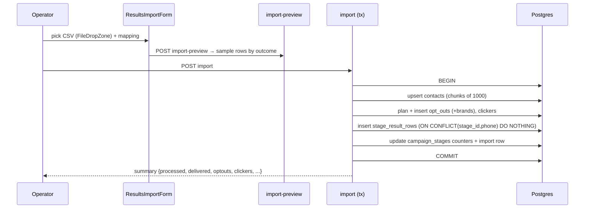

# Feature — CSV Result Imports & Phone Uploads

_Last updated: 2026-06-05_

## 1. Purpose
After a manual send, the provider exports a results CSV. This module imports it, derives a per-row **outcome**, propagates opt-outs and clickers into the suppression/engagement tables, and updates the stage's result counters — all transactionally and **revertibly**. A separate, simpler path handles bulk phone uploads.

## 2. Key concepts / entities
- `result_import_mappings` — per-provider column-mapping templates (`mapping` jsonb + `status_value_map` jsonb, `is_default`).
- `stage_results_imports` — one row per import event (permanent audit; `clicker_phase` day1/late; `reverted_at`).
- `stage_result_rows` — per-row record; **UNIQUE(stage_id, phone_number)** is the dedup key; `created_opt_out_id`/`created_clicker_id` enable cross-import preservation on revert.
- Code: [`lib/imports/`](../../lib/imports/) (`parse-csv.ts`, `outcome.ts`, `canonical-fields.ts`, `contact-status.ts`), [`lib/upload/audience-upload.ts`](../../lib/upload/audience-upload.ts).

## 3. How it works

### Result import flow

### Outcome derivation ([`lib/imports/outcome.ts`](../../lib/imports/outcome.ts))
Per row, highest-priority match wins (driven by `status_value_map` word lists, falling back to heuristics):

| priority | outcome | trigger |
|----------|---------|---------|
| 7 | `opt_out` | `is_optout` truthy or STOP/unsub/removed/blocked |
| 6 | `scrubbed` | invalid/not_mobile/landline |
| 5 | `bounced` | bounce/bounced |
| 4 | `clicker` | `is_clicker` truthy or click/engaged |
| 3 | `delivered` | delivered/success/ok/sent/yes |
| 2 | `failed` | failed/error/rejected/filtered |
| 1 | `noop` | unrecognized |

Within one CSV, per-phone duplicates collapse to the highest-priority outcome. Parsing via PapaParse (header rows), phone validation via libphonenumber-js, **max 25 MB**.

### Propagation
- `opt_out` → `opt_outs` (reason `opt_out`) + `opt_out_brands` (brand-scoped to the campaign's brand).
- `scrubbed` / `bounced` → `opt_outs` (reason `scrubbed`/`bounced`, **universal**, no brand junction).
- `clicker` → `clickers` (per contact+brand; requires `campaign.brand_id`).
- `delivered`/`failed`/`noop` → `stage_result_rows` only, no propagation.
- Each created opt-out/clicker id is recorded on its `stage_result_rows` row.

### Late-clicker phase
- `clicker_phase='day1'` (default): full import; clicks feed `campaign_stages.click_count`.
- `clicker_phase='late'`: clicker outcomes only, deduped against every clicker already recorded for the stage; feed `late_click_count`, touch **no other counters**. Revert branches on this column.

### Revert (`POST …/imports/[importId]/revert`)
- Marks `reverted_at` + `reverted_by_user_id`, deletes this import's `stage_result_rows`, subtracts its `*_added` counters from the stage.
- **Cross-import preservation:** for each opt-out/clicker the deleted rows created, it is deleted **only if** no other non-reverted `stage_result_rows` still references it; otherwise kept.

### Phone uploads (separate path)
Four entry points — contacts / opt-outs / opt-ins / clickers — share `processAudienceUpload()`: dedupe by E.164, upsert `contacts`, insert entity rows, apply `assign_to_group_ids` (idempotent). See [contacts-and-groups.md](contacts-and-groups.md).

## 4. Data it reads/writes
- Writes `stage_results_imports`, `stage_result_rows`, `opt_outs`(+`opt_out_brands`), `clickers`, `contacts`, `campaign_stages` counters.
- Reads `result_import_mappings`, the stage/campaign, existing opt-outs/clickers (for dedup).

## 5. UI surface
- `components/campaigns/results-import-form.tsx` (CSV upload via `<FileDropZone>`), `manual-results-form.tsx` (manual counters), `import-history-dialog.tsx` (list + revert).
- Per-provider mapping config under `app/(protected)/` / `app/api/result-import-mappings/`.

## 6. Rules & edge cases
- Re-importing the same CSV is a no-op for already-seen `(stage_id, phone)` rows (`ON CONFLICT DO NOTHING`).
- `stage_results_imports` rows are never hard-deleted (audit survives revert).
- Permissions: `result_imports.create` (operator+), `result_imports.revert` (manager+), `import_mappings.*`.

## 7. Extension points / limitations
- Checkout clicks / sales have no CSV path (manual only).
- Outcome heuristics are tuned for known providers; new providers should ship a `status_value_map` rather than relying on heuristics.
