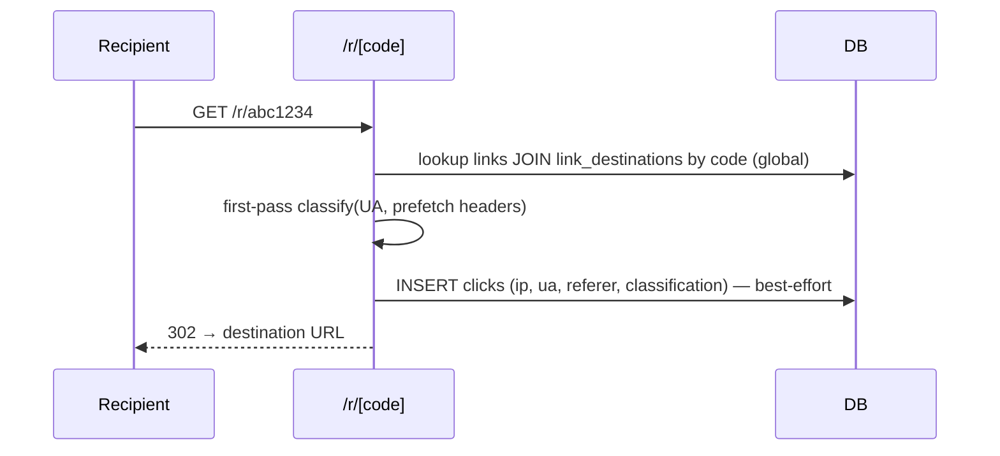

# Feature — Link Shortener, Click Tracking & Attribution

_Last updated: 2026-06-05_

## 1. Purpose
For tracked campaigns, mint a **unique short link per recipient-message** so a click resolves 1:1 to `(contact, campaign, stage, creative, destination)`. The public redirect logs every click; a deferred scoring job enriches and classifies clicks (human / bot / prefetch / suspect) without ever deleting data — reports filter on the score.

## 2. Key concepts / entities
- `short_domains` — a brand's short-link host (e.g. `go.brandx.co`); one per brand. Required to switch a campaign to `link_mode='tracked'`.
- `link_destinations` — deduped destination URLs (keyed by SHA-256 `url_hash`).
- `links` — one minted short link; `code` is **globally** unique; idempotency `(stage_id, contact_id, send_token)`.
- `clicks` — append-only click log; `scored_at IS NULL` = unscored.
- Code: [`lib/links/`](../../lib/links/) (`mint-link.ts`, `classify-click.ts`, `geoip.ts`, `geoip-cache.ts`, `scoring.ts`, `score-clicks.ts`, `datacenter-asns.ts`), [`app/r/[code]/route.ts`](../../app/r/[code]/route.ts).

## 3. How it works

### Minting (`mint-link.ts`)
1. Upsert the destination by `url_hash` → `link_destinations`.
2. Generate a `code`: ~7 chars from a 56-char URL-safe alphabet (ambiguous `0/O/1/l/I` removed). Collision retry up to 5× (SAVEPOINT), then throw.
3. INSERT `links`; idempotency unique `(stage_id, contact_id, send_token)` — a retry of the same message reuses the existing link, a genuinely new message gets a fresh code.
4. `campaign_tracking_id` / `stage_tracking_id` are denormalized onto the link and **NOT NULL** — a link is only minted once those exist (a missing tracking ID means "stage isn't ready to send").

### Redirect (`app/r/[code]/route.ts`, force-dynamic)

- IP precedence: `CF-Connecting-IP` → `x-real-ip` → first `X-Forwarded-For`. **⚠️ `CF-Connecting-IP` is only spoof-proof if the Vercel origin is locked to Cloudflare** (IP allowlist / tunnel); otherwise it can be forged. This gates the trustworthiness of the Phase-3 ASN bot filter.
- First-pass classification (`classify-click.ts`): prefetch headers (`Purpose`/`X-Purpose`/`X-Moz`/`Sec-Purpose`) → `prefetch`; bot/crawler/headless UA → `bot`; missing UA → `unknown`; else `human`.
- Click logging is best-effort — the redirect never blocks on a logging failure.

### Deferred scoring (`/api/clicks/score-pending`, cron `*/15`)
- Modes: `pending` (rows where `scored_at IS NULL`, default) or `rescore` (all rows, idempotent — after retuning weights). `maxRows` default 2000 (≤20000).
- Enrichment via MaxMind GeoLite2 ASN/Country `.mmdb` (`geoip.ts`): fills `asn`, `asn_org`, `country`, and `is_datacenter` (from a hosting-ASN list, `datacenter-asns.ts` — GeoLite has no hosting flag).
- Scoring (`scoring.ts`): weighted `bot_score` (e.g. datacenter ASN, scanner/headless UA, missing UA) → final `classification` (`human` / `suspect` / `bot`) + `bot_reasons[]` (recorded on **every** scored row, including humans, so near-misses are visible when retuning).
- **Fail-safe:** if enrichment is unavailable (no MaxMind key, rate-limited), **no rows are scored** — they stay `pending` for the next tick (self-healing). With the key unset, scoring still runs on UA signals only (asn/country/datacenter stay NULL).
- GeoIP DB caching: L1 `/tmp` per-instance copy, L2 `geoip_cache` Postgres table (cross-instance), 24h freshness, ≤1 refresh/6h, advisory xact-lock to coordinate cold starts.

## 4. Data it reads/writes
- Writes `link_destinations`, `links`, `clicks`, `geoip_cache`.
- Reads `short_domains`, `links` (redirect), `clicks` (scoring), MaxMind service.

## 5. UI surface
- `components/campaigns/click-report-section.tsx` + `app/api/campaigns/[campaignId]/click-report/` — attribution reporting (filters out bot/prefetch via the score).
- `CopyableId` / link mode toggle on the campaign editor.

## 6. Rules & edge cases / known constraints
- **Classify-don't-delete:** raw click rows are never mutated to "clean" data; the `classification` first-pass verdict is overwritten by the scoring job, and reports filter on `bot_score`/`classification`.
- `seconds_since_send` is **deferred** — no send pipeline records a per-message send time consumed here yet; it stays NULL (≈ `clicked_at - links.created_at` once minting runs at send time).
- `links.creative_id` is `ON DELETE SET NULL` so a deleted creative doesn't orphan click history.
- Attribution is link-click based: a click proves the recipient opened the link, not that they converted (checkout/sales are manual stage counters).

## 7. Extension points / limitations
- Re-score pass (`mode=rescore`) lets you retune weights and re-grade history.
- Add hosting ASNs to `datacenter-asns.ts` to improve datacenter detection.
- Origin-lock to Cloudflare is a prerequisite for fully trusting IP-based signals.
