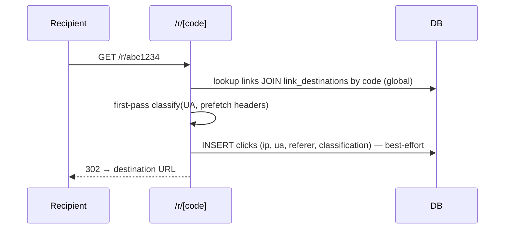

# Feature — Link Shortener, Click Tracking & Attribution

_Last updated: 2026-08-24_

## 1. Purpose
For tracked campaigns, mint a **unique short link per recipient-message** so a click resolves 1:1 to `(contact, campaign, stage, creative, destination)`. The public redirect logs every click; a deferred scoring job enriches and classifies clicks (human / bot / prefetch / suspect) without ever deleting data — reports filter on the score.

## 2. Key concepts / entities
- `short_domains` — a brand's short-link host (e.g. `go.brandx.co`); one per brand. Required to switch a campaign to `link_mode='tracked'`.
- `link_destinations` — deduped destination URLs (keyed by SHA-256 `url_hash`).
- `links` — one minted short link; `code` is **globally** unique; idempotency `(stage_id, contact_id, send_token)`.
- `clicks` — append-only click log; `scored_at IS NULL` = unscored.
- Code: [`lib/links/`](../../lib/links/) (`mint-link.ts`, `classify-click.ts`, `geoip.ts`, `geoip-cache.ts`, `scoring.ts`, `score-clicks.ts`, `datacenter-asns.ts`), [`app/r/[code]/route.ts`](../../app/r/[code]/route.ts).

## 3. How it works

### Minting (`mint-link.ts`)
1. Upsert the destination by `url_hash` → `link_destinations`.
2. Generate a `code`: ~7 chars from a 56-char URL-safe alphabet (ambiguous `0/O/1/l/I` removed). Collision retry up to 5× (SAVEPOINT), then throw.
3. INSERT `links`; idempotency unique `(stage_id, contact_id, send_token)` — a retry of the same message reuses the existing link, a genuinely new message gets a fresh code.
4. `campaign_tracking_id` / `stage_tracking_id` are denormalized onto the link and **NOT NULL** — a link is only minted once those exist (a missing tracking ID means "stage isn't ready to send").

### Redirect (`app/r/[code]/route.ts`, force-dynamic)

```mermaid
sequenceDiagram
  participant Recipient
  participant R as /r/[code]
  participant DB
  Recipient->>R: GET /r/abc1234
  R->>DB: lookup links JOIN link_destinations by code (global)
  R->>R: first-pass classify(UA, prefetch headers)
  R->>DB: INSERT clicks (ip, ua, referer, classification) — best-effort
  R-->>Recipient: 302 → destination URL
```
- IP precedence: `CF-Connecting-IP` → `x-real-ip` → first `X-Forwarded-For`. **⚠️ `CF-Connecting-IP` is only spoof-proof if the Vercel origin is locked to Cloudflare** (IP allowlist / tunnel); otherwise it can be forged. This gates the trustworthiness of the Phase-3 ASN bot filter.
- First-pass classification (`classify-click.ts`): prefetch headers (`Purpose`/`X-Purpose`/`X-Moz`/`Sec-Purpose`) → `prefetch`; bot/crawler/headless UA → `bot`; missing UA → `unknown`; else `human`.
- Click logging is best-effort — the redirect never blocks on a logging failure.
- **Per-recipient `sub_id1` append (sale attribution):** `resolveAndLogClick` appends `&sub_id1=<send_token>` to the destination before the 302 (`RECIPIENT_SUB_ID_PARAM`). The `send_token` is the link's per-recipient id (= `stage_sends.id`), so a Keitaro conversion's `sub_id_1` maps back to the exact recipient/phone. The **shared per-stage destination is untouched** (the param is added only here, at redirect time) and the operator's stage Full URL never carries it. Spelling mirrors `sub_id3`: URL param `sub_id1` (no underscore) → Keitaro token `sub_id_1` (underscore). Consumed by the conversions poll — see [keitaro-poll.md §8](keitaro-poll.md).

### Deferred scoring (`/api/clicks/score-pending`, cron `*/15`)
- Modes: `pending` (rows where `scored_at IS NULL`, default) or `rescore` (all rows, idempotent — after retuning weights). `maxRows` default 2000 (≤20000).
- Enrichment via MaxMind GeoLite2 ASN/Country `.mmdb` (`geoip.ts`): fills `asn`, `asn_org`, `country`, and `is_datacenter` (from a hosting-ASN list, `datacenter-asns.ts` — GeoLite has no hosting flag).
- **`is_datacenter` matches on the exact ASN NUMBER only.** A substring fallback over the ASN *organization name* was removed 2026-08-11 (see §7a). Never reintroduce name matching — add the ASN number instead.
- **Consumer-relay carve-out** (`CONSUMER_RELAY_ASNS`): Fastly `54113`, Cloudflare `13335`, Akamai `36183` and Google Fiber `16591` are explicitly **not** datacenter. The first three are Apple iCloud Private Relay egress partners (default-on for iCloud+ subscribers); the fourth is a residential ISP. This set wins over `DATACENTER_ASNS`, so mistakenly re-adding one of those numbers cannot resurrect the bug.
- Scoring (`scoring.ts`): weighted `bot_score` (e.g. datacenter ASN, scanner/headless UA, missing UA) → final `classification` (`human` / `suspect` / `bot`) + `bot_reasons[]` (recorded on **every** scored row, including humans, so near-misses are visible when retuning).
- **Fail-safe:** if enrichment is unavailable (no MaxMind key, rate-limited), **no rows are scored** — they stay `pending` for the next tick (self-healing). With the key unset, scoring still runs on UA signals only (asn/country/datacenter stay NULL).
- GeoIP DB caching: L1 `/tmp` per-instance copy, L2 `geoip_cache` Postgres table (cross-instance), 24h freshness, ≤1 refresh/6h, advisory xact-lock to coordinate cold starts.

## 4. Data it reads/writes
- Writes `link_destinations`, `links`, `clicks`, `geoip_cache`.
- Reads `short_domains`, `links` (redirect), `clicks` (scoring), MaxMind service.

## 5. UI surface
- `components/campaigns/click-report-section.tsx` + `app/api/campaigns/[campaignId]/click-report/` — attribution reporting (filters out bot/prefetch via the score).
- `CopyableId` / link mode toggle on the campaign editor.

## 5b. Destination-URL contract & validation (guidekn shape guard)
The canonical guidekn destination is exactly `https://www.guidekn.com/lp/<slug>?sub_id3=<stage tracking_id>` — one query param, lowercase-alphanumeric slug (`[a-z0-9]+`, e.g. `orv`, `gb1`; the concat guard keys off an underscore in the path, not a digit, so digit-bearing slugs pass — migration 0111). A historical string-concatenation bug (the tracking-ID chip appended a **bare value** with no `sub_id3=` key) produced malformed destinations — the id glued into the path (`…/lp/knd8_62_…`), an empty `sub_id3=`, or an unsubstituted `subid3=sub_id3` placeholder — each a 404 that silently loses attribution.

Guard, defense-in-depth (single source of truth: `validateDestination(url, trackingId?)` in [`lib/stage-url.ts`](../../lib/stage-url.ts)):
1. **Form** — the stage form blocks Save (button disabled + the specific defect named on screen) when a hand-edited (non-auto) Full URL is a malformed guidekn URL. The tracking-ID chip now attaches a proper `sub_id3=<id>` param via `setUrlParam`, so the id can no longer glue onto the path.
2. **Write routes** — the stage `POST`/`PATCH` reject a malformed guidekn `full_url` with 4xx (`field: full_url`), shape-only (the send path enforces `sub_id3 == tracking_id`).
3. **Send path** — [`lib/sends/kickoff.ts`](../../lib/sends/kickoff.ts) trusts a stored `full_url` only when it carries the stage's tracking id in a **well-formed** way (`validateDestination(...) === null` for guidekn URLs); otherwise it rebuilds canonically. The old `storedFull.includes(trackingId)` check was fooled by the id-in-path case. A resolved destination that is still a malformed guidekn URL is refused (`reason: invalid_destination`).
4. **DB** — CHECK constraint `link_destinations_guidekn_url_shape` (migration 0094, `NOT VALID`) rejects any malformed guidekn `url` on insert/update; non-guidekn URLs are unaffected (`url NOT LIKE '%guidekn.com/lp/%'`).

Scope: only guidekn `/lp/` URLs are shape-checked; empty URLs (drafts/auto mode) and non-guidekn network URLs (e.g. `clicks2scale.com`) pass. **Splits/lanes** rebuild each sibling's `full_url` canonically from its OWN tracking id (guidekn/empty sources) instead of inheriting-and-patching a possibly-malformed base — see [campaigns-stages-creatives.md](campaigns-stages-creatives.md). Legacy repair: [`scripts/backfill-guidekn-destinations.ts`](../../scripts/backfill-guidekn-destinations.ts) (idempotent; dry-run by default, `--apply` to commit, `--skip=<stage_id>` to exclude).

## 6. Rules & edge cases / known constraints
- **Classify-don't-delete:** raw click rows are never mutated to "clean" data; the `classification` first-pass verdict is overwritten by the scoring job, and reports filter on `bot_score`/`classification`.
- `seconds_since_send` is **deferred** — no send pipeline records a per-message send time consumed here yet; it stays NULL (≈ `clicked_at - links.created_at` once minting runs at send time).
- `links.creative_id` is `ON DELETE SET NULL` so a deleted creative doesn't orphan click history.
- Attribution is link-click based: a click proves the recipient opened the link, not that they converted (checkout/sales are manual stage counters).

## 7a. ⚠️ Datacenter-ASN false positives + the 2026-08-11 rescore backfill

**Backfill date: 2026-08-11.** `clicks.classification` was rewritten for **4,382 historical rows**. Any comparison spanning that date is not like-for-like — a step change in Hourly Clickers or By-Group weights around 2026-08-11 is this backfill, not a traffic change.

**What was wrong.** `isDatacenterAsn` fell back to substring matching on the ASN organization name (`"hosting"`, `"cloud"`, `"colo"`, `"google"`, …). Substring matching free text is unsound in a way that fails silently — a false positive looks exactly like successful bot filtering:

- `"colo"` matched **"NE COLORADO CELLULAR"**, **"COLORADO VALLEY COMMUNICATIONS"** and **"University of Colorado Hospital"** — a mobile carrier, a rural telco and a hospital.
- `"google"` matched **"Google Fiber Inc."** — a residential ISP.
- Fastly/Cloudflare/Akamai were listed as datacenter, but they are Apple's three **iCloud Private Relay** egress partners.

Every affected click scored +60 (datacenter) → `suspect` → dropped from every click metric.

**How it was found.** 89 converted recipients (**$6,212, 12.1% of attributed revenue**) were in the revenue numerator but absent from the click denominator. Bots do not buy. Conversion rate by ASN group among excluded clickers, versus a 0.9703% benchmark for clickers scored `human`:

| ASN group | clickers | buyers | conv % |
|---|---|---|---|
| relay/CDN + plausible UA | 3,664 | 82 | **2.2380%** |
| relay/CDN + missing/scanner UA | 31 | 0 | 0.0000% |
| AWS | 3,124 | 7 | 0.2241% |
| Google AS15169 (SMS link scanners) | 510,679 | 1 | 0.0002% |

Relay traffic converts at **2.3× the human rate**; the Google AS15169 mass (91% of all taps) converts at effectively zero and is correctly excluded. The UA split is why the carve-out is relay-ASN **and** plausible-UA.

**What changed.** Name matching deleted; the 19 genuine hosting providers it was catching were audited against production traffic and enumerated as explicit ASN numbers; the four relay ASNs carved out. Backfill: `scripts/backfill-rescore-datacenter.ts` — deterministic and offline (recomputes from the stored `asn`, re-runs the same pure `scoreClick()`, no MaxMind call), dry-run by default, idempotent, and it aborts unless the new rule is strictly narrower. Result: 4,312 `suspect → human`, 70 `bot → suspect`. Excluded buyers **89 → 8** ($6,212 → $562). Pre-backfill state is snapshotted on the ClickUp card via `scripts/snapshot-click-classifications.ts`.

**Standing risk.** ~91% of taps ride on a single signal (datacenter ASN, weight 60). If Google shifts ASN, or a scanner appears from residential-looking IPs, every click metric moves platform-wide with no other warning. Monitors are specified on the EPC-unification card: monthly human share of taps, excluded-clicker conversion rate (alert ~0.1% — would have caught this on day one), and the Rule-F rescue count.

## 7b. `clickers` propagation — rebuild mode and the reconciliation probe

`propagateTrackedClickers` ([lib/links/propagate-clickers.ts](../../lib/links/propagate-clickers.ts)) bridges tracked clicks into the `clickers` engagement table, which feeds segment clicker rules (`is_clicker_*`), the campaign audience-snapshot `cl_set`, and the clicker export. It is **targeting data, not reporting data.**

**Two modes:**

| mode | window | when |
|---|---|---|
| `incremental` (default) | `scored_at in (watermark, now()-5min]` | every 15 min |
| `rebuild` | **ALL history, watermark ignored** | weekly, Mon 06:50 UTC |

**Why rebuild exists.** The watermark is on `clicks.scored_at`. When the 2026-08-11 rescore corrected `classification` **without touching `scored_at`**, 4,312 corrected rows fell behind the cursor and became permanently unreachable — 3,022 (contact, brand, offer) combos were left missing and the scorer fix could not repair them. **A watermark makes a derived table silently un-repairable the moment its source is corrected.**

Rebuild is safe to run at any time (the `NOT EXISTS` guard makes every insert idempotent) and **deliberately does not advance the cursor** — the incremental pass owns it, and a rebuild must never be able to skip incremental work by moving it forward. Verified in production: after a rebuild the watermark was unchanged and the next incremental pass advanced it normally.

**Reconciliation probe** (`getClickerReconciliation`, in the weekly EPC monitor set with the same alerting and heartbeat treatment): counts human-clicked combos with no `clickers` row. Tolerance 50, since the incremental pass only considers `scored_at <= now()-5min`. **It read 3,022 before the backfill and 0 after.** This is the check that would have caught the original failure — without it the table was simply, quietly wrong for two months.

**Backfill of 2026-08-11:** 3,022 rows inserted, `clickers` 56,056 → 59,078, probe 3,022 → 0. Gated on no campaign activating, materializing or firing (`was_clicker_at_snapshot` freezes at activation and cannot be corrected afterwards). Pre-write snapshot: `docs/snapshots/clickers_pre_backfill_2026-08-11.csv`.

⚠️ **This fixes future snapshots, the 9 active clicker segment rules, and exports. It does NOT recover the follow-up messages those contacts never received** — those sends already happened against frozen, incorrect pools, and re-snapshotting an activated campaign is not an option.

## 7c. Keitaro tracking gap — detection and display fallback

A landing page missing its Keitaro visit script records no visits while CamMan
keeps recording every tap. `keitaro_stage_results.visit_clicks_raw/clean` read 0,
the Overview tab renders "Clickers 0", and nothing else in the system notices —
sends succeed, DLRs arrive, and redirects may keep landing.

**Detection.** `/api/cron/tracking-monitors` (hourly) reports any tracked stage
sent 6h–7d ago with zero Keitaro visits and ≥25 CamMan human clicks. Latched per
stage through `alert_state` (org-scoped — `clearAlert` passes the stage's own
`org_id`, so the latch row's org never goes stale-NULL), so it alerts once per
stage and re-arms if the stage recovers. Watched by `/api/cron/tells-monitors`
(also hourly; see `HEARTBEAT_JOBS.trackingMonitors`) — a dead-man check for the
monitor job itself. Rule and thresholds: [lib/reporting/tracking-gap.ts](../../lib/reporting/tracking-gap.ts).

Visits gate the alert; redirects are reported for context but never gate it — a
redirect fires downstream of the landing page and can land even when the visit
script never runs.

**"Zero Keitaro visits" means BOTH columns.** `hasNoKeitaroVisits(visitClicksRaw,
visitClicksClean)` in [lib/reporting/tracking-gap.ts](../../lib/reporting/tracking-gap.ts)
is the one shared definition — `visit_clicks_raw` is a superset of
`visit_clicks_clean` (no row in the table has clean > raw), so testing clean
alone treats "Keitaro saw visits, none of them unique" as a blackout. Both the
alert above and the display fallback below call it (the alert via an equivalent
SQL `CASE`, kept as SQL for its own query), so they cannot disagree about what
"no visits" means. Measured 2026-08-24: a clean-only test would have marked 58
Overview stages over the default 7-day range; 56 of those had `raw > 0` — the
script had fired, just with no unique visits.

**Display fallback.** The Overview tab substitutes CamMan's `counted_clickers`
for a tracked stage with no Keitaro visits (`hasNoKeitaroVisits`, above) and
`counted_clickers > 0`, marks it with `*`, and renders `—` for `click_rate` and
`redirect_rate` — not because both divide by the missing denominator (only
`redirect_rate` does; `click_rate`'s denominator is `total_sent` and the
substitute is its numerator), but because both would mix a Keitaro basis with a
CamMan one in the same rate. Read-time only — nothing is written to
`keitaro_stage_results`, so the next Keitaro poll cannot fight it and the
substitution self-retires when visits resume. Applied in
[app/api/keitaro/reports/route.ts](../../app/api/keitaro/reports/route.ts) at
stage grain, before the campaign rollup.

**Scope:** Overview only. The By Number / Offer / Sequence / Group tabs are
excluded — their rows aggregate many stages, and `counted_clickers` is not
additive across a dimension.

## 7. Extension points / limitations
- Re-score pass (`mode=rescore`) lets you retune weights and re-grade history.
- Add hosting **ASN numbers** to `datacenter-asns.ts` to improve datacenter detection. Do **not** add org-name keywords — see §7a.
- Origin-lock to Cloudflare is a prerequisite for fully trusting IP-based signals.
