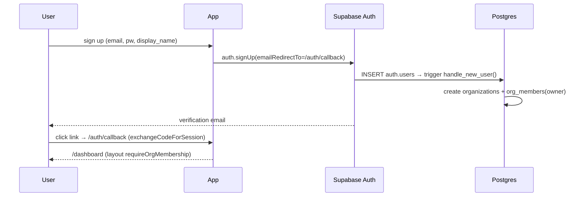
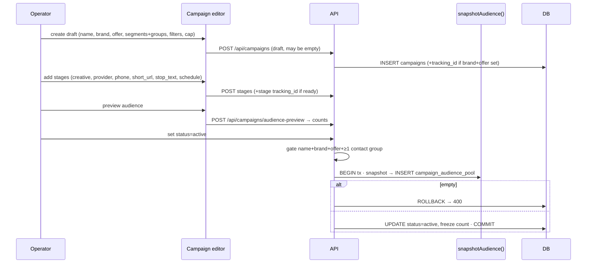
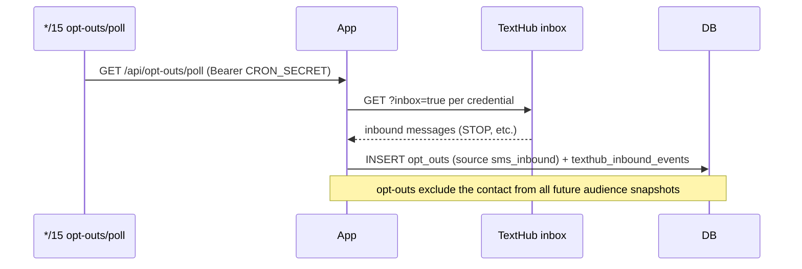

# 05 — End-to-end Flows

_Last updated: 2026-06-16_

Sequence diagrams for the core journeys. File references point at the authoritative code.

## A. Signup → org bootstrap
See [04-features/multi-tenancy-auth.md](04-features/multi-tenancy-auth.md).



## B. Campaign creation → activation (manual mode)



## C. Manual send → results import

```mermaid
sequenceDiagram
  participant Op as Operator
  participant App
  participant Prov as External provider tool
  participant Imp as import route (tx)
  participant DB
  Op->>App: export audience CSV (stage)
  App-->>Op: CSV (phones from frozen pool, live opt-out excluded)
  Op->>Prov: upload + send SMS manually
  Prov-->>Op: results CSV (delivered/failed/optout/clicker/...)
  Op->>App: import CSV (FileDropZone + provider mapping)
  App->>Imp: POST import-preview → sample
  Op->>Imp: POST import
  Imp->>DB: upsert contacts; derive outcomes; propagate opt_outs/clickers; write stage_result_rows; update counters
  Imp-->>Op: summary; revertible from history
```

## D. Tracked send (TextHub) → click attribution

```mermaid
sequenceDiagram
  participant Op as Operator (drain perm)
  participant Kick as kickoffStageSend
  participant Mint as mintLink
  participant Drain as runStageDrain
  participant TH as TextHub
  participant Rec as Recipient
  participant R as /r/[code]
  participant Score as score-pending cron
  Op->>Kick: kickoff stage (tracked, send_approved)
  Kick->>Mint: per recipient → links + link_destinations
  Kick->>Kick: INSERT stage_sends (rendered_text frozen, send_token=id)
  Op->>Drain: drain (SEND_ENABLED + approved + !paused + breakers)
  loop batch
    Drain->>TH: GET send(api_key,text,number)
    TH-->>Drain: {ok,messageId,status}
    Drain->>Drain: mark sent / filtered (status="Suppressed") / failed; ceilings + spike checks
  end
  Rec->>R: GET /r/<code>
  R->>R: first-pass classify (UA/headers)
  R->>R: INSERT clicks; 302 → destination
  Score->>Score: */15 enrich (MaxMind ASN) + bot_score + classification
```

## E. Opt-out (STOP) intake



## F. Segment rule audience resolution
See [04-features/audience-segments.md](04-features/audience-segments.md) — `buildSegmentAudienceClause` compiles rules to UNION/INTERSECT/EXCEPT set arithmetic and UNIONs the result with manual membership.

## G. Keitaro results poll (every 5 min)

```mermaid
sequenceDiagram
  participant Cron as */5 keitaro/poll
  participant Poll as pollKeitaro
  participant K as Keitaro Admin API
  participant DB
  participant CRM as /api/keitaro/results
  Cron->>Poll: GET /api/keitaro/poll (Bearer CRON_SECRET)
  Poll->>K: POST /report/build (3-day ET window, group day+sub_id_3)
  K-->>Poll: rows[{day, sub_id_3, clicks, leads, sales, revenue, epc…}]
  Poll->>DB: resolve sub_id_3 → campaign_stages.tracking_id (stage/campaign/org)
  loop each matched row
    Poll->>DB: UPSERT keitaro_stage_results (org_id, stage_id, stat_date)
  end
  Note over Poll,DB: idempotent (last-write-wins) — re-poll overwrites, never double-counts;<br/>unmatched/blank sub_id_3 counted + sampled, not written
  CRM->>DB: GET results?campaign_id → per-stage + campaign rollup (derived rates)
```

> `sub_id_3` carries the **stage** tracking id, so rows are per-stage; campaign totals = SUM across stages. Per-customer (`sub_id_5`) detail is deferred — no per-recipient id reaches Keitaro yet (see [04-features/keitaro-poll.md](04-features/keitaro-poll.md) §7).
