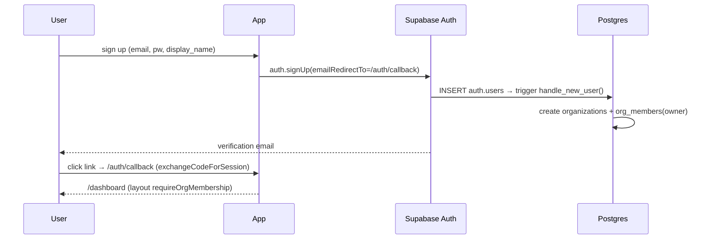
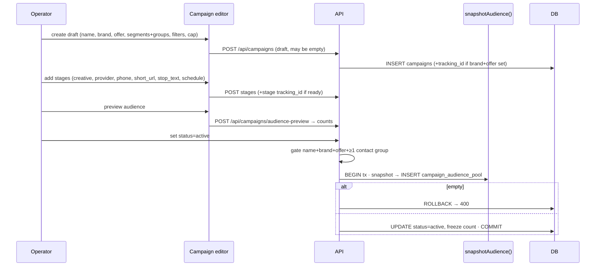
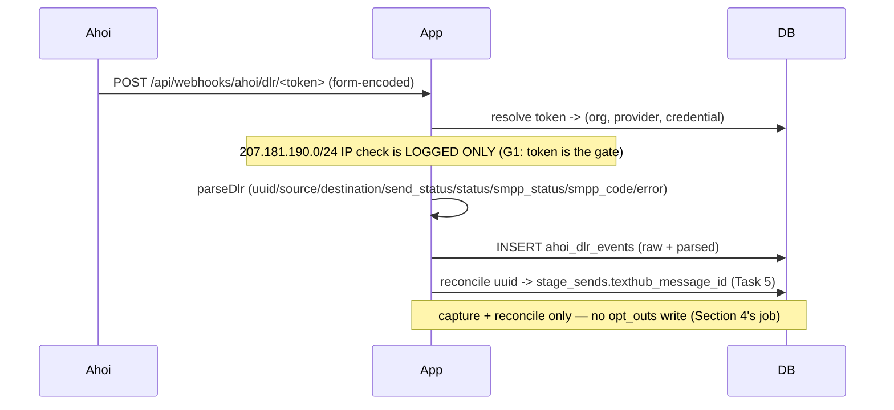
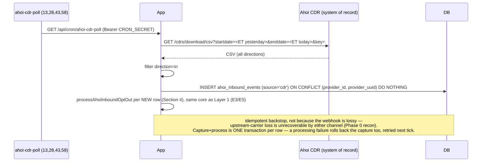
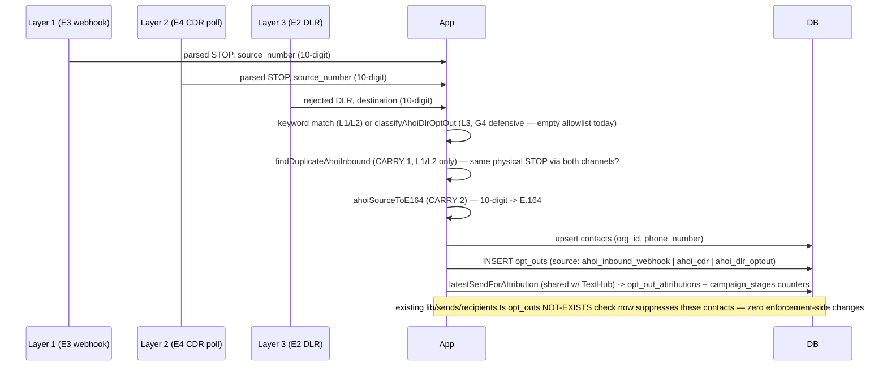

# 05 — End-to-end Flows

_Last updated: 2026-07-16_

Sequence diagrams for the core journeys. File references point at the authoritative code.

## A. Signup → org bootstrap
See [04-features/multi-tenancy-auth.md](04-features/multi-tenancy-auth.md).



## B. Campaign creation → activation (manual mode)



## C. Manual send → results import

```mermaid
sequenceDiagram
  participant Op as Operator
  participant App
  participant Prov as External provider tool
  participant Imp as import route (tx)
  participant DB
  Op->>App: export audience CSV (stage)
  App-->>Op: CSV (phones from frozen pool, live opt-out excluded)
  Op->>Prov: upload + send SMS manually
  Prov-->>Op: results CSV (delivered/failed/optout/clicker/...)
  Op->>App: import CSV (FileDropZone + provider mapping)
  App->>Imp: POST import-preview → sample
  Op->>Imp: POST import
  Imp->>DB: upsert contacts; derive outcomes; propagate opt_outs/clickers; write stage_result_rows; update counters
  Imp-->>Op: summary; revertible from history
```

## D. Tracked send (TextHub) → click attribution

```mermaid
sequenceDiagram
  participant Op as Operator (drain perm)
  participant Kick as kickoffStageSend
  participant Mint as mintLink
  participant Drain as runStageDrain
  participant TH as TextHub
  participant Rec as Recipient
  participant R as /r/[code]
  participant Score as score-pending cron
  Op->>Kick: kickoff stage (tracked, send_approved)
  Kick->>Mint: per recipient → links + link_destinations
  Kick->>Kick: INSERT stage_sends (rendered_text frozen, send_token=id)
  Op->>Drain: drain (SEND_ENABLED + approved + !paused + breakers)
  Drain->>Drain: resolve key: stage.provider_phone_id -> provider_phones.credential_id -> provider_credentials
  Drain->>Drain: decryptCredentialKey (api_key_encrypted else legacy plaintext api_key)
  loop batch
    Drain->>TH: GET send(api_key,text,number)
    TH-->>Drain: {ok,messageId,status}
    Drain->>Drain: mark sent / filtered (status="Suppressed") / failed; ceilings + spike checks
  end
  Rec->>R: GET /r/<code>
  R->>R: first-pass classify (UA/headers)
  R->>R: INSERT clicks; append &sub_id1=<send_token>; 302 → destination
  Score->>Score: */15 enrich (MaxMind ASN) + bot_score + classification
```
> The redirect appends `&sub_id1=<send_token>` (= `stage_sends.id`) to the shared destination so a later Keitaro sale attributes back to this recipient (flow H). The operator's stage Full URL is never touched.

> **Key resolution is number → account → key (migration 0110).** A stage with no `provider_phone_id` falls back to the legacy `(provider, brand)`/default lookup, but only while the provider has exactly ONE credential — once a provider has ≥2 accounts a numberless stage refuses (`no_credentials`) rather than guessing. The key is decrypted at this point only (AES-256-GCM `api_key_encrypted`, dual-read against legacy plaintext `api_key`) — never earlier, never returned by any list/GET response. See [07-conventions.md](07-conventions.md).

## E. Opt-out (STOP) intake

```mermaid
sequenceDiagram
  participant Cron as */15 opt-outs/poll
  participant App
  participant TH as TextHub inbox
  participant DB
  Cron->>App: GET /api/opt-outs/poll (Bearer CRON_SECRET)
  App->>TH: GET ?inbox=true per credential
  TH-->>App: inbound messages (STOP, etc.) — phone + body + received_at only
  App->>DB: INSERT opt_outs (source sms_inbound, org-wide) + texthub_inbound_events
  App->>DB: match stage_sends by phone, sent within 72h of received_at
  DB-->>App: every stage that sent to the number in the window
  App->>DB: INSERT opt_out_attributions (1/stage) + bump campaign_stages.inbound_opt_out_count
  Note over App,DB: org-wide opt-out excludes the contact from all future snapshots;<br/>attribution is additive analytics (Reports + campaign "Inbound STOPs"), never a gate
```

Attribution rule (migration 0075): TextHub's inbox has no campaign reference, so a STOP is credited to **every** stage that sent to the number within a 72h trailing window (`OPT_OUT_ATTRIBUTION_WINDOW_HOURS`). One `opt_out_attributions` row per (opt_out, stage); the per-stage `inbound_opt_out_count` counter drives the Reports "Opt-outs" column, and the campaign page shows DISTINCT attributed contacts. No match ⇒ org-wide opt-out only. See [lib/sends/poll-opt-outs.ts](../lib/sends/poll-opt-outs.ts).

## E2. Ahoi DLR (delivery receipt) capture



## E3. Ahoi inbound (STOP-carrying) webhook capture

```mermaid
sequenceDiagram
  participant Ahoi
  participant App
  participant DB
  Ahoi->>App: POST /api/webhooks/ahoi/inbound/<token> (form-encoded)
  App->>DB: resolve token -> (org, provider, credential) — same token as the DLR webhook
  App->>App: parseInbound (source/destination/message/type/cost)
  App->>DB: INSERT ahoi_inbound_events (source='webhook')
  App->>App: processAhoiInboundOptOut (Section 4): keyword match, dedup vs CDR (CARRY 1), contact upsert, opt_outs write
  Note over App,DB: capture ALWAYS commits + always 200-acks Ahoi; a process failure fires a LOUD Telegram alert (never silent) and the CDR poll (Layer 2, ≤45min) re-runs it
```

## E4. Ahoi CDR poll (every 15 min, inbound backstop)



## E5. Ahoi opt-out intake — 3 layers converge on `opt_outs`



Layer 3 ships with an intentionally EMPTY known-opt-out-code allowlist (`AHOI_KNOWN_OPTOUT_DLR_CODES`, `lib/sends/ahoi-dlr-optout.ts`) — no real Ahoi opt-out DLR signature has been observed live (O1). It is fully wired and tested but will not classify anything as an opt-out in production until a human adds a real code after seeing one in the `[ahoi-dlr-optout]` distinct-log lines. See [07-conventions.md](07-conventions.md).

## F. Segment rule audience resolution
See [04-features/audience-segments.md](04-features/audience-segments.md) — `buildSegmentAudienceClause` compiles rules to UNION/INTERSECT/EXCEPT set arithmetic and UNIONs the result with manual membership.

## G. Keitaro results poll (every 5 min)

```mermaid
sequenceDiagram
  participant Cron as */5 keitaro/poll
  participant Poll as pollKeitaro
  participant K as Keitaro Admin API
  participant DB
  participant CRM as /api/keitaro/results
  Cron->>Poll: GET /api/keitaro/poll (Bearer CRON_SECRET)
  Poll->>K: POST /report/build (3-day ET window, group day+sub_id_3)
  K-->>Poll: rows[{day, sub_id_3, clicks, leads, sales, revenue, epc…}]
  Poll->>DB: resolve sub_id_3 → campaign_stages.tracking_id (stage/campaign/org)
  loop each matched row
    Poll->>DB: UPSERT keitaro_stage_results (org_id, stage_id, stat_date)
  end
  Note over Poll,DB: idempotent (last-write-wins) — re-poll overwrites, never double-counts;<br/>unmatched/blank sub_id_3 counted + sampled, not written
  CRM->>DB: GET results?campaign_id → per-stage + campaign rollup (derived rates)
```

> `sub_id_3` carries the **stage** tracking id, so rows are per-stage; campaign totals = SUM across stages. Per-recipient SALE detail is a **separate** poll keyed on `sub_id_1` (flow H).

## H. Keitaro conversions poll → per-recipient sale (every 15 min)

```mermaid
sequenceDiagram
  participant Cron as */15 keitaro/poll-conversions
  participant Poll as pollKeitaroConversions
  participant K as Keitaro Admin API
  participant DB
  Cron->>Poll: GET /api/keitaro/poll-conversions (Bearer CRON_SECRET)
  Poll->>K: POST /conversions/log (7-day ET window, columns incl. sub_id_1, event_id, revenue)
  K-->>Poll: rows[{event_id, sub_id_1, status, revenue, datetime…}]
  Poll->>Poll: fold latest conversion per sub_id_1 (in-memory, by datetime)
  Poll->>DB: SELECT stage_sends WHERE id IN (sub_id_1…) — resolve matched + current event_id
  loop each matched recipient (event_id changed)
    Poll->>DB: UPDATE stage_sends SET sale_status, sale_revenue, converted_at, keitaro_conversion_id
  end
  Note over Poll,DB: dedup on event_id (skip unchanged) + latest-wins ⇒ idempotent;<br/>blank/non-UUID sub_id_1 counted unmatched (clicks predating the sub_id1 rollout)
```

> `sub_id_1` = the recipient's `stage_sends.id` (injected at redirect time, flow D). One sale per recipient, **latest wins** (not cumulative). The **Sale** badge on the Activity → Messages list reads `sale_status`/`sale_revenue`. See [04-features/keitaro-poll.md](04-features/keitaro-poll.md) §8.

## I. Keitaro offer-reach poll → per-recipient offer-page reach (every 15 min, engagement Level 2)

```mermaid
sequenceDiagram
  participant Cron as */15 keitaro/poll-offer-reaches
  participant Poll as pollKeitaroOfferReaches
  participant K as Keitaro Admin API
  participant DB
  Cron->>Poll: GET /api/keitaro/poll-offer-reaches (Bearer CRON_SECRET)
  Poll->>K: POST /clicks/log (7-day ET window, sub_id_1 NOT_EQUAL "", columns incl. event_id, campaign)
  K-->>Poll: rows[{event_id, sub_id_1, campaign, campaign_id, datetime}]
  Poll->>Poll: drop campaign="gk-lp-visits" (landing/L1); fold earliest offer click per sub_id_1
  Poll->>DB: SELECT stage_sends WHERE id IN (sub_id_1…) — resolve matched + current offer_reach_event_id
  loop each matched recipient (not yet reached)
    Poll->>DB: UPDATE stage_sends SET offer_reached_at, offer_reach_event_id WHERE offer_reached_at IS NULL
  end
  Note over Poll,DB: reach is monotonic — already-stamped rows skipped (dedup on event_id);<br/>landing (gk-lp-visits) clicks are Level 1, never stamped here
```

> Same id chain as sales (`sub_id_1` = `stage_sends.id`), but the SOURCE is clicks, classified by campaign name: `gk-lp-visits` ⇒ landing (Level 1, dropped); any other ⇒ offer (Level 2). The `reached_offer*` segment rules read `offer_reached_at`. "Reached but didn't buy" = `reached_offer` is + `made_purchase` is_not. See [04-features/keitaro-poll.md](04-features/keitaro-poll.md) §8b.
