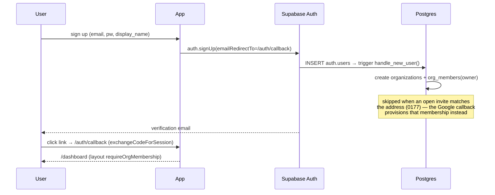
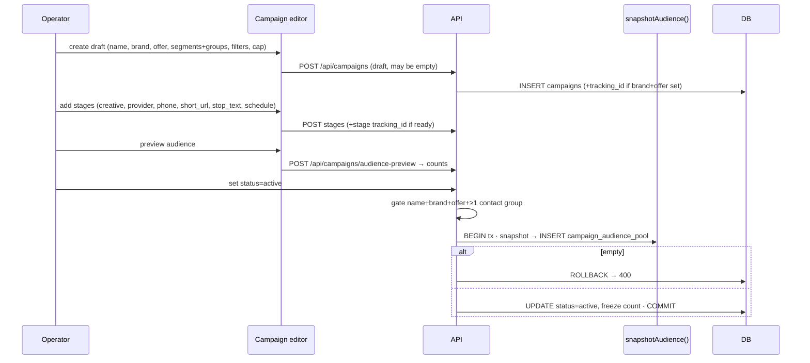
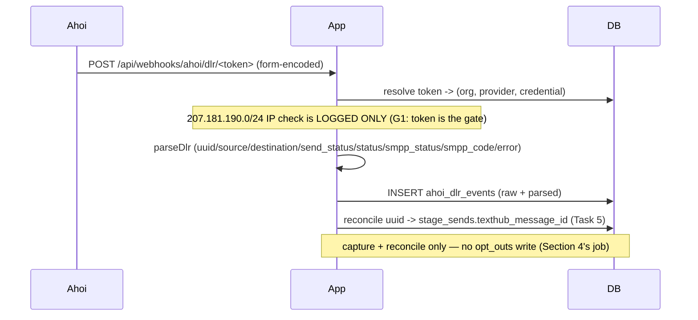
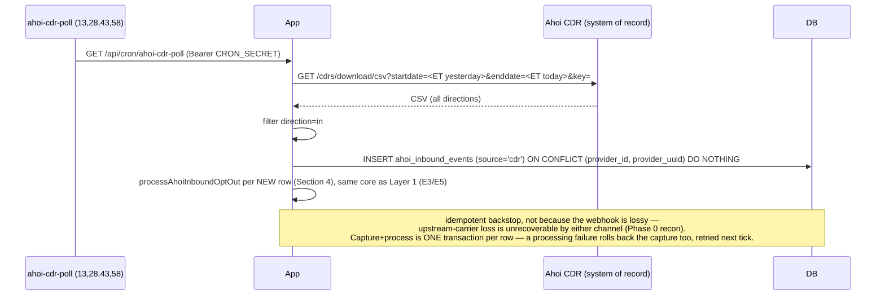
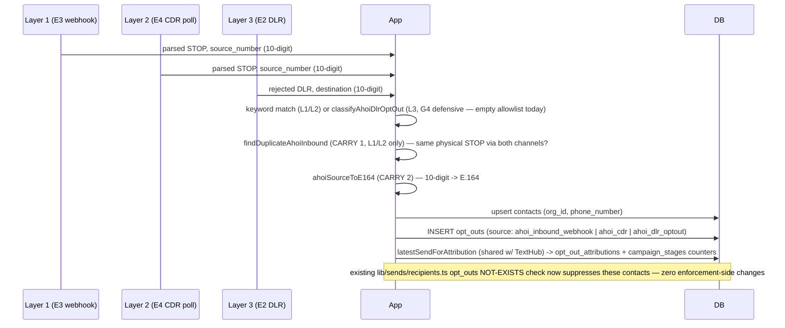
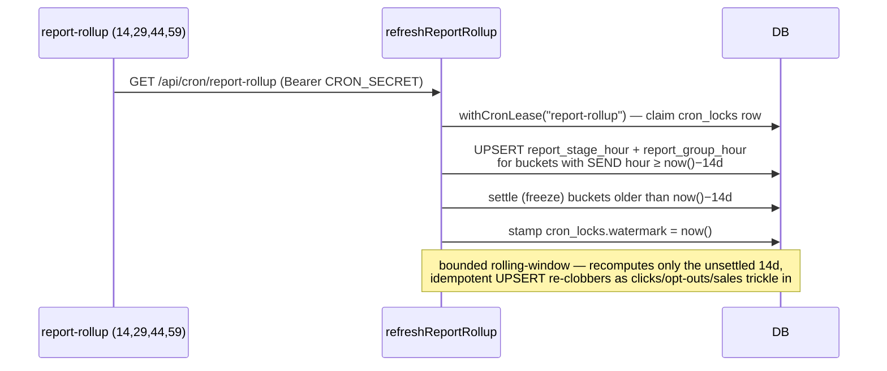
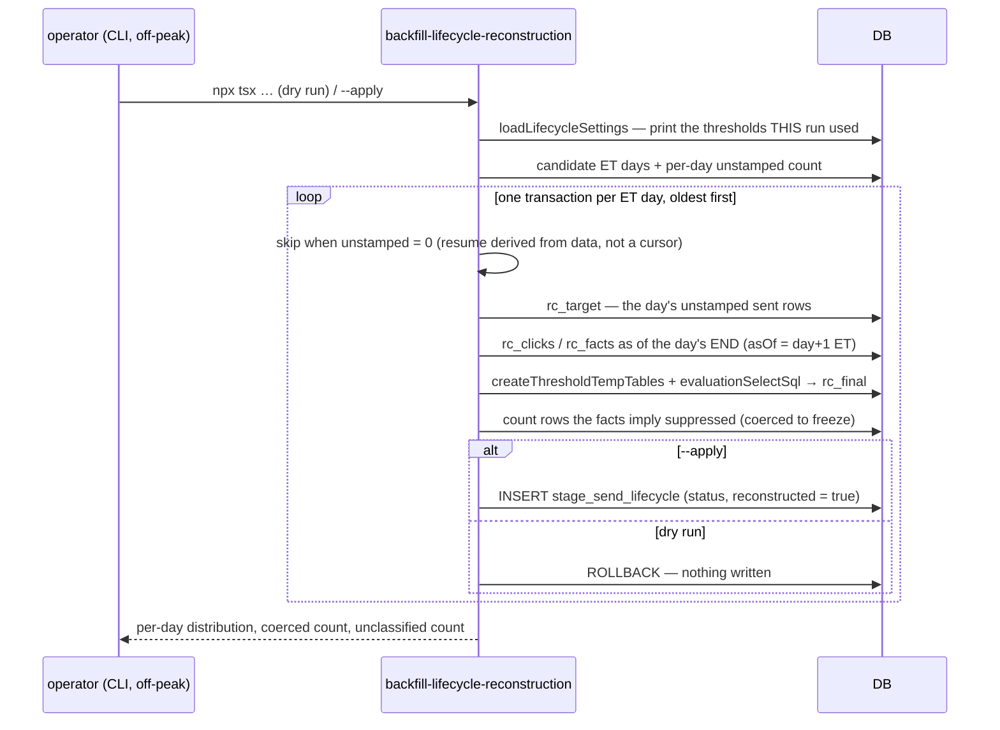

# 05 — End-to-end Flows

_Last updated: 2026-10-06_

Sequence diagrams for the core journeys. File references point at the authoritative code.

## A. Signup → org bootstrap
See [04-features/multi-tenancy-auth.md](04-features/multi-tenancy-auth.md).

```mermaid
sequenceDiagram
  participant U as User
  participant App
  participant SB as Supabase Auth
  participant DB as Postgres
  U->>App: sign up (email, pw, display_name)
  App->>SB: auth.signUp(emailRedirectTo=/auth/callback)
  SB->>DB: INSERT auth.users → trigger handle_new_user()
  DB->>DB: create organizations + org_members(owner)
  Note over DB: skipped when an open invite matches<br/>the address (0177) — the Google callback<br/>provisions that membership instead
  SB-->>U: verification email
  U->>App: click link → /auth/callback (exchangeCodeForSession)
  App-->>U: /dashboard (layout requireOrgMembership)
```

## B. Campaign creation → activation (manual mode)

```mermaid
sequenceDiagram
  participant Op as Operator
  participant Ed as Campaign editor
  participant API
  participant Snap as snapshotAudience()
  participant DB
  Op->>Ed: create draft (name, brand, offer, segments+groups, filters, cap)
  Ed->>API: POST /api/campaigns (draft, may be empty)
  API->>DB: INSERT campaigns (+tracking_id if brand+offer set)
  Op->>Ed: add stages (creative, provider, phone, short_url, stop_text, schedule)
  Ed->>API: POST stages (+stage tracking_id if ready)
  Op->>Ed: preview audience
  Ed->>API: POST /api/campaigns/audience-preview → counts
  Op->>API: set status=active
  API->>API: gate name+brand+offer+≥1 contact group
  API->>Snap: BEGIN tx · snapshot → INSERT campaign_audience_pool
  alt empty
    API->>DB: ROLLBACK → 400
  else
    API->>DB: UPDATE status=active, freeze count · COMMIT
  end
```

## C. Manual send → results import

```mermaid
sequenceDiagram
  participant Op as Operator
  participant App
  participant Prov as External provider tool
  participant Imp as import route (tx)
  participant DB
  Op->>App: export audience CSV (stage)
  App-->>Op: CSV (phones from frozen pool, live opt-out excluded)
  Op->>Prov: upload + send SMS manually
  Prov-->>Op: results CSV (delivered/failed/optout/clicker/...)
  Op->>App: import CSV (FileDropZone + provider mapping)
  App->>Imp: POST import-preview → sample
  Op->>Imp: POST import
  Imp->>DB: upsert contacts; derive outcomes; propagate opt_outs/clickers; write stage_result_rows; update counters
  Imp-->>Op: summary; revertible from history
```

## D. Tracked send (TextHub) → click attribution

```mermaid
sequenceDiagram
  participant Op as Operator (drain perm)
  participant Kick as kickoffStageSend
  participant Mint as mintLink
  participant Drain as runStageDrain
  participant TH as TextHub
  participant Rec as Recipient
  participant R as /r/[code]
  participant Score as score-pending cron
  Op->>Kick: kickoff stage (tracked, send_approved)
  Kick->>Mint: per recipient → links + link_destinations
  Kick->>Kick: EXCEPT eligibility layers, in EXCLUSION_PRIORITY order<br/>(lifecycle campaign: suppressed, bought_offer, freeze_not_due; then creative, in_flight, offer)
  Kick->>Kick: INSERT stage_sends + stage_send_lifecycle in ONE statement<br/>(rendered_text frozen, send_token=id; status-at-send stamped from contact_engagement)
  Kick->>Kick: last window landed: stamp materialized_at + status draft→pending (skipped if status_set_manually)
  Op->>Drain: drain (SEND_ENABLED + approved + !paused + breakers)
  Drain->>Drain: resolve key: stage.provider_phone_id -> provider_phones.credential_id -> provider_credentials
  Drain->>Drain: decryptCredentialKey (api_key_encrypted else legacy plaintext api_key)
  loop batch
    Drain->>TH: GET send(api_key,text,number)
    TH-->>Drain: {ok,messageId,status}
    Drain->>Drain: re-check lifecycle eligibility (lifecycle campaigns only)<br/>suppressed / bought_offer / freeze_not_due — freeze reads stage_sends LIVE, not contact_engagement<br/>losers → skipped_ineligible + reason in last_error; FAILS OPEN (counted, never halts the batch)
  Drain->>Drain: mark sent / filtered (status="Suppressed") / failed; ceilings + spike checks
  end
  Rec->>R: GET /r/<code>
  R->>R: first-pass classify (UA/headers)
  R->>R: INSERT clicks; append &sub_id1=<send_token>; 302 → destination
  Score->>Score: */15 enrich (MaxMind ASN) + bot_score + classification
```
> The redirect appends `&sub_id1=<send_token>` (= `stage_sends.id`) to the shared destination so a later Keitaro sale attributes back to this recipient (flow H). The operator's stage Full URL is never touched.

> **Key resolution is number → account → key (migration 0110).** A stage with no `provider_phone_id` falls back to the legacy `(provider, brand)`/default lookup, but only while the provider has exactly ONE credential — once a provider has ≥2 accounts a numberless stage refuses (`no_credentials`) rather than guessing. The key is decrypted at this point only (AES-256-GCM `api_key_encrypted`, dual-read against legacy plaintext `api_key`) — never earlier, never returned by any list/GET response. See [07-conventions.md](07-conventions.md).

## D2. Behavioural split group — recompute, materialize, release (0174)

```mermaid
sequenceDiagram
  participant Op as Operator
  participant API as POST /campaigns/[id]/behavioral-split
  participant Pre as send-preflight cron (*/5, T-15min)
  participant PhA as send-scheduled Phase A
  participant PhB as send-scheduled Phase B
  participant TG as Telegram
  Op->>API: split (gated on >=1 COMPLETED stage)
  API->>API: INSERT split group (state=pending, source_stage_ids EMPTY)
  API->>API: INSERT the SELECTED lanes (tiers 0/1/2/3, parent=anchor, split_group_id)
  Note over API: the source set is NOT frozen here -- a stage finishing<br/>before the recompute must still be included
  Pre->>Pre: ensureGroupSourceResolved (guarded on state='pending')
  Pre->>Pre: resolve COMPLETED stages -> source_stage_ids, recomputed_at
  Pre->>Pre: state pending -> materializing
  alt no completed source stages
    Pre->>TG: Tier-1 "split FAILED" ; state -> failed
  end
  loop each lane, independently (windowed + resumable)
    PhA->>PhA: ensureGroupSourceResolved (lazy backstop)
    PhA->>PhA: kickoffStageSend with sourceStageIds
    alt 0 recipients
      PhA->>PhA: skipped_empty_at (terminal, benign) ; SATISFIES the group
      PhA->>TG: Tier-3 informational note
    else permanent refusal
      PhA->>PhA: schedule_missed_at ; group -> failed
      PhA->>TG: Tier-1 "no lane will send"
    end
    PhA->>PhA: settleSplitGroup (flips when NO lane is outstanding)
  end
  PhB->>PhB: drain ONLY if the whole group is 'materialized'
```
> **All-or-nothing at the RELEASE boundary, not the insert boundary.** Lanes
> materialize independently and resumably; Phase B is what refuses to let any lane
> send until every sibling is done. A one-transaction trio was measured at ~30-65s
> for the largest real trio and would have discarded resumability.

> **A failed group keeps its already-materialized rows, unreleased.** Rolling them
> back would be a second failure mode with nothing to gain — the abort route
> (`.../send/abort`) is how an operator clears them.

> **The lane set is the operator's SELECTION, not a fixed trio.** The picker
> offers every tier in `LANE_TIER_VALUES` ([`lib/campaign-tier.ts`](../lib/campaign-tier.ts));
> `DEFAULT_LANE_TIERS` is `[1, 2]` (Clicked + Reached offer), so tier 0 (Ignored)
> and tier 3 (**Registered**, migration 0184) are offered **unticked** and a
> campaign only gets those lanes when someone asks for one. Tier 4 (**purchased**)
> exits the sequence: it is refused by the route validator (`400
> invalid_lane_tier`) and by the `campaign_stages_behavioral_lane_check` CHECK, so
> it cannot be inserted at all. ⚠️ A lane matches on the contact's **exact** tier,
> and the tier is computed the same way whether or not a Registered lane exists —
> so a registrant reads 3, is therefore NOT in the Reached-offer lane, and with
> Registered unticked lands in **no lane at all** and receives nothing at that
> position. Ticking it is what gives them a message, not what removes them from
> somewhere else. See [behavioral-lanes.md](04-features/behavioral-lanes.md).

## E. Opt-out (STOP) intake

```mermaid
sequenceDiagram
  participant Cron as */5 opt-outs/poll
  participant App
  participant TH as TextHub inbox
  participant DB
  Cron->>App: GET /api/opt-outs/poll (Bearer CRON_SECRET)
  App->>TH: GET ?inbox=true per credential
  TH-->>App: inbound messages (STOP, etc.) — phone + body + received_at only
  App->>DB: INSERT opt_outs (source sms_inbound, org-wide) + texthub_inbound_events
  App->>DB: match stage_sends by phone, sent within 72h of received_at
  DB-->>App: every stage that sent to the number in the window
  App->>DB: INSERT opt_out_attributions (1/stage) + bump campaign_stages.inbound_opt_out_count
  Note over App,DB: org-wide opt-out excludes the contact from all future snapshots;<br/>attribution is additive analytics (Reports + campaign "Inbound STOPs"), never a gate
  App->>DB: checkOptOutRateBreaker(ATTRIBUTED STAGE) — 2 queries, 24h + 2h in one FILTER pass
  Note over App,DB: numerator JOINs stage_sends ON id = stage_send_id ⇒ BOTH sides<br/>bucket by sent_at (one aligned send cohort, never STOP receipt time)
  DB-->>App: sent{24h,2h} + aligned opt_outs{24h,2h}
  App->>DB: breach ⇒ UPDATE campaigns SET send_paused (SAME tx) + campaign_circuit_events
  App-->>App: post-commit: Telegram alert (rate, counts, stage, campaign link)
```

**Breaker step (P7/P8, cohort re-cut 2026-07-26).** The rate is judged on the **attributed stage** and the latch applied to its **campaign**. Both counts bucket by `stage_sends.sent_at`, so the metric is "of what this stage sent in the window, what fraction has STOPped so far" — bucketing the numerator by `oa.created_at` makes it unbounded and auto-paused four campaigns on false signals (see [the diagnostic](optout-rate-breaker-false-trip-2026-07-25.md)). A long (24h @ 10%) and a short (2h @ 8%) window are evaluated from the same pair of queries; either can latch. Attributions with a NULL `stage_send_id` are excluded, and the hourly Telegram cron alerts if that share exceeds 5%.

Attribution rule (migration 0075): TextHub's inbox has no campaign reference, so a STOP is credited to **every** stage that sent to the number within a 72h trailing window (`OPT_OUT_ATTRIBUTION_WINDOW_HOURS`). One `opt_out_attributions` row per (opt_out, stage); the per-stage `inbound_opt_out_count` counter drives the Reports "Opt-outs" column, and the campaign page shows DISTINCT attributed contacts. No match ⇒ org-wide opt-out only. See [lib/sends/poll-opt-outs.ts](../lib/sends/poll-opt-outs.ts).

## E2. Ahoi DLR (delivery receipt) capture

```mermaid
sequenceDiagram
  participant Ahoi
  participant App
  participant DB
  Ahoi->>App: POST /api/webhooks/ahoi/dlr/<token> (form-encoded)
  App->>DB: resolve token -> (org, provider, credential)
  Note over App: 207.181.190.0/24 IP check is LOGGED ONLY (G1: token is the gate)
  App->>App: parseDlr (uuid/source/destination/send_status/status/smpp_status/smpp_code/error)
  App->>DB: INSERT ahoi_dlr_events (raw + parsed)
  App->>DB: reconcile uuid -> stage_sends.texthub_message_id (Task 5)
  Note over App,DB: capture + reconcile only — no opt_outs write (Section 4's job)
```

## E3. Ahoi inbound (STOP-carrying) webhook capture

```mermaid
sequenceDiagram
  participant Ahoi
  participant App
  participant DB
  Ahoi->>App: POST /api/webhooks/ahoi/inbound/<token> (form-encoded)
  App->>DB: resolve token -> (org, provider, credential) — same token as the DLR webhook
  App->>App: parseInbound (source/destination/message/type/cost)
  App->>DB: INSERT ahoi_inbound_events (source='webhook')
  App->>App: processAhoiInboundOptOut (Section 4): keyword match, dedup vs CDR (CARRY 1), contact upsert, opt_outs write
  Note over App,DB: capture ALWAYS commits + always 200-acks Ahoi; a process failure fires a LOUD Telegram alert (never silent) and the CDR poll (Layer 2, ≤45min) re-runs it
```

## E4. Ahoi CDR poll (every 15 min, inbound backstop)

```mermaid
sequenceDiagram
  participant Cron as ahoi-cdr-poll (13,28,43,58)
  participant App
  participant Ahoi as Ahoi CDR (system of record)
  participant DB
  Cron->>App: GET /api/cron/ahoi-cdr-poll (Bearer CRON_SECRET)
  App->>Ahoi: GET /cdrs/download/csv?startdate=<ET yesterday>&enddate=<ET today>&key=
  Ahoi-->>App: CSV (all directions)
  App->>App: filter direction=in
  App->>DB: INSERT ahoi_inbound_events (source='cdr') ON CONFLICT (provider_id, provider_uuid) DO NOTHING
  App->>App: processAhoiInboundOptOut per NEW row (Section 4), same core as Layer 1 (E3/E5)
  Note over App,DB: idempotent backstop, not because the webhook is lossy —<br/>upstream-carrier loss is unrecoverable by either channel (Phase 0 recon).<br/>Capture+process is ONE transaction per row — a processing failure rolls back the capture too, retried next tick.
```

## E5. Ahoi opt-out intake — 3 layers converge on `opt_outs`

```mermaid
sequenceDiagram
  participant L1 as Layer 1 (E3 webhook)
  participant L2 as Layer 2 (E4 CDR poll)
  participant L3 as Layer 3 (E2 DLR)
  participant App
  participant DB
  L1->>App: parsed STOP, source_number (10-digit)
  L2->>App: parsed STOP, source_number (10-digit)
  L3->>App: rejected DLR, destination (10-digit)
  App->>App: keyword match (L1/L2) or classifyAhoiDlrOptOut (L3, G4 defensive — empty allowlist today)
  App->>App: findDuplicateAhoiInbound (CARRY 1, L1/L2 only) — same physical STOP via both channels?
  App->>App: ahoiSourceToE164 (CARRY 2) — 10-digit -> E.164
  App->>DB: upsert contacts (org_id, phone_number)
  App->>DB: INSERT opt_outs (source: ahoi_inbound_webhook | ahoi_cdr | ahoi_dlr_optout)
  App->>DB: latestSendForAttribution (shared w/ TextHub) -> opt_out_attributions + campaign_stages counters
  Note over App,DB: existing lib/sends/recipients.ts opt_outs NOT-EXISTS check now suppresses these contacts — zero enforcement-side changes
```

Layer 3 ships with an intentionally EMPTY known-opt-out-code allowlist (`AHOI_KNOWN_OPTOUT_DLR_CODES`, `lib/sends/ahoi-dlr-optout.ts`) — no real Ahoi opt-out DLR signature has been observed live (O1). It is fully wired and tested but will not classify anything as an opt-out in production until a human adds a real code after seeing one in the `[ahoi-dlr-optout]` distinct-log lines. See [07-conventions.md](07-conventions.md).

## E6. Text Request delivery status — per-message callback + poll backstop

```mermaid
sequenceDiagram
  participant Drain as Send drain
  participant TR as Text Request
  participant Hook as /api/webhooks/textrequest/status/[token]?ss=
  participant Cron as /api/cron/textrequest-poll (4,19,34,49)
  participant DB
  Drain->>TR: POST /messages {from,to,body,status_callback=…/status/<token>?ss=<stage_send_id>}
  TR-->>Drain: {message_id, status:"sending", segments_count}
  Drain->>DB: stage_sends.texthub_message_id = message_id · send_attempts.segments_count
  TR->>Hook: POST {message_id, status, errorCode}
  Hook->>DB: INSERT textrequest_dlr_events (method='POST')
  Hook->>DB: reconcile — ?ss= DIRECTLY (else message_id -> stage_sends.texthub_message_id)
  Hook->>Hook: errorCode 2100 ⇒ opt-out (E7 signal 4a)
  Hook-->>TR: 200 ALWAYS (a non-2XX counts toward TR's 10-strike hook disconnect)
  Note over Drain,Hook: no inbound_webhook_token or no origin ⇒ NO status_callback is requested at all; the poll is then the only reconciler
  Cron->>DB: stamp textrequest-poll:started (previous run never finished ⇒ Telegram "did not finish", once per streak)
  Cron->>TR: inbound walks, every dashboard (message_direction=R) — unbudgeted, per-row opt-out processing (E7)
  Cron->>TR: contacts poll · webhook health (before outbound, so a slow outbound walk can't skip them)
  Cron->>DB: read pass stamps + owed ranges (cron_locks textrequest-poll:pass|gap-from|gap-to:*)
  loop each dashboard — oldest complete pass first — equal share of the time left before 45 s
    Cron->>TR: GET /dashboards/{id}/messages (S, sort=desc, page_size 1000): owed range first, then the 6 h window
    Cron->>DB: ONE INSERT…SELECT per page (method='poll') ON CONFLICT (provider_id,message_id,status) DO NOTHING, matched via texthub_message_id
    Cron->>DB: walk stopped (time, page cap, failed page or write) ⇒ owed range = [start, oldest read + 1 s]; all read ⇒ pass stamp, owed range cleared
  end
  Cron->>DB: pass-age check (outbound > 4 runs, inbound > 2 runs ⇒ Telegram once per streak) · stamp textrequest-poll:finished
  Note over Cron,DB: tells-monitors (hourly) also watches textrequest-poll:finished (45 min) for a cron that stops firing
```

## E7. Text Request opt-out intake — 4 signals converge on `opt_outs`

```mermaid
sequenceDiagram
  participant S1 as 1. msg_received hook (real-time STOP)
  participant S2 as 2. contact_updated hook (TR's own opt-out flag)
  participant S3 as 3. polls (messages R rows / contacts has_opted_out)
  participant S4 as 4. errorCode 2100 (DLR) / 30050 (send reject)
  participant App as processTextrequestOptOut
  participant DB
  S1->>App: conversation.consumerPhoneNumber + conversation.message (direction 'R' only)
  S2->>App: phone_number + opted_out_utc / is_suppressed
  S3->>App: same facts, polled (backstop for a disconnected hook)
  S4->>App: recipient resolved from the reconciled stage_send (DLR body has no phone)
  App->>App: message-shaped ⇒ isOptOutKeyword gate · state-shaped ⇒ authoritative, acts ONCE per number
  App->>App: capture idempotency: UNIQUE(provider_id, provider_uuid) — webhook + poll share TR's message GUID
  App->>App: findDuplicateTxrInbound (45-min window) — cross-SHAPE duplicates (STOP vs contact flag)
  App->>DB: upsert contacts · INSERT opt_outs (source: textrequest_inbound_webhook | _messages_poll | _contact_webhook | _contacts_poll | _dlr_optout | _send_reject)
  App->>DB: cascade-cancel pending stage_sends -> skipped_opted_out / opt_out_cancel
  App->>DB: latestSendForAttribution -> opt_out_attributions + campaign_stages counters + recomputeStageTotalCost
  App->>DB: checkOptOutRateBreaker (latch in-tx; Telegram post-commit)
```

Unlike Ahoi's Layer 3, Text Request's opt-out error codes are **documented and live from day one** (2100 on a delivery status, 30050 on a send response). A hit means our suppression list is behind Text Request's. An UNMATCHED 2100 DLR carries no recipient (the body is only `{message_id,status,errorCode}`) and is logged rather than guessed at — the contacts poll is the backstop for that number.

## E8. Tells webhook intake — persist-first capture (DLR + inbound)

```mermaid
sequenceDiagram
  participant T as Tells
  participant R as /api/webhooks/tells/{dlr|inbound}/[token]
  participant DB
  participant Sw as /api/cron/tells-sweep (*/5, offset :2)
  T->>R: POST JSON
  R->>R: read body ONCE as text (the evidence)
  R->>DB: resolveTellsCredential(token) scoped to sms_provider_id='tls'
  alt token does not resolve
    R->>R: Tells-shaped body? console.error + Telegram (the event's LAST copy) : silent console.warn
    R-->>T: 401
  end
  opt inbound only (F1 second factor)
    R->>DB: resolveCredentialKeyById -> stored api_key
    R->>R: safeEqual(payload Key, stored key); mismatch ⇒ 401 + alert, nothing persisted
    R->>R: ⚠️ §4.6 redactTellsKeyFromBody — the live API key NEVER reaches raw_body
  end
  R->>R: guarded extraction (~8 fields, try/catch ⇒ NULLs) + dedup_key
  R->>DB: ONE committed INSERT (ON CONFLICT DO UPDATE bumps duplicate_count ONLY)
  alt INSERT fails
    R->>R: console.error + Telegram with the payload (last copy)
    R-->>T: 500 — never ack what was not stored
  end
  R->>DB: best-effort inline processing (reconcile / suppress) — cannot fail the request
  R-->>T: 200
  Note over DB,Sw: processed_at IS NULL is the work queue
  Sw->>DB: drain oldest-first, ≤200/tick, ≤10 attempts, then alert on stuck rows
```

The inline attempt is free precisely because the row is already committed: even if processing blows past Tells's 12-second timeout, the event is ours and we never needed their ack. **Tells has no poll and no reconciliation API**, so this sweeper is the only recovery path — which is why neither Ahoi nor Text Request has an equivalent.

## E9. Tells opt-out intake — ONE signal, and it is the only automated STOP path

```mermaid
sequenceDiagram
  participant T as Tells inbound webhook (the ONLY channel)
  participant App as processTellsOptOut
  participant DB
  T->>App: From (contact) + Body, from the committed event row
  App->>App: isOptOutKeyword(Body) — the SHARED gate (first token, uppercased, non-letters stripped)
  Note over App: no match ⇒ result='ignored', stored forever, nothing downstream reads it
  App->>App: tellsPhoneToE164(From) — null ⇒ 'invalid_phone', never a guessed number
  App->>App: findDuplicateTellsInbound (45-min window, same number + same text)
  App->>DB: upsert contacts (a STOP must stick for a non-contact number)
  App->>DB: INSERT opt_outs (source 'tells_inbound_webhook', created_at = ORIGINAL receipt time)
  App->>DB: cascade-cancel pending stage_sends -> skipped_opted_out / opt_out_cancel
  App->>DB: latestSendForAttribution -> opt_out_attributions + stage counters + recomputeStageTotalCost
  App->>DB: checkOptOutRateBreaker (latch in-tx; Telegram post-commit)
  App->>DB: stamp result='suppressed' + processed_at
```

**Suppression is org-wide and unconditional; attribution is best-effort.** If `latestSendForAttribution` returns null the contact is still suppressed — the opt-out simply isn't credited to a stage. Losing attribution is a reporting gap; losing suppression would be a compliance breach, and the two are deliberately not coupled.

Unlike Text Request's four signals, Tells has exactly **one**: no state-shaped "contact is opted out" flag, no poll, no opt-out error code on a DLR. Combined with STOP-undelivered self-healing being closed as won't-build (spec §8), **this webhook is the entire automated STOP surface** — which is what makes the Phase 4 silence monitors compliance infrastructure rather than observability polish.

## F. Segment rule audience resolution
See [04-features/audience-segments.md](04-features/audience-segments.md) — `buildSegmentAudienceClause` compiles rules to UNION/INTERSECT/EXCEPT set arithmetic and UNIONs the result with manual membership.

## G. Keitaro results poll (every 5 min)

```mermaid
sequenceDiagram
  participant Cron as */5 keitaro/poll
  participant Poll as pollKeitaro
  participant Ledger as ingestKeitaroConversions
  participant K as Keitaro Admin API
  participant DB
  participant TG as Telegram
  participant CRM as /api/keitaro/results
  Cron->>Poll: GET /api/keitaro/poll (Bearer CRON_SECRET)
  Poll->>K: POST /report/build (3-day ET window, group day+sub_id_3)
  K-->>Poll: rows[{day, sub_id_3, clicks, leads, sales, revenue, epc…}]
  Poll->>DB: resolve sub_id_3 → campaign_stages.tracking_id (stage/campaign/org)
  loop each matched row
    Poll->>DB: UPSERT keitaro_stage_results (org_id, stage_id, stat_date)
  end
  Note over Poll,DB: idempotent (last-write-wins) — re-poll overwrites, never double-counts;<br/>unmatched/blank sub_id_3 counted + sampled, not written
  Cron->>Ledger: then the conversion ledger (rolling 7-day ET window, own try/catch)
  Ledger->>K: POST /conversions/log (all conversion types, refused if malformed or truncated)
  K-->>Ledger: rows[{event_id, tid, sub_id_1, sub_id_3, conversion_type, revenue, status_history…}]
  Ledger->>DB: which status-only rows have no ledger row yet (first sightings — they land with no event type)
  Ledger->>DB: UPSERT conversion_events ON keitaro_event_id (one transaction)
  opt cron path only
    Cron->>DB: read ledger problem combos (unmapped, status-only untyped, type conflicts) + firing combo keys + heartbeat age on a failed or thrown tick (fetch_failed 15-min debounce)
    Cron->>TG: page on a transition into firing (alert_state latch, one page per new combo of each of the three kinds, most recently changed first, plus a per-kind combo_cap_exceeded page past the 10-combo cap), clear keys whose condition or combo is gone
    Cron->>DB: stamp conversion-events-ingest heartbeat (complete windows only)
  end
  CRM->>DB: GET results?campaign_id → per-stage + campaign rollup (derived rates)
```

> `sub_id_3` carries the **stage** tracking id, so rows are per-stage; campaign totals = SUM across stages. Per-recipient SALE detail is a **separate** poll keyed on `sub_id_1` (flow H). The ledger step writes only `conversion_events` (plus `alert_state` / `cron_locks` on the cron path); `/api/cron/tracking-monitors` watches its heartbeat. See [04-features/conversion-events.md](04-features/conversion-events.md).

## H. Keitaro conversions poll → per-recipient sale (every 15 min)

```mermaid
sequenceDiagram
  participant Cron as */15 keitaro/poll-conversions
  participant Poll as pollKeitaroConversions
  participant K as Keitaro Admin API
  participant DB
  Cron->>Poll: GET /api/keitaro/poll-conversions (Bearer CRON_SECRET)
  Poll->>K: POST /conversions/log (7-day ET window, columns incl. sub_id_1, event_id, revenue)
  K-->>Poll: rows[{event_id, sub_id_1, status, revenue, datetime…}]
  Poll->>Poll: fold latest conversion per sub_id_1 (in-memory, by datetime)
  Poll->>DB: SELECT stage_sends WHERE id IN (sub_id_1…) — resolve matched + current event_id
  loop each matched recipient (event_id changed)
    Poll->>DB: UPDATE stage_sends SET sale_status, sale_revenue, converted_at, keitaro_conversion_id
  end
  Note over Poll,DB: dedup on event_id (skip unchanged) + latest-wins ⇒ idempotent;<br/>blank/non-UUID sub_id_1 counted unmatched (clicks predating the sub_id1 rollout)
```

> `sub_id_1` = the recipient's `stage_sends.id` (injected at redirect time, flow D). One sale per recipient, **latest wins** (not cumulative). ⚠️ **This poll is now a WRITER with no app-side reader left.** `sale_status` / `sale_revenue` / `converted_at` are still stamped here every 15 min, but as of Phase 3 Task 4 every other mention of those three columns in `app/`, `lib/` and `components/` is a COMMENT — the only exceptions are `legacySaleStatusPurchasedClause()` in [lib/sale-attribution.ts](../lib/sale-attribution.ts), which exists so two verification scripts can compute the OLD number beside the new one, and `smoke-prod-purchase-rule.ts`, which inlines its own copy. The last real consumers were the two report matviews, switched by migration 0183. Read this box as a write path kept for parity and rollback, not as a source anyone still reads; a later card drops the columns. The Activity → Messages list no longer reads these columns: its **Conversion** badge (renamed from **Sale**, 2026-09-17) shows the recipient's LATEST `conversion_events` row — event label + lifecycle status + approved amount, via `latestConversionForSend()` in [lib/sale-attribution.ts](../lib/sale-attribution.ts) — so a $0 registration renders as a registration in its own colour instead of as “lead · $0.00”. See [04-features/keitaro-poll.md](04-features/keitaro-poll.md) §8.

## I. Keitaro offer-reach poll → per-recipient offer-page reach (every 15 min, engagement Level 2)

```mermaid
sequenceDiagram
  participant Cron as */15 keitaro/poll-offer-reaches
  participant Poll as pollKeitaroOfferReaches
  participant K as Keitaro Admin API
  participant DB
  Cron->>Poll: GET /api/keitaro/poll-offer-reaches (Bearer CRON_SECRET)
  Poll->>K: POST /clicks/log (7-day ET window, sub_id_1 NOT_EQUAL "", columns incl. event_id, campaign)
  K-->>Poll: rows[{event_id, sub_id_1, campaign, campaign_id, datetime}]
  Poll->>Poll: drop campaign="gk-lp-visits" (landing/L1); fold earliest offer click per sub_id_1
  Poll->>DB: SELECT stage_sends WHERE id IN (sub_id_1…) — resolve matched + current offer_reach_event_id
  loop each matched recipient (not yet reached)
    Poll->>DB: UPDATE stage_sends SET offer_reached_at, offer_reach_event_id WHERE offer_reached_at IS NULL
  end
  Note over Poll,DB: reach is monotonic — already-stamped rows skipped (dedup on event_id);<br/>landing (gk-lp-visits) clicks are Level 1, never stamped here
```

> Same id chain as sales (`sub_id_1` = `stage_sends.id`), but the SOURCE is clicks, classified by campaign name: `gk-lp-visits` ⇒ landing (Level 1, dropped); any other ⇒ offer (Level 2). The `reached_offer*` segment rules read `offer_reached_at`. "Reached but didn't buy" = `reached_offer` is + `made_purchase` is_not. See [04-features/keitaro-poll.md](04-features/keitaro-poll.md) §8b.

## J. Reports rollup maintenance (every 15 min)

```mermaid
sequenceDiagram
  participant Cron as report-rollup (14,29,44,59)
  participant Fn as refreshReportRollup
  participant DB
  Cron->>Fn: GET /api/cron/report-rollup (Bearer CRON_SECRET)
  Fn->>DB: withCronLease("report-rollup") — claim cron_locks row
  Fn->>DB: UPSERT report_stage_hour + report_group_hour<br/>for buckets with SEND hour ≥ now()−14d
  Fn->>DB: settle (freeze) buckets older than now()−14d
  Fn->>DB: stamp cron_locks.watermark = now()
  Note over Fn,DB: bounded rolling-window — recomputes only the unsettled 14d,<br/>idempotent UPSERT re-clobbers as clicks/opt-outs/sales trickle in
```

> Runs just after the opt-out / conversions / offer-reach pollers each quarter-hour so it folds in freshly-attributed engagement. All bucketing is by the SEND hour in ET; sales/revenue use the per-recipient `stage_sends` attribution (not the Keitaro daily aggregate) so they're hour- and group-splittable. Grand totals come from `report_stage_hour`; `report_group_hour` fans out over contact groups and is non-additive. See [04-features/reports-rollup.md](04-features/reports-rollup.md).

## K. Lifecycle cohort report — read path (PR 5)

```mermaid
sequenceDiagram
  participant UI as /reports/lifecycle
  participant API as GET /api/reports/lifecycle
  participant Fn as getLifecycleReport
  participant DB
  UI->>API: ?from=&to= (ET dates, default last 7d, 14d cap, maxDuration 60)
  API->>API: requireApiMembership + can("campaigns.view")
  API->>Fn: { orgId, from, to }
  Fn->>DB: sent = stage_sends status='sent', ET send date in range<br/>LEFT JOIN stage_send_lifecycle (the STAMP, not contacts.lifecycle_status)
  Fn->>DB: clicked = links for the window's STAGES, EXISTS a HUMAN_CLICK<br/>(driven from links, not from the sends — see conventions)
  Fn->>DB: sales = conversion_events (ledger) else stage_sends.sale_status<br/>revenue = ledger approved-only sum
  Fn->>DB: opted = opt_out_attributions.stage_send_id
  Fn->>DB: stage_rate = total_cost / (greatest(sms_count, sent rows) + opt_out_count)<br/>ONLY for stages holding a send with a NULL cost_per_sms
  DB-->>Fn: one row per cohort
  Fn-->>API: six cohorts + Clickers/Non-clickers + Total + Unclassified<br/>has_reconstructed
  API-->>UI: JSON — ratios null where the denominator is 0
  Note over UI: Suppressed renders as a dash ("excluded by construction");<br/>a reconstructed period is flagged with the thresholds note
```

> No rollup and no cache: the read is per-recipient over `stage_sends`, bounded by the 14-day cap (measured: ~34s at 14 days, minutes at 92). `Unclassified` counts sends with no stamp, so the cohorts always foot with `Total` and missing history shows as missing rather than as a broken tool. See [04-features/contact-lifecycle.md](04-features/contact-lifecycle.md) §3k.

## K2. Lifecycle reconstruction — one-off backfill (PR 5)

```mermaid
sequenceDiagram
  participant Op as operator (CLI, off-peak)
  participant S as backfill-lifecycle-reconstruction
  participant DB
  Op->>S: npx tsx … (dry run) / --apply
  S->>DB: loadLifecycleSettings — print the thresholds THIS run used
  S->>DB: candidate ET days + per-day unstamped count
  loop one transaction per ET day, oldest first
    S->>S: skip when unstamped = 0 (resume derived from data, not a cursor)
    S->>DB: rc_target — the day's unstamped sent rows
    S->>DB: rc_clicks / rc_facts as of the day's END (asOf = day+1 ET)
    S->>DB: createThresholdTempTables + evaluationSelectSql → rc_final
    S->>DB: count rows the facts imply suppressed (coerced to freeze)
    alt --apply
      S->>DB: INSERT stage_send_lifecycle (status, reconstructed = true)
    else dry run
      S->>DB: ROLLBACK — nothing written
    end
  end
  S-->>Op: per-day distribution, coerced count, unclassified count
```

> A REPLAY, not a lookup: `contact_engagement` holds only current rollups and `contact_engagement_transitions` begins after every row this targets, so the facts are rebuilt and fed to the one evaluator. `suppressed` is never written — suppression could not have happened before launch. One-shot: it uses today's thresholds and is NOT re-run after a threshold change, so re-running would produce different history for the same day.

## L. "Texted in the last…" rule — nightly trial (Task 3 T5, 05:20 UTC)

`/api/cron/texted-rule-trial` ([lib/segments/texted-rule-trial.ts](../lib/segments/texted-rule-trial.ts)). Fourteen consecutive clean nights must pass before the first segment switch (owner, 2026-10-03).

```mermaid
sequenceDiagram
  participant Cron as Vercel cron 05:20 UTC
  participant Route as /api/cron/texted-rule-trial
  participant DB as Postgres (REPEATABLE READ, read only)
  participant TG as Telegram
  Cron->>Route: GET (Bearer CRON_SECRET)
  Route->>DB: orgs with engine_mode = 'write'
  loop each org
    Route->>DB: per period 3d/1w/2w (+ periods of active texted rules): served set (fact + lag tail + manual) vs sends set (direct), counts both ways
    Route->>DB: manual stages marked sent/success/failed in 26 h with nothing recorded (gaps)
    Route->>DB: segments with a lone in-use is_not rule: today's count vs texted-rule count (info)
    Route->>DB: operator_rollups 'texted_rule_trial': streak (+1 if clean on the next UTC day, 1 after a missed night, 0 on drift)
    alt drift, gaps, or streak reaches 14
      Route->>TG: message (periods, deltas, example ids / gap stages / "may switch")
    end
  end
```

## Google Workspace sign-in (migration 0175, ClickUp 869et3vm1 Phase 1)

The gate is in the callback, not in Supabase. Supabase will mint a session for
any Google account once the provider is on; everything that makes it *our*
session happens after `exchangeCodeForSession`.

```mermaid
sequenceDiagram
  participant U as User
  participant App as Next.js
  participant G as Google
  participant SB as Supabase Auth
  participant DB as Postgres

  U->>App: "Sign in with Google"
  App->>SB: signInWithOAuth(google, hd=exuma.io)
  Note over App,G: hd is a CONVENIENCE hint for the account<br/>chooser — a URL param, never a control
  SB-->>U: redirect to Google
  U->>G: choose account
  G-->>App: /auth/callback?code=...
  App->>SB: exchangeCodeForSession(code)
  App->>SB: getUser()  (server-verified)

  App->>App: verifyWorkspaceIdentity(user)
  Note over App: provider=google AND email verified<br/>AND domain = exuma.io AND (hd absent OR hd matches)
  alt identity fails
    App->>SB: signOut()
    App-->>U: /login?error=not_authorized
  end

  App->>DB: resolveAllowlist(userId, email)
  alt no membership and no open invite
    App->>SB: signOut()
    App-->>U: /login?error=not_authorized
  else member but is_active = false
    App->>DB: audit_log auth.login_denied
    App->>SB: signOut()
    App-->>U: /login?error=deactivated
  else open invite
    App->>DB: BEGIN — INSERT org_members + burn invite — COMMIT
    App->>DB: audit_log user.joined
  end

  App->>DB: recordLogin — stamp last_login_at/ip, audit auth.login
  App-->>U: redirect /dashboard
```

**Why the sign-out on every refusal:** a session left alive would let the user
simply navigate to `/dashboard`, where no later request re-runs this gate.

**Why the invite redemption is one transaction:** a failure between the two
writes would otherwise leave a consumed invite with no membership (the user can
never get in and the Owner sees the invite as accepted), or a membership with a
live invite still open.

## Deactivation kill switch

```mermaid
sequenceDiagram
  participant O as Owner
  participant App as Next.js
  participant DB as Postgres
  participant SB as Supabase Admin

  O->>App: PATCH /api/users/:memberId {is_active:false}
  Note over App: refuses self-modification and<br/>the last active owner
  App->>DB: 1. UPDATE org_members SET is_active = false
  Note over App,DB: FIRST, so there is no instant where the<br/>account is un-revoked AND active
  App->>SB: 2. auth.admin.signOut(userId, "global")
  Note over App,SB: best-effort — a failure must not abort,<br/>step 1 already cut access and step 3 must run
  App->>DB: 3. UPDATE campaign_stages SET send_approved = false<br/>WHERE created_by_user_id = :user<br/>AND send_approved AND sent_at IS NULL
  Note over App,DB: clears an EXISTING drain gate — no new<br/>send-path logic, and sent_at is NEVER written<br/>(it is the scheduler's atomic fire-lock)
  App->>DB: campaign_events stage_auto_paused (per stage)
  App->>DB: audit_log user.deactivated
  App-->>O: {stages_paused, sessions_revoked}
```

Reactivation deliberately does **not** re-approve those stages: un-pausing a
send is a per-stage decision an Owner makes with the campaign in front of them,
not a side effect of restoring an account.
