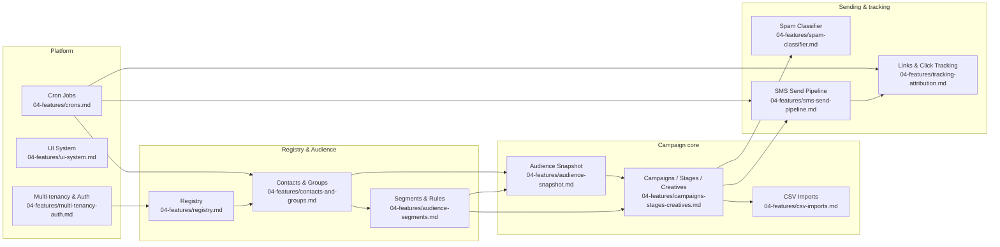

# CamMan — Developer Documentation

_Last updated: 2026-06-05_

**CamMan** (Campaign Manager) is a multi-tenant, CRM-style internal tool for running **SMS affiliate-marketing campaigns**. It is a *system of record* for contacts, audience segments, campaigns, creatives, and results — plus, in later phases, a tracked **link shortener**, a **spam classifier**, and an **outbound TextHub send pipeline**.

> **60-second overview.** Operators build campaigns from a frozen **audience snapshot** (segments ∪ contact-groups, de-duped, opt-out-suppressed). Each campaign has ordered **stages** (one SMS each), wired to a **creative** + **provider phone**. Sending is either **manual** (export a CSV, send in the provider's tool, import results back) or **tracked/API** (mint a unique short link per recipient, send via TextHub, log clicks, score them for bots). Everything is scoped to an `org_id`; one Postgres (Supabase) database, one Next.js 16 app on Vercel, three `*/15` cron jobs.

## Read this first
- New to the project? → [01-overview.md](01-overview.md) then [02-architecture.md](02-architecture.md)
- Setting up locally? → [08-local-setup.md](08-local-setup.md)
- Touching the database? → [03-data-model.md](03-data-model.md)
- Hunting a business rule or ID format? → [07-conventions.md](07-conventions.md)

## Document index

| Doc | Contents |
|-----|----------|
| [01-overview.md](01-overview.md) | What CamMan is, who it's for, core concepts, glossary, scope (in/out) |
| [02-architecture.md](02-architecture.md) | Stack, infra, Supabase pooler model, deployment, runtime topology + component diagram |
| [03-data-model.md](03-data-model.md) | Full ER diagram, every table, relationships, multi-tenant boundary, conventions |
| [04-features/](04-features/) | One file per module (see map below) |
| [05-flows.md](05-flows.md) | Sequence diagrams for the core journeys |
| [06-integrations.md](06-integrations.md) | External services, API contracts, env vars (names only) |
| [07-conventions.md](07-conventions.md) | Business rules, ID formats, timezone, gotchas, doc↔code discrepancies |
| [08-local-setup.md](08-local-setup.md) | Clone → running, PowerShell commands, migrations |
| [CHANGELOG.md](CHANGELOG.md) | Running log of doc-affecting changes |
| [security-notes.md](security-notes.md) | (Pre-existing) security posture notes — plaintext API keys, RLS, etc. |

## Feature / module map

### Feature files
- [multi-tenancy-auth.md](04-features/multi-tenancy-auth.md) — org isolation, auth flow, roles & `can()`
- [registry.md](04-features/registry.md) — brands, offers, networks, providers, phones, routing/traffic types, UTM tags
- [contacts-and-groups.md](04-features/contacts-and-groups.md) — contacts, contact groups, opt-outs/ins, clickers
- [audience-segments.md](04-features/audience-segments.md) — segments, segment rules (UNION semantics)
- [audience-snapshot.md](04-features/audience-snapshot.md) — freeze-at-activation audience model
- [campaigns-stages-creatives.md](04-features/campaigns-stages-creatives.md) — campaign/stage/creative model, tracking IDs
- [csv-imports.md](04-features/csv-imports.md) — result imports, mappings, revert; phone uploads
- [spam-classifier.md](04-features/spam-classifier.md) — self-hosted classifier integration
- [sms-send-pipeline.md](04-features/sms-send-pipeline.md) — TextHub kickoff/drain, circuit breakers
- [tracking-attribution.md](04-features/tracking-attribution.md) — link shortener, click scoring
- [ui-system.md](04-features/ui-system.md) — shared components, editor surfaces, dialog rules
- [crons.md](04-features/crons.md) — the three scheduled jobs

> **Convention used in these docs:** statements that could not be confirmed from source are tagged `> [VERIFY]`. See the end of [07-conventions.md](07-conventions.md) for the running list.
