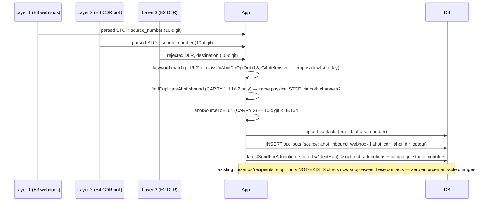

# Ahoi Provider — Section 4 (Opt-out Intake, 3 Layers + Go-Live Gate) Implementation Plan

> **For agentic workers:** REQUIRED SUB-SKILL: Use superpowers:subagent-driven-development (recommended) or superpowers:executing-plans to implement this plan task-by-task. Steps use checkbox (`- [ ]`) syntax for tracking.

## Boundary this plan draws (PRESSURE-TEST THIS FIRST)

Spec §6 is this plan's entire scope: turn what Section 3 already **captures** (`ahoi_inbound_events`, `ahoi_dlr_events`) into `opt_outs` writes across three signal sources, plus the go-live harness that gates flipping `SEND_ENABLED`. This is also the **final** section of the Ahoi Phase 1 build — after this plan's Task 7 is green, the whole feature (adapter, send, DLR/CDR intake, opt-out intake) is code-complete on `feat/ahoi-sms-provider`.

Two scoping calls made explicit here so they can be pressure-tested rather than discovered later:

1. **CARRY 1 (cross-channel attribution dedup) is scoped to Layers 1+2 only, not Layer 3.** A physical STOP is captured independently by the inbound webhook (real-time) and the CDR poll (a poll-cadence later, covered by the 45-min dedup window) — same event, two rows, no shared identity (webhook rows have no `provider_uuid`). Layer 3 (a DLR reporting our own send as `rejected`) is a structurally different signal — an outbound-side rejection, not an observed inbound reply — and since Ahoi does not enforce opt-out suppression on its own platform (Phase 0 recon) and our own preflight already excludes contacts with an existing `opt_outs` row before ever attempting to send them again, Layer 3 firing for an ALREADY-opted-out contact would require a narrow in-flight race (a send queued before the opt-out landed). Given Layer 3 additionally ships with an **empty** known-code allowlist today (O1 — no real code observed) and so cannot fire in production at all yet, extending the Layer-1/2 dedup machinery to cover it is speculative complexity for a scenario that (a) is rare, (b) never actually happens today, and (c) if it ever did, would only produce a harmless extra `opt_out_attributions` credit, not a suppression failure. Flagged as a deliberate, documented gap — not silently dropped.
2. **The Layer-3 opt-out code allowlist ships EMPTY.** O1 is unambiguous: no Ahoi opt-out DLR signature has ever been observed live (only `carrier_sent`/`delivered`/`error=000` on success; `rejected`/`600` is doc-inferred and describes generic rejection, not confirmed to mean "recipient sent MO STOP"). Layer 3 is therefore built **end-to-end and fully tested** (classifier, contact match, `opt_outs` write, attribution, all wired into the DLR route) but the classifier's default known-code set is empty, so it never actually classifies a live DLR as an opt-out until a human adds a real code after seeing one in production logs. The go-live harness (Task 7) proves the *pipeline* works using an **injected** test code (a seam parameter `knownCodes`, prod default unused) — it does not and cannot prove a real Ahoi code exists, because none does yet.

If either scoping call is rejected, the natural adjustments are: (1) add a `matched_stage_send_id`-independent, `contact_id`-keyed "already opted out, skip re-attribution" check to Layer 3 too (a few extra lines in `processAhoiDlrOptOut`, Task 6); (2) nothing changes code-wise for (2) — O1 is a fact about the world, not a design choice.

---

## Goal

Write `opt_outs` (+ `opt_out_attributions` where a match exists) from all three Ahoi signal sources — inbound webhook STOP, CDR-poll STOP, DLR opt-out-error — reusing the existing contact-suppression machinery (`opt_outs` → live `NOT EXISTS` check in `lib/sends/recipients.ts`) with zero changes to enforcement code. Then build the automated go-live harness that proves, deterministically and without any real Ahoi network call, that a suppressed contact is blocked at the real preflight/kickoff code path and a clean contact still sends — the hard blocker before `SEND_ENABLED` can ever flip for Ahoi.

## Architecture

Three intake pipelines write into two new pure functions, both reusing TextHub's proven attribution/cost-recompute code (no fork):

- **`lib/sends/ahoi-optout.ts`** — Layers 1+2 (both are "someone sent us a message"; only the channel differs). `processAhoiInboundOptOut(dbc, opts)` does: keyword match → phone normalize (CARRY 2) → cross-channel dedup check (CARRY 1) → contact upsert → `opt_outs` insert → attribution via the SAME `latestSendForAttribution` TextHub's poller uses → `campaign_stages` counter bump + `recomputeStageTotalCost` → update the `ahoi_inbound_events` row. Called from the inbound webhook route (Task 4, `optOutSource: "ahoi_inbound_webhook"`) and the CDR poll (Task 5, `optOutSource: "ahoi_cdr"`), each captured row updated exactly once.
- **`lib/sends/ahoi-dlr-optout.ts`** — Layer 3. `classifyAhoiDlrOptOut()` is a pure, injectable-allowlist predicate (G4, defensive — empty by default). `processAhoiDlrOptOut(dbc, opts)` mirrors the same contact-match → `opt_outs` → attribution shape, keyed on the DLR's `destination` (the recipient — opposite of inbound events, where `source` is the recipient). Called from the DLR webhook route (Task 6) after `reconcileAhoiDlrEvent`; logs every `rejected` DLR distinctly (G4/O1) regardless of classification outcome.
- **`ahoiSourceToE164()`** (CARRY 2, Task 1, in `lib/sends/providers/ahoi.ts` next to the existing inverse `toAhoiRecipient`) wraps the project's single phone-validation source of truth (`lib/phone-validation.ts`'s `validatePhone`) — the SAME helper TextHub's own poller already uses for inbound numbers. No new phone-parsing logic.
- **Cross-channel dedup (CARRY 1, Task 2)** is a query-based check on `(org_id, source_number, normalized_message, 45-min window)` against `ahoi_inbound_events` — the message is normalized (`normalizeAhoiMessageForDedup`) because the webhook and CDR represent the same text differently (webhook `"Stop"` vs CDR `"Stop - 1"`, commas stripped), so a raw equality would defeat it. NOT a DB constraint (no natural shared identity exists between a webhook row and a CDR row of the same physical event) and NOT a `pg_advisory_xact_lock` (documented project anti-pattern: `lib/cron/lease.ts` — "Advisory locks are unsafe through the transaction pooler (port 6543, prepare=false): a backend reassignment between statements can lose or strand the lock"). When it catches a duplicate it LOGS (`console.warn`, observable, not a Telegram alert). The residual race (webhook and CDR-poll processing the exact same event in the same instant) is accepted as rare and harmless — worst case is one redundant `opt_out_attributions` credit, never a suppression miss — and documented as such.
- **Go-live harness (Task 7, CARRY 4/G7)** drives all three layers' pure functions directly (no HTTP, no Ahoi network) inside one rolled-back transaction, then proves suppression using the **real production kickoff code path** (`kickoffStageSend` → `enumerateStageRecipients` → `stageRecipientsSql`'s live `opt_outs` check) — not a reimplementation of the suppression predicate.

**Processing model: inline-on-capture, no unprocessed-scan cron.** Every capture path (webhook route, CDR-poll per-row loop, DLR route) calls its processing function in the SAME request/poll-tick right after capture — mirroring how Section 3 already does DLR capture+reconcile in one request rather than TextHub's historical deferred Stage-A/B poll split. This is a deliberate continuation of that pattern, not a new one. See Global Constraints for the retry/backstop story and why this makes CARRY 3's deferred index moot.

## Tech Stack

Next.js 16 (App Router route handlers) · TypeScript · Drizzle ORM · Postgres (Supabase) · `tsx` test scripts (no vitest/jest — `scripts/test-*.ts` run via `npx tsx`), rolled-back transactions for anything writing to shared/live tables where feasible.

## Global Constraints

- **`SEND_ENABLED` stays OFF** the entire phase — this plan never flips it. The go-live flip itself is explicitly OUT of this build (spec §6: "Go-live is gated on both harness pass and smoke-test sign-off — separate from merging code").
- **No migration in this plan — verified, not assumed.** `opt_outs.source` is `text("source")` with **no CHECK constraint** (only `opt_outs.reason` has one, and Section 4 always writes the default `reason='opt_out'`, already an allowed value) — confirmed by reading `db/schema.ts`'s `opt_outs` table definition. `ahoi_inbound_events.result`/`ahoi_dlr_events.result` are both plain `text` with no CHECK either (migration 0109), so new values (`'duplicate'`) need no schema change. `opt_out_attributions` (migration 0075) is fully provider-agnostic — it keys off `stage_sends`/`campaign_stages`/`campaigns`, none of which reference a provider — so it's reused **as-is**, not forked. `ahoi_inbound_events` already carries `matched_contact_id`/`matched_stage_send_id`/`result`/`processed_at`, pre-created by Section 3's migration 0109 specifically for this section to fill (see that migration's own header comment). **Net: zero new migrations in Section 4.**
- **CARRY 1 — cross-channel dedup key.** `(org_id, source_number, normalized_message, time window)` against `ahoi_inbound_events` rows with `result='suppressed'`, window = **`AHOI_OPTOUT_DEDUP_WINDOW_MINUTES = 45`** (Task 2). Rationale for the window: the CDR poll runs every 15 min (`*/15` cadence, Section 3); 45 min survives even a **missed CDR poll tick** (15-min cadence + one skipped tick + margin) while staying far short of conflating two genuinely separate STOP events from the same number. **The message MUST be normalized** because the two channels represent the same text DIFFERENTLY (Phase 0 recon): the CDR export STRIPS COMMAS and APPENDS a segment marker, so the webhook's `"Stop"` arrives in the CDR as `"Stop - 1"` (or `"… - 2 of 2"` for a multi-segment message). A naive `message = message` equality would therefore DEFEAT the dedup. `normalizeAhoiMessageForDedup()` (Task 2) reconciles both representations — strip a trailing ` - <n>` / ` - <n> of <m>` segment suffix, remove commas, collapse whitespace, trim, lowercase — and the dedup compares normalized-to-normalized on both sides. When the guard catches a duplicate it LOGS it (`console.warn`, not a Telegram alert — this is expected/benign), so the dedup is observable in production.
- **CARRY 2 — normalization helper.** `ahoiSourceToE164()` (Task 1, `lib/sends/providers/ahoi.ts`) wraps `validatePhone()` from `lib/phone-validation.ts` (existing single source of truth, already used identically by `lib/sends/poll-opt-outs.ts` for TextHub's inbound numbers) — not a new phone parser. Used on BOTH the contact-match path and the contact-upsert path, in both Layer 1/2's `processAhoiInboundOptOut` and Layer 3's `processAhoiDlrOptOut`.
- **CARRY 3 — deferred `processed_at` partial index.** NOT added in this plan. The inline-on-capture processing model means no code ever scans `ahoi_inbound_events`/`ahoi_dlr_events` for `WHERE processed_at IS NULL` — every row is processed synchronously in the same request/tick that captured it — so the index has no query to serve. Documented as a moot, deferred optimization, not built.
- **CARRY 4 — go-live harness (Task 7) is the hard blocker.** `SEND_ENABLED` cannot flip to `true` for Ahoi until this script is green. The harness also documents (in a code comment, not a script — Ahoi has no test/sandbox mode) the ONE-TIME manual real-STOP smoke test required before go-live, per spec §6's second gate. Both gates are OUT of this build's scope to execute — only the harness script and the documented smoke-test procedure are deliverables here.
- **G4 (extended) — defensive DLR opt-out mapping.** `AHOI_KNOWN_OPTOUT_DLR_CODES` (Task 6) ships as an **empty** `Set` — no known signature exists (O1). Every `rejected` DLR gets a **distinct** `console.warn` line (its `error`/`smpp_code`) regardless of classification outcome, separate from Section 3's existing "unmapped `send_status`" log (which only fires for statuses OTHER than `carrier_sent`/`delivered`/`rejected` — `rejected` itself is already a *known* `send_status`, just not yet resolved to a specific *reason*). This is how the real code gets found and added later.
- **Processing model & Ahoi retry (unconfirmed) — DEFAULT TO LOUD.** Phase 0 recon never tested whether Ahoi retries a webhook delivery on a non-2xx response (our catcher always returned 200), so this plan does **not** rely on that behavior: the inbound webhook route ALWAYS 200-acks Ahoi and NEVER returns a 5xx on a processing failure (a returned 5xx that Ahoi silently drops would LOSE the STOP). Instead the webhook path is **capture-always-committed + loud-alert-on-process-failure**: capture commits first (raw row never lost), processing runs best-effort, and any `processAhoiInboundOptOut` throw fires a `notifyTelegram` alert (the same alert path the drain/circuit-breaker use) so a stuck STOP is noticed — never a silent `console.error`. The CDR poll (Layer 2) is the automatic safety-net: its independent re-capture of the same physical event within the 45-min dedup window re-runs processing fresh (the failed webhook row is still `result=NULL`, so CARRY 1's dedup doesn't suppress the retry). **Fast-follow (documented, not built):** IF Ahoi is later live-confirmed to retry on non-2xx, the webhook path can be upgraded to atomic (return 5xx on process failure so Ahoi redelivers) — until confirmed, loud-alert + CDR-backstop is the safe default. The CDR poll itself is STRONGER regardless: Task 5 wraps capture+process in one transaction per row, so a processing failure rolls back the capture too and the SAME `provider_uuid` is naturally re-fetched and retried on the next `*/15` tick (mirrors TextHub's per-message claim+process in `lib/sends/poll-opt-outs.ts`) — a cron retries naturally, so it needs no alert. The DLR route's Layer-3 call is best-effort/non-fatal — a DLR has no analogous backstop channel, but Layer 3 is defensively empty today anyway (nothing to lose on a rare failure).
- **Reuse, never fork:** `latestSendForAttribution` + `recomputeStageTotalCost` (both imported directly from their existing modules, called byte-identically to how TextHub's poller calls them) `isOptOutKeyword` (`lib/sends/opt-out-keywords.ts`, unmodified) · `validatePhone` (`lib/phone-validation.ts`, unmodified) · the live suppression predicate in `lib/sends/recipients.ts` (unmodified — Section 4 writes `opt_outs`, it does not touch the read side).
- **G1/G2/G5 (carried, unaffected).** Path-token auth stays the sole gate on both routes (unchanged). TextHub's send/suppression path is untouched (Section 4 touches zero `texthub*` files). No table generalization — `ahoi_inbound_events`/`ahoi_dlr_events` stay Ahoi-only, `opt_outs`/`opt_out_attributions` are the shared cross-provider tables both TextHub and Ahoi have always written into.
- **Advisory locks are NOT used** for CARRY 1 (see Architecture) — this is a deliberate, documented choice, not an oversight.
- Tests are `tsx` scripts (`npx tsx scripts/test-*.ts`), the repo's `check(name, cond, detail)` idiom. DB-writing tests use a `db.transaction()` rolled back via `throw ROLLBACK` wherever the code under test is `dbc`-parameterized (Tasks 1, 2, 3, 6, 7). The two route-level wiring tests (Tasks 4, 6) extend the existing marker+cleanup pattern from Section 3 (`test-ahoi-inbound-webhook.ts`, `test-ahoi-dlr-webhook.ts`) — this time the route ALSO writes into the live `contacts`/`opt_outs` tables (not just the empty Ahoi capture tables), so cleanup relies on `contacts.phone_number`'s FK `ON DELETE CASCADE` into `opt_outs` (deleting the marker-phone `contacts` row cascades the `opt_outs` row automatically) plus the existing `ahoi_inbound_events`/`ahoi_dlr_events` marker cleanup — verified watertight in each task.

---

## File Structure

**New:**
- `lib/sends/ahoi-optout.ts` — `AHOI_OPTOUT_DEDUP_WINDOW_MINUTES`, `normalizeAhoiMessageForDedup`, `findDuplicateAhoiInbound`, `processAhoiInboundOptOut` (Tasks 2, 3).
- `lib/sends/ahoi-dlr-optout.ts` — `AHOI_KNOWN_OPTOUT_DLR_CODES`, `classifyAhoiDlrOptOut`, `processAhoiDlrOptOut` (Task 6).
- `scripts/test-ahoi-e164-roundtrip.ts` — CARRY 2 pure round-trip test (Task 1).
- `scripts/test-ahoi-optout-dedup.ts` — CARRY 1 dedup lookup test (Task 2).
- `scripts/test-ahoi-optout-inbound.ts` — Layer 1/2 core processing test (Task 3).
- `scripts/test-ahoi-dlr-optout.ts` — Layer 3 classifier + processing test (Task 6).
- `scripts/test-ahoi-optout-golive-harness.ts` — the go-live harness, CARRY 4/G7 (Task 7).

**Modified:**
- `lib/sends/providers/ahoi.ts` — add `ahoiSourceToE164` (Task 1).
- `app/api/webhooks/ahoi/inbound/[token]/route.ts` — wire `processAhoiInboundOptOut` (Task 4).
- `scripts/test-ahoi-inbound-webhook.ts` — extend with one opt-out-write case (Task 4).
- `lib/sends/ahoi-cdr-poll.ts` — refactor per-row loop to transaction-wrapped capture+process (Task 5).
- `scripts/test-ahoi-cdr-poll.ts` — extend with one STOP-row opt-out-write case (Task 5).
- `app/api/webhooks/ahoi/dlr/[token]/route.ts` — wire `processAhoiDlrOptOut` (Task 6).
- `scripts/test-ahoi-dlr-webhook.ts` — extend with one `rejected`-DLR-doesn't-crash case (Task 6).
- `docs/03-data-model.md`, `docs/05-flows.md`, `docs/06-integrations.md`, `docs/07-conventions.md`, `docs/04-features/sms-send-pipeline.md`, `docs/CHANGELOG.md` — updated per task.

---

## Task 1: CARRY 2 — Ahoi source-number → E.164 normalization + round-trip test

**Files:**
- Modify: `lib/sends/providers/ahoi.ts`
- Test: `scripts/test-ahoi-e164-roundtrip.ts`

**Interfaces:**
- Produces: `ahoiSourceToE164(tenDigit: string): string | null` — inverse of the existing `toAhoiRecipient(e164: string): string`.

- [ ] **Step 1: Write the failing test** — `scripts/test-ahoi-e164-roundtrip.ts`

```ts
// CARRY 2: Ahoi's inbound/DLR source/destination fields are 10-digit, no +1
// (Phase 0 recon). Contacts are stored E.164. ahoiSourceToE164 is the
// inverse of toAhoiRecipient — both directions must round-trip cleanly, and
// both reuse the SAME phone-validation source of truth TextHub's own inbound
// intake uses (lib/phone-validation.ts), not a new parser.
// Run: npx tsx scripts/test-ahoi-e164-roundtrip.ts
import { ahoiSourceToE164, toAhoiRecipient } from "@/lib/sends/providers/ahoi";

let failed = 0;
function check(name: string, cond: boolean, detail = "") {
  if (!cond) failed++;
  console.log(`${cond ? "✓" : "✗"} ${name}${cond ? "" : `  ${detail}`}`);
}

check("10-digit -> E.164", ahoiSourceToE164("5852155963") === "+15852155963", ahoiSourceToE164("5852155963") ?? "null");
check(
  "round trip: E.164 -> 10-digit (toAhoiRecipient) -> E.164 (ahoiSourceToE164) reproduces the original",
  ahoiSourceToE164(toAhoiRecipient("+15852155963")) === "+15852155963",
);
check(
  "round trip: a DIFFERENT number also survives",
  ahoiSourceToE164(toAhoiRecipient("+13158359592")) === "+13158359592",
);
check("11-digit with leading 1 also normalizes (defensive)", ahoiSourceToE164("15852155963") === "+15852155963");
check("too few digits -> null (invalid NANP number)", ahoiSourceToE164("12345") === null);
check("empty string -> null", ahoiSourceToE164("") === null);
check("non-numeric junk -> null", ahoiSourceToE164("not-a-phone") === null);

console.log(failed === 0 ? "\nALL PASS" : `\n${failed} FAILED`);
process.exit(failed === 0 ? 0 : 1);
```

- [ ] **Step 2: Run test to verify it fails**

Run: `npx tsx scripts/test-ahoi-e164-roundtrip.ts`
Expected: FAIL — `ahoiSourceToE164` is not exported (module error / undefined is not a function).

- [ ] **Step 3: Implement in `lib/sends/providers/ahoi.ts`**

Add the import at the top (alongside the existing imports):

```ts
import { validatePhone } from "@/lib/phone-validation";
```

Add immediately after the existing `toAhoiRecipient` function:

```ts
// 10-digit Ahoi-format number (the `source`/`destination` field on inbound
// and DLR payloads) -> E.164, via the project's single phone-validation
// source of truth (lib/phone-validation.ts) — the SAME helper TextHub's own
// inbound STOP intake already uses for its numbers (lib/sends/poll-opt-outs.ts).
// Returns null when the digits don't form a valid NANP number (defensive —
// a malformed payload should never crash intake, just fail this one row).
// Inverse of toAhoiRecipient above; round-trip-tested (CARRY 2).
export function ahoiSourceToE164(tenDigit: string): string | null {
  const parsed = validatePhone(tenDigit, "US");
  return parsed.valid ? parsed.normalized : null;
}
```

- [ ] **Step 4: Run test to verify it passes**

Run: `npx tsx scripts/test-ahoi-e164-roundtrip.ts`
Expected: PASS — `ALL PASS`, exit 0.

- [ ] **Step 5: Typecheck**

Run: `npx tsc --noEmit`
Expected: no errors.

- [ ] **Step 6: Commit**

```bash
git add lib/sends/providers/ahoi.ts scripts/test-ahoi-e164-roundtrip.ts
git commit -m "feat(ahoi): ahoiSourceToE164 normalization helper (CARRY 2)"
```

---

## Task 2: CARRY 1 foundation — cross-channel duplicate-inbound lookup

**Files:**
- Create: `lib/sends/ahoi-optout.ts`
- Test: `scripts/test-ahoi-optout-dedup.ts`

**Interfaces:**
- Consumes: `DbOrTx` type from `@/lib/sends/ahoi-dlr` (existing).
- Produces: `AHOI_OPTOUT_DEDUP_WINDOW_MINUTES` (number constant), `normalizeAhoiMessageForDedup(msg): string`, `findDuplicateAhoiInbound(dbc, opts): Promise<DuplicateAhoiInbound | null>`.

- [ ] **Step 1: Write the failing test** — `scripts/test-ahoi-optout-dedup.ts`

```ts
// CARRY 1 foundation: findDuplicateAhoiInbound finds an already-SUPPRESSED
// ahoi_inbound_events row for the same (org, source_number, NORMALIZED
// message) within the dedup window, regardless of channel — this is what
// lets Layer 2 (CDR) recognize "this STOP was already handled by Layer 1
// (webhook)" a few minutes later. The message MUST be normalized because
// the CDR export strips commas and appends a segment marker ("Stop" via
// webhook vs "Stop - 1" via CDR). Rolled-back transaction.
// Run: npx tsx scripts/test-ahoi-optout-dedup.ts
import "./_env-preload";
import { sql } from "drizzle-orm";

import { db, sql as pgConn } from "@/db/client";
import {
  AHOI_OPTOUT_DEDUP_WINDOW_MINUTES,
  findDuplicateAhoiInbound,
  normalizeAhoiMessageForDedup,
} from "@/lib/sends/ahoi-optout";

let failed = 0;
function check(name: string, cond: boolean, detail = "") {
  if (!cond) failed++;
  console.log(`${cond ? "✓" : "✗"} ${name}${cond ? "" : `  ${detail}`}`);
}
const ROLLBACK = Symbol("rollback");

// ---- Pure normalizer tests (CARRY 1's crux — webhook vs CDR representation) ----
check("webhook 'Stop' and CDR 'Stop - 1' normalize equal", normalizeAhoiMessageForDedup("Stop") === normalizeAhoiMessageForDedup("Stop - 1"));
check("multi-segment CDR marker ' - 2 of 2' stripped", normalizeAhoiMessageForDedup("Stop") === normalizeAhoiMessageForDedup("Stop - 2 of 2"));
check("commas removed (CDR strips them)", normalizeAhoiMessageForDedup("Stop, please") === normalizeAhoiMessageForDedup("Stop please - 1"));
check("case + whitespace collapsed", normalizeAhoiMessageForDedup("  STOP   please  ") === "stop please");
check("two genuinely different messages do NOT normalize equal", normalizeAhoiMessageForDedup("Stop") !== normalizeAhoiMessageForDedup("Start"));
check("null/empty -> empty string", normalizeAhoiMessageForDedup(null) === "" && normalizeAhoiMessageForDedup("") === "");

async function main() {
  try {
    await db.transaction(async (tx) => {
      const sfx = Date.now().toString().slice(-9);
      const one = async <T>(q: ReturnType<typeof sql>) => ((await tx.execute(q)) as unknown as T[])[0];
      const org = await one<{ id: string }>(sql`SELECT id FROM organizations LIMIT 1`);
      const orgId = org.id;
      const contact = await one<{ id: string }>(sql`
        INSERT INTO contacts (org_id, phone_number) VALUES (${orgId}, ${"+1555" + sfx}) RETURNING id`);
      const srcNum = "555" + sfx;
      const now = new Date();

      // A prior, ALREADY-SUPPRESSED webhook row for this number, 5 minutes ago.
      // Stored message is the raw webhook form ("Stop") — the CDR-form lookup
      // below must still match it via normalization.
      const priorTime = new Date(now.getTime() - 5 * 60 * 1000);
      const priorEvent = await one<{ id: string; source: string }>(sql`
        INSERT INTO ahoi_inbound_events
          (org_id, source, source_number, message, method, result, matched_contact_id, processed_at, received_at)
        VALUES (${orgId}, 'webhook', ${srcNum}, 'Stop', 'POST', 'suppressed', ${contact.id}, now(), ${priorTime.toISOString()}::timestamptz)
        RETURNING id, source`);

      // Case 1: a NEW CDR row (different id), same number, CDR-form message
      // "Stop - 1", within the window -> found via message normalization.
      const newEvent = await one<{ id: string }>(sql`
        INSERT INTO ahoi_inbound_events (org_id, source, source_number, message, method, provider_uuid, received_at)
        VALUES (${orgId}, 'cdr', ${srcNum}, 'Stop - 1', 'poll', ${"cdr-" + sfx}, ${now.toISOString()}::timestamptz)
        RETURNING id`);
      const dup = await findDuplicateAhoiInbound(tx, {
        orgId, sourceNumber: srcNum, message: "Stop - 1", excludeEventId: newEvent.id, anchor: now,
      });
      check("webhook 'Stop' row dedups against CDR 'Stop - 1' lookup (normalized match)", dup?.matched_contact_id === contact.id, JSON.stringify(dup));
      check("duplicate carries the prior event id + channel for logging", dup?.event_id === priorEvent.id && dup?.source === "webhook", JSON.stringify(dup));

      // Case 1b: same number + window, but a genuinely DIFFERENT message
      // ("Start") -> NOT deduped (normalization must not over-match).
      const otherMsgEvent = await one<{ id: string }>(sql`
        INSERT INTO ahoi_inbound_events (org_id, source, source_number, message, method, received_at)
        VALUES (${orgId}, 'cdr', ${srcNum}, 'Start', 'poll', ${now.toISOString()}::timestamptz)
        RETURNING id`);
      const noDupMsg = await findDuplicateAhoiInbound(tx, {
        orgId, sourceNumber: srcNum, message: "Start", excludeEventId: otherMsgEvent.id, anchor: now,
      });
      check("a different message from the same number in-window does NOT dedup", noDupMsg === null, JSON.stringify(noDupMsg));

      // Case 2: outside the window (window + 10 min in the past) -> not found.
      const farPast = new Date(now.getTime() - (AHOI_OPTOUT_DEDUP_WINDOW_MINUTES + 10) * 60 * 1000);
      const farEvent = await one<{ id: string }>(sql`
        INSERT INTO ahoi_inbound_events
          (org_id, source, source_number, message, method, result, matched_contact_id, processed_at, received_at)
        VALUES (${orgId}, 'webhook', ${srcNum}, 'Stop', 'POST', 'suppressed', ${contact.id}, now(), ${farPast.toISOString()}::timestamptz)
        RETURNING id`);
      const noDup = await findDuplicateAhoiInbound(tx, {
        orgId, sourceNumber: srcNum, message: "Stop - 1", excludeEventId: farEvent.id, anchor: now,
      });
      // (Case 1's prior row is 5 min ago and would still match; assert the FAR
      // row specifically isn't what's returned by checking it's the near one.)
      check("a suppressed row OUTSIDE the window is not matched (near one still is)", noDup === null || noDup.event_id !== farEvent.id, JSON.stringify(noDup));

      // Case 3: different source_number + no other in-window suppressed row for
      // it -> not found (result NULL rows and different numbers are ignored).
      const otherNum = "556" + sfx;
      const unprocessed = await one<{ id: string }>(sql`
        INSERT INTO ahoi_inbound_events (org_id, source, source_number, message, method, received_at)
        VALUES (${orgId}, 'webhook', ${otherNum}, 'Stop', 'POST', ${now.toISOString()}::timestamptz)
        RETURNING id`);
      const secondEvent = await one<{ id: string }>(sql`
        INSERT INTO ahoi_inbound_events (org_id, source, source_number, message, method, received_at)
        VALUES (${orgId}, 'cdr', ${otherNum}, 'Stop - 1', 'poll', ${now.toISOString()}::timestamptz)
        RETURNING id`);
      const noDup2 = await findDuplicateAhoiInbound(tx, {
        orgId, sourceNumber: otherNum, message: "Stop - 1", excludeEventId: secondEvent.id, anchor: now,
      });
      check("does NOT match an unprocessed (result=NULL) row", noDup2 === null, JSON.stringify(noDup2));
      check("(fixture sanity) unprocessed row really has no result", true, unprocessed.id);

      // Case 4: different source_number entirely -> not found.
      const diffNumEvent = await one<{ id: string }>(sql`
        INSERT INTO ahoi_inbound_events (org_id, source, source_number, message, method, received_at)
        VALUES (${orgId}, 'cdr', ${"999" + sfx}, 'Stop - 1', 'poll', ${now.toISOString()}::timestamptz)
        RETURNING id`);
      const noDup3 = await findDuplicateAhoiInbound(tx, {
        orgId, sourceNumber: "999" + sfx, message: "Stop - 1", excludeEventId: diffNumEvent.id, anchor: now,
      });
      check("does NOT match a different source_number", noDup3 === null);

      throw ROLLBACK;
    });
  } catch (e) {
    if (e !== ROLLBACK) throw e;
  }
  await pgConn.end({ timeout: 5 });
  console.log(failed === 0 ? "\nALL PASS (rolled back)." : `\n${failed} FAILED`);
  if (failed > 0) process.exit(1);
}
main().catch((e) => { console.error(e); process.exit(1); });
```

- [ ] **Step 2: Run test to verify it fails**

Run: `npx tsx scripts/test-ahoi-optout-dedup.ts`
Expected: FAIL — module `@/lib/sends/ahoi-optout` doesn't exist.

- [ ] **Step 3: Create `lib/sends/ahoi-optout.ts`**

```ts
import { sql } from "drizzle-orm";

import type { DbOrTx } from "@/lib/sends/ahoi-dlr";

// CARRY 1: a single physical STOP is captured independently by the inbound
// webhook (real-time) and the CDR poll (*/15, up to ~15min later) — two
// ahoi_inbound_events rows, no shared identity (webhook rows have no
// provider_uuid to key on). Dedup on (org_id, source_number,
// NORMALIZED message, time window) against rows already fully processed
// (result='suppressed') instead.
//
// Window rationale: the CDR poll cadence is 15 minutes (Section 3). 45
// minutes survives even a MISSED CDR poll tick (15-min cadence + one skipped
// tick + margin) so a webhook STOP and its later CDR twin still fall in the
// same window, without being so wide it risks conflating two genuinely
// separate STOP replies from the same number as one event.
//
// Message MUST be normalized: the CDR export represents the SAME text
// DIFFERENTLY from the webhook — it STRIPS COMMAS and APPENDS a segment
// marker (Phase 0 recon), so the webhook's "Stop" arrives in the CDR as
// "Stop - 1" (or "... - 2 of 2" for a multi-segment message). A naive
// message = message equality would DEFEAT the dedup. normalizeAhoiMessage-
// ForDedup reconciles both representations; the comparison is
// normalized-to-normalized on BOTH sides (done in JS below, not SQL, since
// the candidate set for one (org, number, window) is tiny).
//
// NOT a DB constraint or pg_advisory_xact_lock: no natural shared identity
// exists to constrain on, and advisory locks are a documented anti-pattern
// in this codebase under the transaction pooler (see lib/cron/lease.ts). The
// residual race (both channels processing the exact same event in the same
// instant) is accepted as rare and harmless — worst case one redundant
// opt_out_attributions credit, never a suppression miss. When the guard DOES
// catch a duplicate the caller logs it (processAhoiInboundOptOut) so the
// dedup is observable in production.
export const AHOI_OPTOUT_DEDUP_WINDOW_MINUTES = 45;

// Reconcile the webhook vs CDR message representations to a comparable form:
// strip a trailing " - <n>" / " - <n> of <m>" CDR segment marker, remove
// commas (CDR strips them), collapse whitespace, trim, lowercase. Pure.
export function normalizeAhoiMessageForDedup(msg: string | null): string {
  if (!msg) return "";
  return msg
    .replace(/\s*-\s*\d+(?:\s+of\s+\d+)?\s*$/i, "") // drop CDR segment suffix
    .replace(/,/g, "")                               // CDR strips commas
    .replace(/\s+/g, " ")                            // collapse whitespace
    .trim()
    .toLowerCase();
}

export interface DuplicateAhoiInbound {
  event_id: string;             // the PRIOR row's id (for the dedup log line)
  source: string;               // the PRIOR row's channel ('webhook' | 'cdr')
  matched_contact_id: string;
  matched_stage_send_id: string | null;
}

export async function findDuplicateAhoiInbound(
  dbc: DbOrTx,
  opts: {
    orgId: string;
    sourceNumber: string;
    message: string;
    excludeEventId: string;
    anchor: Date;
    windowMinutes?: number;
  },
): Promise<DuplicateAhoiInbound | null> {
  const windowMin = opts.windowMinutes ?? AHOI_OPTOUT_DEDUP_WINDOW_MINUTES;
  const anchorIso = opts.anchor.toISOString();
  // Fetch the (tiny) candidate set by org/number/window, then match on the
  // NORMALIZED message in JS — SQL-side normalization of the stored `message`
  // column would need a fragile regexp_replace chain to mirror the helper.
  const rows = (await dbc.execute(sql`
    SELECT id, source, message, matched_contact_id, matched_stage_send_id
    FROM ahoi_inbound_events
    WHERE org_id = ${opts.orgId}
      AND source_number = ${opts.sourceNumber}
      AND result = 'suppressed'
      AND matched_contact_id IS NOT NULL
      AND id != ${opts.excludeEventId}
      AND received_at BETWEEN ${anchorIso}::timestamptz - (${windowMin} * interval '1 minute')
                           AND ${anchorIso}::timestamptz + (${windowMin} * interval '1 minute')
    ORDER BY received_at ASC
  `)) as unknown as {
    id: string; source: string; message: string | null;
    matched_contact_id: string; matched_stage_send_id: string | null;
  }[];
  const target = normalizeAhoiMessageForDedup(opts.message);
  const hit = rows.find((r) => normalizeAhoiMessageForDedup(r.message) === target);
  return hit
    ? {
        event_id: hit.id,
        source: hit.source,
        matched_contact_id: hit.matched_contact_id,
        matched_stage_send_id: hit.matched_stage_send_id,
      }
    : null;
}
```

- [ ] **Step 4: Run test to verify it passes**

Run: `npx tsx scripts/test-ahoi-optout-dedup.ts`
Expected: PASS — `ALL PASS (rolled back).`, exit 0.

- [ ] **Step 5: Typecheck**

Run: `npx tsc --noEmit`
Expected: no errors.

- [ ] **Step 6: Commit**

```bash
git add lib/sends/ahoi-optout.ts scripts/test-ahoi-optout-dedup.ts
git commit -m "feat(ahoi): findDuplicateAhoiInbound cross-channel dedup lookup (CARRY 1 foundation)"
```

---

## Task 3: `processAhoiInboundOptOut` — Layer 1/2 shared core

**Files:**
- Modify: `lib/sends/ahoi-optout.ts`
- Test: `scripts/test-ahoi-optout-inbound.ts`
- Docs: `docs/03-data-model.md`, `docs/07-conventions.md`, `docs/CHANGELOG.md`

**Interfaces:**
- Consumes: `ahoiSourceToE164` (Task 1), `findDuplicateAhoiInbound` (Task 2), `isOptOutKeyword` (`@/lib/sends/opt-out-keywords`, existing), `latestSendForAttribution` (`@/lib/sends/poll-opt-outs`, existing), `recomputeStageTotalCost` (`@/lib/stages/total-cost`, existing).
- Produces: `processAhoiInboundOptOut(dbc, opts): Promise<ProcessAhoiInboundOptOutOutcome>` — called by Task 4 (webhook route) and Task 5 (CDR poll).

- [ ] **Step 1: Write the failing test** — `scripts/test-ahoi-optout-inbound.ts`

```ts
// processAhoiInboundOptOut: keyword match -> normalize -> cross-channel
// dedup -> contact upsert -> opt_outs write -> attribution. Mirrors
// lib/sends/poll-opt-outs.ts's TextHub logic exactly (reused, not forked) —
// this test proves Ahoi's version produces the same shape of result.
// Rolled-back transaction.
// Run: npx tsx scripts/test-ahoi-optout-inbound.ts
import "./_env-preload";
import { sql } from "drizzle-orm";

import { db, sql as pgConn } from "@/db/client";
import { processAhoiInboundOptOut } from "@/lib/sends/ahoi-optout";

let failed = 0;
function check(name: string, cond: boolean, detail = "") {
  if (!cond) failed++;
  console.log(`${cond ? "✓" : "✗"} ${name}${cond ? "" : `  ${detail}`}`);
}
const ROLLBACK = Symbol("rollback");

async function main() {
  try {
    await db.transaction(async (tx) => {
      const sfx = Date.now().toString().slice(-9);
      const one = async <T>(q: ReturnType<typeof sql>) => ((await tx.execute(q)) as unknown as T[])[0];
      const org = await one<{ id: string }>(sql`SELECT id FROM organizations LIMIT 1`);
      const orgId = org.id;

      // Valid 10-digit NANP numbers (area 315, exchange 586) — Section 4
      // normalizes source_number via ahoiSourceToE164 (real libphonenumber
      // validation), so fixtures MUST be genuinely valid or they'd short-
      // circuit to invalid_phone. ph(i) -> "3155861000"+i, e164(i) -> "+1"+ph(i).
      const ph = (i: number) => "315586" + (1000 + i).toString();
      const e164 = (i: number) => "+1" + ph(i);

      async function mkEvent(channel: "webhook" | "cdr", srcNum: string, message: string) {
        return one<{ id: string }>(sql`
          INSERT INTO ahoi_inbound_events (org_id, source, source_number, message, method, received_at)
          VALUES (${orgId}, ${channel}, ${srcNum}, ${message}, ${channel === "webhook" ? "POST" : "poll"}, now())
          RETURNING id`);
      }

      // ---- Case A: non-STOP message -> ignored, no writes. ----
      const evA = await mkEvent("webhook", ph(0), "Hello there");
      const rA = await processAhoiInboundOptOut(tx, {
        eventId: evA.id, orgId, sourceNumber: ph(0), message: "Hello there",
        optOutSource: "ahoi_inbound_webhook", receivedAt: new Date(),
      });
      check("non-STOP -> ignored", rA.kind === "ignored", JSON.stringify(rA));
      const rowA = await one<{ result: string }>(sql`SELECT result FROM ahoi_inbound_events WHERE id = ${evA.id}`);
      check("event row marked result='ignored'", rowA.result === "ignored");

      // ---- Case B: STOP for a MATCHED (pre-existing) contact -> suppressed + attributed. ----
      const phoneB = e164(1);
      const contactB = await one<{ id: string }>(sql`INSERT INTO contacts (org_id, phone_number) VALUES (${orgId}, ${phoneB}) RETURNING id`);
      const campB = await one<{ id: number }>(sql`
        INSERT INTO campaigns (org_id, slug, name, status, link_mode) VALUES (${orgId}, ${"optout-camp-" + sfx}, ${"optout"}, 'active', 'manual') RETURNING id`);
      const stageB = await one<{ id: number }>(sql`
        INSERT INTO campaign_stages (org_id, campaign_id, stage_number, stop_text, inbound_opt_out_count, opt_out_count)
        VALUES (${orgId}, ${campB.id}, 1, 'STOP', 0, 0) RETURNING id`);
      const sendB = await one<{ id: string }>(sql`
        INSERT INTO stage_sends (org_id, campaign_id, stage_id, contact_id, phone, rendered_text, texthub_message_id, status, sent_at)
        VALUES (${orgId}, ${campB.id}, ${stageB.id}, ${contactB.id}, ${phoneB}, 'hi', ${"s-b-" + sfx}, 'sent', now())
        RETURNING id`);
      const evB = await mkEvent("webhook", ph(1), "STOP");
      const rB = await processAhoiInboundOptOut(tx, {
        eventId: evB.id, orgId, sourceNumber: ph(1), message: "STOP",
        optOutSource: "ahoi_inbound_webhook", receivedAt: new Date(),
      });
      check("matched STOP -> suppressed", rB.kind === "suppressed" && rB.contactId === contactB.id, JSON.stringify(rB));
      check("matched STOP -> attributed to the one in-window send", rB.kind === "suppressed" && rB.attributed === true, JSON.stringify(rB));
      const ooB = await tx.execute(sql`SELECT * FROM opt_outs WHERE contact_id = ${contactB.id} AND source = 'ahoi_inbound_webhook'`);
      check("opt_outs row written with source='ahoi_inbound_webhook'", (ooB as unknown[]).length === 1);
      const attrB = await tx.execute(sql`SELECT * FROM opt_out_attributions WHERE stage_send_id = ${sendB.id}`);
      check("opt_out_attributions row written", (attrB as unknown[]).length === 1);
      const stageRowB = await one<{ opt_out_count: number }>(sql`SELECT opt_out_count FROM campaign_stages WHERE id = ${stageB.id}`);
      check("campaign_stages.opt_out_count bumped to 1", Number(stageRowB.opt_out_count) === 1, JSON.stringify(stageRowB));

      // ---- Case C: STOP for an UNMATCHED number -> contact materialized (E.164), suppressed, unattributed (no send in window). ----
      const digitsC = ph(2);
      const preC = await tx.execute(sql`SELECT 1 FROM contacts WHERE org_id = ${orgId} AND phone_number = ${"+1" + digitsC}`);
      check("(fixture sanity) no pre-existing contact for case C", (preC as unknown[]).length === 0);
      const evC = await mkEvent("webhook", digitsC, "Stop please");
      const rC = await processAhoiInboundOptOut(tx, {
        eventId: evC.id, orgId, sourceNumber: digitsC, message: "Stop please",
        optOutSource: "ahoi_inbound_webhook", receivedAt: new Date(),
      });
      check("unmatched STOP -> suppressed", rC.kind === "suppressed", JSON.stringify(rC));
      check("unmatched STOP -> unattributed (no send in window)", rC.kind === "suppressed" && rC.attributed === false, JSON.stringify(rC));
      const contactC = await tx.execute(sql`SELECT id FROM contacts WHERE org_id = ${orgId} AND phone_number = ${"+1" + digitsC}`);
      check("contact upserted in E.164 form", (contactC as { id: string }[]).length === 1);
      check(
        "returned contactId matches the newly upserted contact",
        rC.kind === "suppressed" && rC.contactId === (contactC as { id: string }[])[0].id,
      );

      // ---- Case D: invalid source number -> invalid_phone, no writes. ----
      const evD = await mkEvent("webhook", "123", "STOP");
      const rD = await processAhoiInboundOptOut(tx, {
        eventId: evD.id, orgId, sourceNumber: "123", message: "STOP",
        optOutSource: "ahoi_inbound_webhook", receivedAt: new Date(),
      });
      check("garbage source number -> invalid_phone", rD.kind === "invalid_phone", JSON.stringify(rD));

      // ---- Case E: CARRY 1 — the SAME STOP arrives again via CDR shortly
      // after, in the CDR's representation ("STOP - 1") -> deduped against
      // case B's webhook "STOP" via message normalization. ----
      const evE = await mkEvent("cdr", ph(1), "STOP - 1");
      const rE = await processAhoiInboundOptOut(tx, {
        eventId: evE.id, orgId, sourceNumber: ph(1), message: "STOP - 1",
        optOutSource: "ahoi_cdr", receivedAt: new Date(),
      });
      check("cross-channel repeat (CDR 'STOP - 1' vs webhook 'STOP') -> duplicate (CARRY 1)", rE.kind === "duplicate" && rE.contactId === contactB.id, JSON.stringify(rE));
      const evERow = await one<{ result: string }>(sql`SELECT result FROM ahoi_inbound_events WHERE id = ${evE.id}`);
      check("duplicate event row marked result='duplicate'", evERow.result === "duplicate", JSON.stringify(evERow));
      const ooCountB = await one<{ n: number }>(sql`SELECT count(*)::int AS n FROM opt_outs WHERE contact_id = ${contactB.id}`);
      check("still exactly ONE opt_outs row for the contact (no double-write)", Number(ooCountB.n) === 1, JSON.stringify(ooCountB));
      const attrCountB = await one<{ n: number }>(sql`SELECT count(*)::int AS n FROM opt_out_attributions WHERE stage_send_id = ${sendB.id}`);
      check("still exactly ONE attribution (no double-count, CARRY 1)", Number(attrCountB.n) === 1, JSON.stringify(attrCountB));
      const stageRowB2 = await one<{ opt_out_count: number }>(sql`SELECT opt_out_count FROM campaign_stages WHERE id = ${stageB.id}`);
      check("stage opt_out_count still 1, not double-bumped", Number(stageRowB2.opt_out_count) === 1, JSON.stringify(stageRowB2));

      throw ROLLBACK;
    });
  } catch (e) {
    if (e !== ROLLBACK) throw e;
  }
  await pgConn.end({ timeout: 5 });
  console.log(failed === 0 ? "\nALL PASS (rolled back)." : `\n${failed} FAILED`);
  if (failed > 0) process.exit(1);
}
main().catch((e) => { console.error(e); process.exit(1); });
```

- [ ] **Step 2: Run test to verify it fails**

Run: `npx tsx scripts/test-ahoi-optout-inbound.ts`
Expected: FAIL — `processAhoiInboundOptOut` is not exported.

- [ ] **Step 3: Implement `processAhoiInboundOptOut` in `lib/sends/ahoi-optout.ts`**

Add imports at the top (alongside the existing ones):

```ts
import { ahoiSourceToE164 } from "@/lib/sends/providers/ahoi";
import { isOptOutKeyword } from "@/lib/sends/opt-out-keywords";
import { latestSendForAttribution } from "@/lib/sends/poll-opt-outs";
import { recomputeStageTotalCost } from "@/lib/stages/total-cost";
```

Append to the end of the file:

```ts
export interface ProcessAhoiInboundOptOutOpts {
  eventId: string;
  orgId: string;
  sourceNumber: string; // 10-digit, from InboundEvent.source (webhook) or the CDR row's src
  message: string;
  // opt_outs.source tag — the CHANNEL (Layer) this event came through. Not to
  // be confused with ahoi_inbound_events.source, which is the channel
  // discriminator column ('webhook'/'cdr') — same underlying fact, different
  // column, named distinctly here to avoid the two colliding in code.
  optOutSource: "ahoi_inbound_webhook" | "ahoi_cdr";
  receivedAt: Date;
}

export type ProcessAhoiInboundOptOutOutcome =
  | { kind: "ignored" }
  | { kind: "invalid_phone" }
  | { kind: "duplicate"; contactId: string }
  | { kind: "suppressed"; contactId: string; attributed: boolean };

// Layer 1 (inbound webhook) + Layer 2 (CDR poll) shared core (spec §6). Both
// channels observe the same kind of signal — "someone replied with a
// STOP-class message" — so they share this one pipeline, distinguished only
// by optOutSource and by which ahoi_inbound_events.source wrote the captured
// row. Mirrors lib/sends/poll-opt-outs.ts's TextHub logic (upsert contact ->
// opt_outs -> attribution) as closely as the schema allows — reused
// (latestSendForAttribution, recomputeStageTotalCost), not forked.
export async function processAhoiInboundOptOut(
  dbc: DbOrTx,
  o: ProcessAhoiInboundOptOutOpts,
): Promise<ProcessAhoiInboundOptOutOutcome> {
  const isStop = isOptOutKeyword(o.message);
  if (!isStop) {
    await dbc.execute(sql`
      UPDATE ahoi_inbound_events SET result = 'ignored', processed_at = now()
      WHERE id = ${o.eventId} AND org_id = ${o.orgId}
    `);
    return { kind: "ignored" };
  }

  // CARRY 2: normalize BEFORE both the dedup lookup key comparison would need
  // it and the contact match/upsert below — ahoiSourceToE164 is the single
  // entry point for "Ahoi wire format -> our storage format".
  const phone = ahoiSourceToE164(o.sourceNumber);
  if (!phone) {
    await dbc.execute(sql`
      UPDATE ahoi_inbound_events SET result = 'invalid_phone', processed_at = now()
      WHERE id = ${o.eventId} AND org_id = ${o.orgId}
    `);
    return { kind: "invalid_phone" };
  }

  // CARRY 1: cross-channel dedup BEFORE writing anything. A single physical
  // STOP is captured independently by the webhook (real-time) and the CDR
  // poll (up to a poll-cadence later, covered by the 45-min window) — dedupe
  // on (org, source_number, normalized message, time window), never on
  // provider_uuid (webhook rows have none)
  // or a would-be new opt_out_id (that's a NEW row every time, which is
  // exactly the bug this prevents). See findDuplicateAhoiInbound for the
  // key/window/normalization rationale.
  const dup = await findDuplicateAhoiInbound(dbc, {
    orgId: o.orgId, sourceNumber: o.sourceNumber, message: o.message,
    excludeEventId: o.eventId, anchor: o.receivedAt,
  });
  if (dup) {
    // Observable-by-design: log every caught cross-channel duplicate (expected
    // + benign — NOT a Telegram alert). Records both event ids/channels so the
    // dedup rate is greppable in production logs.
    console.warn(
      `[ahoi-optout] cross-channel duplicate STOP caught (deduped) — org=${o.orgId} ` +
        `source_number=${o.sourceNumber} this_event=${o.eventId} (${o.optOutSource}) ` +
        `prior_event=${dup.event_id} (${dup.source}); suppression already recorded, ` +
        `skipping second opt_out + attribution`,
    );
    await dbc.execute(sql`
      UPDATE ahoi_inbound_events
      SET result = 'duplicate', matched_contact_id = ${dup.matched_contact_id},
          matched_stage_send_id = ${dup.matched_stage_send_id}, processed_at = now()
      WHERE id = ${o.eventId} AND org_id = ${o.orgId}
    `);
    return { kind: "duplicate", contactId: dup.matched_contact_id };
  }

  // Upsert the contact (mirrors TextHub's poll-opt-outs.ts exactly) — a STOP
  // must suppress the number even if it isn't an existing contact yet
  // (spec §6 decision (a), G6).
  const c = (await dbc.execute(sql`
    INSERT INTO contacts (org_id, phone_number)
    VALUES (${o.orgId}, ${phone})
    ON CONFLICT (org_id, phone_number) DO UPDATE SET updated_at = now()
    RETURNING id
  `)) as unknown as { id: string }[];
  const contactId = c[0]!.id;

  // created_at = the STOP's real receipt time, matching TextHub's own
  // reasoning (poll-opt-outs.ts): report buckets and opt_out_attributions
  // must agree on the day it actually happened, not when we processed it.
  const anchorIso = o.receivedAt.toISOString();
  const oo = (await dbc.execute(sql`
    INSERT INTO opt_outs (org_id, contact_id, phone_number, source, created_at)
    VALUES (${o.orgId}, ${contactId}, ${phone}, ${o.optOutSource}, ${anchorIso}::timestamptz)
    RETURNING id
  `)) as unknown as { id: number }[];
  const optOutId = oo[0]!.id;

  // Attribution: the SAME cross-provider helper TextHub's poller uses — one
  // STOP credits the single most-recent matching send across ALL stages
  // (any provider) in the trailing window. null -> unattributed, org-wide
  // opt-out still stands.
  const match = await latestSendForAttribution(dbc, o.orgId, phone, anchorIso);
  let attributed = false;
  let matchedStageSendId: string | null = null;
  if (match) {
    matchedStageSendId = match.stage_send_id;
    const ins = (await dbc.execute(sql`
      INSERT INTO opt_out_attributions (org_id, opt_out_id, stage_send_id, stage_id, campaign_id, created_at)
      VALUES (${o.orgId}, ${optOutId}, ${match.stage_send_id}, ${match.stage_id}, ${match.campaign_id}, ${anchorIso}::timestamptz)
      ON CONFLICT (opt_out_id, stage_id) DO NOTHING
      RETURNING id
    `)) as unknown as { id: number }[];
    if (ins.length > 0) {
      attributed = true;
      await dbc.execute(sql`
        UPDATE campaign_stages
        SET inbound_opt_out_count = inbound_opt_out_count + 1,
            opt_out_count = inbound_opt_out_count + 1
        WHERE id = ${match.stage_id}
      `);
      await recomputeStageTotalCost(dbc, match.stage_id);
    }
  }

  await dbc.execute(sql`
    UPDATE ahoi_inbound_events
    SET result = 'suppressed', matched_contact_id = ${contactId},
        matched_stage_send_id = ${matchedStageSendId}, processed_at = now()
    WHERE id = ${o.eventId} AND org_id = ${o.orgId}
  `);

  return { kind: "suppressed", contactId, attributed };
}
```

- [ ] **Step 4: Run test to verify it passes**

Run: `npx tsx scripts/test-ahoi-optout-inbound.ts`
Expected: PASS — `ALL PASS (rolled back).`, exit 0.

- [ ] **Step 5: Typecheck**

Run: `npx tsc --noEmit`
Expected: no errors.

- [ ] **Step 6: Update `docs/03-data-model.md`**

Find the existing `ahoi_inbound_events` row (added in Section 3) and change its description's trailing clause from "unused by Section 3" to reflect Section 4 now fills it:

```
| `ahoi_inbound_events` | `provider_id`, `source` (channel: webhook/cdr), `source_number`, `destination_number`, `provider_uuid`, `matched_contact_id`, `matched_stage_send_id`, `result` | append-only inbound (STOP-carrying) capture from TWO channels (migration 0109); `matched_*`/`result`/`processed_at` are filled by Section 4's `processAhoiInboundOptOut` (`lib/sends/ahoi-optout.ts`) — `result` also takes `'duplicate'` for a cross-channel repeat of an already-suppressed STOP (CARRY 1) |
```

- [ ] **Step 7: Update `docs/07-conventions.md`**

Add after the existing "Ahoi DLR defensive classification (G4)" bullet (the one ending "...gets spotted when it first appears in production."):

```
- **Ahoi cross-channel opt-out dedup (Section 4, CARRY 1).** The inbound webhook (real-time) and the CDR poll (`*/15`) can both capture the SAME physical STOP as two separate `ahoi_inbound_events` rows with no shared identity (webhook rows have no `provider_uuid`). `findDuplicateAhoiInbound` (`lib/sends/ahoi-optout.ts`) dedupes on `(org_id, source_number, normalized_message, time window)` — `AHOI_OPTOUT_DEDUP_WINDOW_MINUTES = 45` (survives one missed CDR poll tick) — against already-`result='suppressed'` rows, so a repeat only ever writes ONE `opt_outs` row and credits ONE `opt_out_attributions` row for the same physical event. The message is normalized (`normalizeAhoiMessageForDedup` — strips the CDR's trailing ` - <n>[ of <m>]` segment marker + commas, collapses whitespace, lowercases) because the two channels represent the same text differently (webhook `"Stop"` vs CDR `"Stop - 1"`), so a raw `message = message` equality would defeat the dedup. A caught duplicate emits a `console.warn` (observable, expected/benign — not a Telegram alert). Not a DB constraint (no natural shared key exists) and not a `pg_advisory_xact_lock` (unsafe under this project's transaction-pooler connection — see `lib/cron/lease.ts`); the residual race is accepted as rare and harmless.
- **Ahoi 10-digit ↔ E.164 (Section 4, CARRY 2).** `ahoiSourceToE164()` (`lib/sends/providers/ahoi.ts`) is the inverse of `toAhoiRecipient()` and the single normalization entry point for Ahoi's wire-format `source`/`destination` fields (10-digit, no `+1`) on both the contact-match and contact-upsert paths — wraps `lib/phone-validation.ts`'s `validatePhone`, the project's one phone parser (also what TextHub's own inbound intake uses).
```

- [ ] **Step 8: Append to `docs/CHANGELOG.md`**

```
## 2026-07-15 — Ahoi opt-out intake Layer 1/2 core (processAhoiInboundOptOut, CARRY 1+2) — docs/03-data-model.md, docs/07-conventions.md
```

- [ ] **Step 9: Commit**

```bash
git add lib/sends/ahoi-optout.ts scripts/test-ahoi-optout-inbound.ts docs/03-data-model.md docs/07-conventions.md docs/CHANGELOG.md
git commit -m "feat(ahoi): processAhoiInboundOptOut — Layer 1/2 shared opt-out core"
```

---

## Task 4: Wire Layer 1 (inbound webhook route)

**Files:**
- Modify: `app/api/webhooks/ahoi/inbound/[token]/route.ts`
- Modify: `scripts/test-ahoi-inbound-webhook.ts`
- Docs: `docs/05-flows.md`, `docs/06-integrations.md`, `docs/CHANGELOG.md`

**Interfaces:**
- Consumes: `processAhoiInboundOptOut` (Task 3).

- [ ] **Step 1: Extend `scripts/test-ahoi-inbound-webhook.ts` with a failing case**

Add this block right before the final `} finally {` in the existing `main()` function (after the existing `check("provider_uuid is null (webhook payload has none)", ...)` line), and extend the outer `try`'s captured variables so cleanup can reach the new contact:

First, declare the STOP fixtures BEFORE the `try` block (just after the existing `let foreignProviderId: number | null = null;` line) so the `finally` cleanup can see them. Unlike the capture-only markers, Section 4 validates the phone via `ahoiSourceToE164`, so the STOP source MUST be a genuinely valid 10-digit NANP number (a `zzz`-style marker would return `invalid_phone`, never `suppressed`). Use a valid area code (315) + valid exchange (58x) + a per-run suffix:

```ts
  const stopDigits = "31558" + Date.now().toString().slice(-5); // 10-digit, valid NANP, unique per run
  const stopE164 = "+1" + stopDigits;
```

Then add this block right before the final `} finally {` in `main()` (after the existing `check("provider_uuid is null (webhook payload has none)", ...)` line):

```ts
    // ---- NEW (Section 4, Task 4): a real STOP end-to-end through the route
    // must produce a suppressed contact + an opt_outs row, not just a
    // captured ahoi_inbound_events row. ----
    const stopBody = `source=${stopDigits}&destination=3158359592&message=STOP&type=sms&cost=0`;
    const stopRes = await POST(postReq(`https://x/api/webhooks/ahoi/inbound/${token}`, stopBody), {
      params: Promise.resolve({ token }),
    });
    check("STOP through the route -> 200", stopRes.status === 200);
    const stopEventRow = await sql`SELECT * FROM ahoi_inbound_events WHERE source_number = ${stopDigits}`;
    check("STOP event row captured + processed", stopEventRow.length === 1 && stopEventRow[0]?.result === "suppressed", JSON.stringify(stopEventRow[0]));
    const stopContact = await sql`SELECT id FROM contacts WHERE org_id = ${orgId} AND phone_number = ${stopE164}`;
    check("contact materialized in E.164 form", stopContact.length === 1);
    const stopOptOut = await sql`SELECT * FROM opt_outs WHERE contact_id = ${stopContact[0]?.id} AND source = 'ahoi_inbound_webhook'`;
    check("opt_outs row written with source='ahoi_inbound_webhook'", stopOptOut.length === 1);
```

Then extend the `finally` block to clean up the new `contacts` row (which CASCADEs its `opt_outs` row automatically via the FK — see Global Constraints):

```ts
  } finally {
    await sql`DELETE FROM ahoi_inbound_events WHERE source_number LIKE ${marker + "%"}`;
    await sql`DELETE FROM ahoi_inbound_events WHERE source_number = ${stopDigits}`;
    await sql`DELETE FROM contacts WHERE phone_number = ${stopE164}`; // cascades opt_outs
    if (foreignProviderId !== null) {
      await sql`DELETE FROM provider_credentials WHERE provider_id = ${foreignProviderId}`;
      await sql`DELETE FROM sms_providers WHERE id = ${foreignProviderId}`;
    }
    await sql.end();
  }
```

- [ ] **Step 2: Run test to verify it fails**

Run: `npx tsx scripts/test-ahoi-inbound-webhook.ts`
Expected: FAIL — `STOP event row captured + processed` ✗ (route doesn't call the processing function yet, `result` stays NULL).

- [ ] **Step 3: Wire into `app/api/webhooks/ahoi/inbound/[token]/route.ts`**

Add the imports:

```ts
import { processAhoiInboundOptOut } from "@/lib/sends/ahoi-optout";
import { notifyTelegram } from "@/lib/alerts/telegram";
```

Replace the final block (from `const parsed = ahoiAdapter.parseInbound(raw);` through the end of the function) with:

```ts
  const parsed = ahoiAdapter.parseInbound(raw);

  const captured = await captureAhoiInboundEvent(db, {
    orgId: cred.org_id,
    credentialId: cred.id,
    providerId: cred.provider_id,
    method: req.method,
    rawBody: rawBody || null,
    parsed,
  });

  // Layer 1 (spec §6): capture ALWAYS commits first (above), independent of
  // processing, and we ALWAYS 200-ack Ahoi (never return a non-2xx) — Phase 0
  // never confirmed whether Ahoi retries a webhook on a non-2xx, so we don't
  // rely on that behavior (see the plan's "Processing model & Ahoi retry"
  // note). Processing is best-effort here, but a FAILURE is LOUD, not silent:
  // it fires a Telegram alert (compliance-critical — a stuck STOP must be
  // noticed), and the CDR poll's independent capture of the SAME physical
  // event (Layer 2, ≤45min window) is the automatic safety-net retry.
  if (parsed) {
    try {
      await processAhoiInboundOptOut(db, {
        eventId: captured.id,
        orgId: cred.org_id,
        sourceNumber: parsed.source,
        message: parsed.message,
        optOutSource: "ahoi_inbound_webhook",
        receivedAt: new Date(),
      });
    } catch (e) {
      console.error("[ahoi-inbound-webhook] opt-out processing failed:", e);
      // Best-effort loud alert — never throws back to Ahoi (we still 200 below).
      await notifyTelegram(
        `⚠️ Ahoi inbound opt-out processing FAILED (STOP not yet suppressed via webhook)\n` +
          `event: ${captured.id} · org ${cred.org_id} · source ${parsed.source}\n` +
          `error: ${e instanceof Error ? e.message : String(e)}\n` +
          `CDR poll (≤45min) is the backstop — verify it recovers.`,
      ).catch(() => {});
    }
  }

  return NextResponse.json({ ok: true });
}
```

Also update the file's header comment block (the one starting "CAPTURE ONLY — this route does NOT match STOP keywords...") to:

```ts
// Public inbound Ahoi message (STOP / general reply) callback receiver.
//
// Capture (Section 3) always commits first and we always 200-ack Ahoi;
// opt-out processing (Section 4, processAhoiInboundOptOut — keyword match,
// contact upsert/match, opt_outs write, attribution) runs right after in the
// SAME request, best-effort. A processing failure never throws back to Ahoi
// (we don't rely on an unconfirmed Ahoi retry-on-non-2xx) but fires a LOUD
// Telegram alert and is backstopped by the CDR poll's independent re-capture
// of the same event (Layer 2). Auth (G1) mirrors the DLR route: path token
// only, resolved via the SAME provider_credentials row/token the DLR webhook
// uses (the URL path distinguishes the two). resolveAhoiCredential scopes
// the lookup to sms_provider_id = 'ahoi' so a token belonging to a different
// provider can't authenticate here.
//
// force-dynamic: every callback must run and be recorded, never cached.
```

- [ ] **Step 4: Run test to verify it passes**

Run: `npx tsx scripts/test-ahoi-inbound-webhook.ts`
Expected: PASS — `ALL PASS`, exit 0.

- [ ] **Step 5: Typecheck**

Run: `npx tsc --noEmit`
Expected: no errors.

- [ ] **Step 6: Update `docs/05-flows.md`**

Replace the E3 section's final line (`Note over App,DB: CAPTURE ONLY — no keyword match, no opt_outs write (Section 4)`) with:

```
  App->>App: processAhoiInboundOptOut (Section 4): keyword match, dedup vs CDR (CARRY 1), contact upsert, opt_outs write
  Note over App,DB: capture ALWAYS commits + always 200-acks Ahoi; a process failure fires a LOUD Telegram alert (never silent) and the CDR poll (Layer 2, ≤45min) re-runs it
```

Add a new subsection immediately after E4 (before `## F. Segment rule audience resolution`):

```
## E5. Ahoi opt-out intake — 3 layers converge on `opt_outs`



Layer 3 ships with an intentionally EMPTY known-opt-out-code allowlist (`AHOI_KNOWN_OPTOUT_DLR_CODES`, `lib/sends/ahoi-dlr-optout.ts`) — no real Ahoi opt-out DLR signature has been observed live (O1). It is fully wired and tested but will not classify anything as an opt-out in production until a human adds a real code after seeing one in the `[ahoi-dlr-optout]` distinct-log lines. See [07-conventions.md](07-conventions.md).
```

- [ ] **Step 7: Update `docs/06-integrations.md`**

Amend the "Ahoi inbound webhook" table row (currently ending "...decoded automatically by `URLSearchParams`") to drop the forward-looking "Section 4" note now that it's done:

```
| **Ahoi inbound webhook** | provider → app | STOP/reply capture + opt-out write (Sections 3+4) | path token (same column as the DLR webhook) | `POST /api/webhooks/ahoi/inbound/<token>` form body `source/destination/message/type/cost`; `message` is form/URL-encoded, decoded automatically by `URLSearchParams`; STOP-class messages write `opt_outs` (`lib/sends/ahoi-optout.ts`) |
```

- [ ] **Step 8: Append to `docs/CHANGELOG.md`**

```
## 2026-07-15 — Ahoi inbound webhook Layer 1 opt-out write (Section 4 Task 4) — docs/05-flows.md, docs/06-integrations.md
```

- [ ] **Step 9: Commit**

```bash
git add app/api/webhooks/ahoi/inbound/[token]/route.ts scripts/test-ahoi-inbound-webhook.ts docs/05-flows.md docs/06-integrations.md docs/CHANGELOG.md
git commit -m "feat(ahoi): wire Layer 1 (inbound webhook) opt-out write"
```

---

## Task 5: Wire Layer 2 (CDR poll, per-row transaction refactor)

**Files:**
- Modify: `lib/sends/ahoi-cdr-poll.ts`
- Modify: `scripts/test-ahoi-cdr-poll.ts`
- Docs: `docs/05-flows.md`, `docs/CHANGELOG.md`

**Interfaces:**
- Consumes: `processAhoiInboundOptOut` (Task 3).

- [ ] **Step 1: Extend `scripts/test-ahoi-cdr-poll.ts` with a failing case**

Add this block right before `throw ROLLBACK;` in the existing DB-backed `main()` transaction (after the existing idempotent-re-run checks):

```ts
      // ---- NEW (Section 4, Task 5): a direction=in STOP row must also
      // produce a suppressed contact + opt_outs, not just a captured row.
      // stopSrc must be a valid 10-digit NANP number (area 315, exchange 586)
      // — the poll now normalizes it via ahoiSourceToE164. ----
      const stopSrc = "3155862001";
      const stopRows: AhoiCdrRow[] = [
        { date: "07/15/2026 11:00:00", your_cost: "0", submaster_id: "1", user_id: "1", submaster_cost: "0", user_cost: "0", surcharge: "0", src: stopSrc, dst: "3158359592", message: "STOP", direction: "in", alpha: "", msg_type: "sms", uuid: `cdrtest-${sfx}-stop` },
      ];
      const fetchStopCdr = async () => ({ ok: true as const, rows: stopRows });
      const r3 = await pollAhoiCdr(tx as unknown as typeof db, { orgId: org.id, fetchCdr: fetchStopCdr });
      check("STOP row: 1 new", r3.new === 1, JSON.stringify(r3));
      const stopCap = await tx.execute(sql`SELECT * FROM ahoi_inbound_events WHERE provider_uuid = ${`cdrtest-${sfx}-stop`}`);
      check("STOP row captured + processed (result='suppressed')", (stopCap as { result: string }[])[0]?.result === "suppressed", JSON.stringify(stopCap[0]));
      const stopContact = await tx.execute(sql`SELECT id FROM contacts WHERE org_id = ${orgId} AND phone_number = ${"+1" + stopSrc}`);
      check("CDR STOP materialized a contact in E.164 form", (stopContact as unknown[]).length === 1);
      const stopOptOut = await tx.execute(sql`
        SELECT * FROM opt_outs WHERE contact_id = ${(stopContact as { id: string }[])[0]?.id} AND source = 'ahoi_cdr'`);
      check("opt_outs row written with source='ahoi_cdr'", (stopOptOut as unknown[]).length === 1);

      // Re-poll with the SAME row -> idempotent capture (unchanged behavior),
      // and processing must NOT run again (no second opt_outs row).
      const r4 = await pollAhoiCdr(tx as unknown as typeof db, { orgId: org.id, fetchCdr: fetchStopCdr });
      check("re-poll of the same STOP row: 0 new (still idempotent)", r4.new === 0, JSON.stringify(r4));
      const stopOptOutCount = await tx.execute(sql`
        SELECT count(*)::int AS n FROM opt_outs WHERE contact_id = ${(stopContact as { id: string }[])[0]?.id}`);
      check("still exactly 1 opt_outs row after re-poll", (stopOptOutCount as { n: number }[])[0]?.n === 1, JSON.stringify(stopOptOutCount));
```

- [ ] **Step 2: Run test to verify it fails**

Run: `npx tsx scripts/test-ahoi-cdr-poll.ts`
Expected: FAIL — `STOP row captured + processed (result='suppressed')` ✗ (`result` stays NULL — the poll doesn't process yet).

- [ ] **Step 3: Refactor `lib/sends/ahoi-cdr-poll.ts`'s per-row loop**

Add the import:

```ts
import { processAhoiInboundOptOut } from "@/lib/sends/ahoi-optout";
```

Replace the `for (const r of inRows) { ... }` loop body inside `pollAhoiCdr` with:

```ts
    for (const r of inRows) {
      try {
        // Capture + process ATOMICALLY per row (unlike the webhook path,
        // which can't — a Next.js route handler using the `db` singleton has
        // no outer transaction to join). If processing throws, the capture
        // rolls back too, so the SAME provider_uuid is naturally re-fetched
        // and retried on the NEXT poll tick — the CDR channel's own
        // idempotent uuid-keyed capture becomes its own retry mechanism,
        // mirroring TextHub's per-message claim+process transaction in
        // lib/sends/poll-opt-outs.ts.
        const outcome = await database.transaction(async (tx) => {
          const inserted = (await tx.execute(sql`
            INSERT INTO ahoi_inbound_events
              (org_id, credential_id, provider_id, source, source_number, destination_number,
               message, type, cost, provider_uuid, method, raw_body)
            VALUES (${cred.org_id}, ${cred.credential_id}, ${cred.provider_id}, 'cdr', ${r.src}, ${r.dst},
                    ${r.message}, ${r.msg_type ?? null}, ${parseCdrCost(r.your_cost)}, ${r.uuid},
                    'poll', ${JSON.stringify(r)})
            ON CONFLICT (provider_id, provider_uuid) WHERE provider_uuid IS NOT NULL DO NOTHING
            RETURNING id
          `)) as unknown as { id: string }[];
          if (inserted.length === 0) return "dupe" as const;

          // Layer 2 (spec §6): same processing core Layer 1 uses, tagged
          // ahoi_cdr. CARRY 1's cross-channel dedup lives inside this call.
          await processAhoiInboundOptOut(tx, {
            eventId: inserted[0]!.id,
            orgId: cred.org_id,
            sourceNumber: r.src,
            message: r.message,
            optOutSource: "ahoi_cdr",
            receivedAt: new Date(),
          });
          return "new" as const;
        });
        if (outcome === "dupe") dupe++; else neu++;
      } catch (e) {
        console.error("[ahoi-cdr-poll] row processing failed, will retry next poll:", e);
      }
    }
```

- [ ] **Step 4: Run test to verify it passes**

Run: `npx tsx scripts/test-ahoi-cdr-poll.ts`
Expected: PASS — `ALL PASS (rolled back).`, exit 0.

- [ ] **Step 5: Typecheck**

Run: `npx tsc --noEmit`
Expected: no errors.

- [ ] **Step 6: Update `docs/05-flows.md`**

Replace the E4 section's final line (`Note over App,DB: idempotent backstop, not because the webhook is lossy —<br/>upstream-carrier loss is unrecoverable by either channel (Phase 0 recon)`) with two lines:

```
  App->>App: processAhoiInboundOptOut per NEW row (Section 4), same core as Layer 1 (E3/E5)
  Note over App,DB: idempotent backstop, not because the webhook is lossy —<br/>upstream-carrier loss is unrecoverable by either channel (Phase 0 recon).<br/>Capture+process is ONE transaction per row — a processing failure rolls back the capture too, retried next tick.
```

- [ ] **Step 7: Append to `docs/CHANGELOG.md`**

```
## 2026-07-15 — Ahoi CDR poll Layer 2 opt-out write, per-row transaction (Section 4 Task 5) — docs/05-flows.md
```

- [ ] **Step 8: Commit**

```bash
git add lib/sends/ahoi-cdr-poll.ts scripts/test-ahoi-cdr-poll.ts docs/05-flows.md docs/CHANGELOG.md
git commit -m "feat(ahoi): wire Layer 2 (CDR poll) opt-out write, per-row transaction"
```

---

## Task 6: Layer 3 — DLR opt-out-error classifier + wire into DLR route

**Files:**
- Create: `lib/sends/ahoi-dlr-optout.ts`
- Modify: `app/api/webhooks/ahoi/dlr/[token]/route.ts`
- Test: `scripts/test-ahoi-dlr-optout.ts`
- Modify: `scripts/test-ahoi-dlr-webhook.ts`
- Docs: `docs/07-conventions.md`, `docs/CHANGELOG.md`

**Interfaces:**
- Consumes: `ahoiSourceToE164` (Task 1), `latestSendForAttribution`, `recomputeStageTotalCost` (existing, reused — same as Task 3).
- Produces: `AHOI_KNOWN_OPTOUT_DLR_CODES`, `classifyAhoiDlrOptOut(dlr, knownCodes?)`, `processAhoiDlrOptOut(dbc, opts)`.

- [ ] **Step 1: Write the failing test** — `scripts/test-ahoi-dlr-optout.ts`

```ts
// Layer 3: classifyAhoiDlrOptOut (pure, G4 defensive — empty allowlist by
// default) + processAhoiDlrOptOut (contact match on DESTINATION — opposite
// of inbound events, where source is the recipient). Rolled-back transaction.
// Run: npx tsx scripts/test-ahoi-dlr-optout.ts
import "./_env-preload";
import { sql } from "drizzle-orm";

import { db, sql as pgConn } from "@/db/client";
import {
  AHOI_KNOWN_OPTOUT_DLR_CODES,
  classifyAhoiDlrOptOut,
  processAhoiDlrOptOut,
} from "@/lib/sends/ahoi-dlr-optout";

let failed = 0;
function check(name: string, cond: boolean, detail = "") {
  if (!cond) failed++;
  console.log(`${cond ? "✓" : "✗"} ${name}${cond ? "" : `  ${detail}`}`);
}
const ROLLBACK = Symbol("rollback");

// ---- Pure classifier tests ----
check(
  "G4/O1: production allowlist is EMPTY today (no confirmed Ahoi opt-out DLR code observed)",
  AHOI_KNOWN_OPTOUT_DLR_CODES.size === 0,
);
check(
  "doc-inferred 'rejected'/error=600 is NOT classified as opt-out by default (defensive)",
  classifyAhoiDlrOptOut({ sendStatus: "rejected", error: "600", smppCode: null }) === false,
);
check(
  "delivered status is never opt-out regardless of error code",
  classifyAhoiDlrOptOut({ sendStatus: "delivered", error: "999-test-optout", smppCode: null }, new Set(["999-test-optout"])) === false,
);
check(
  "with an INJECTED known code (test seam), a matching rejected DLR IS classified as opt-out",
  classifyAhoiDlrOptOut({ sendStatus: "rejected", error: "999-test-optout", smppCode: null }, new Set(["999-test-optout"])) === true,
);
check(
  "matches on smpp_code too, not just error",
  classifyAhoiDlrOptOut({ sendStatus: "rejected", error: null, smppCode: "999-test-optout" }, new Set(["999-test-optout"])) === true,
);
check(
  "case/whitespace-insensitive match",
  classifyAhoiDlrOptOut({ sendStatus: "rejected", error: "  999-TEST-optout  ", smppCode: null }, new Set(["999-test-optout"])) === true,
);

// ---- DB-backed processAhoiDlrOptOut ----
async function main() {
  try {
    await db.transaction(async (tx) => {
      const sfx = Date.now().toString().slice(-9);
      const one = async <T>(q: ReturnType<typeof sql>) => ((await tx.execute(q)) as unknown as T[])[0];
      const org = await one<{ id: string }>(sql`SELECT id FROM organizations LIMIT 1`);
      const orgId = org.id;
      const testCodes = new Set(["999-test-optout"]);
      // Valid 10-digit NANP numbers (area 315, exchange 586) — Layer 3
      // normalizes destinationNumber via ahoiSourceToE164.
      const ph = (i: number) => "315586" + (1000 + i).toString();

      // Case 1: rejected + a recognized (INJECTED) code, no send in window -> suppressed, unattributed.
      const digitsA = ph(0);
      const rA = await processAhoiDlrOptOut(tx, {
        orgId, destinationNumber: digitsA, sendStatus: "rejected", error: "999-test-optout", smppCode: null,
        receivedAt: new Date(), knownCodes: testCodes,
      });
      check("recognized opt-out code -> suppressed", rA.kind === "suppressed", JSON.stringify(rA));
      check("no matching send -> unattributed", rA.kind === "suppressed" && rA.attributed === false, JSON.stringify(rA));
      const contactA = await tx.execute(sql`SELECT id FROM contacts WHERE org_id = ${orgId} AND phone_number = ${"+1" + digitsA}`);
      check("contact upserted from the DLR's DESTINATION field (recipient, not our own number)", (contactA as unknown[]).length === 1);
      const ooA = await tx.execute(sql`
        SELECT * FROM opt_outs WHERE contact_id = ${(contactA as { id: string }[])[0]?.id} AND source = 'ahoi_dlr_optout'`);
      check("opt_outs row written with source='ahoi_dlr_optout'", (ooA as unknown[]).length === 1);

      // Case 2: rejected but UNRECOGNIZED code (default empty allowlist) -> not_opt_out, no writes.
      const digitsB = ph(1);
      const rB = await processAhoiDlrOptOut(tx, {
        orgId, destinationNumber: digitsB, sendStatus: "rejected", error: "600", smppCode: null,
        receivedAt: new Date(),
      });
      check("unrecognized reject code (prod default) -> not_opt_out", rB.kind === "not_opt_out", JSON.stringify(rB));
      const noContactB = await tx.execute(sql`SELECT 1 FROM contacts WHERE org_id = ${orgId} AND phone_number = ${"+1" + digitsB}`);
      check("no contact created for a non-opt-out reject", (noContactB as unknown[]).length === 0);

      // Case 3: delivered (not rejected) -> not_opt_out, even with a code that WOULD match if rejected.
      const rC = await processAhoiDlrOptOut(tx, {
        orgId, destinationNumber: ph(2), sendStatus: "delivered", error: "999-test-optout", smppCode: null,
        receivedAt: new Date(), knownCodes: testCodes,
      });
      check("delivered status never classifies as opt-out", rC.kind === "not_opt_out", JSON.stringify(rC));

      // Case 4: recognized code + a real matching send in window -> attributed.
      const digitsD = ph(3);
      const phoneD = "+1" + digitsD;
      const contactD = await one<{ id: string }>(sql`INSERT INTO contacts (org_id, phone_number) VALUES (${orgId}, ${phoneD}) RETURNING id`);
      const campD = await one<{ id: number }>(sql`
        INSERT INTO campaigns (org_id, slug, name, status, link_mode) VALUES (${orgId}, ${"dlroptout-camp-" + sfx}, ${"dlroptout"}, 'active', 'manual') RETURNING id`);
      const stageD = await one<{ id: number }>(sql`
        INSERT INTO campaign_stages (org_id, campaign_id, stage_number, stop_text, inbound_opt_out_count, opt_out_count)
        VALUES (${orgId}, ${campD.id}, 1, 'STOP', 0, 0) RETURNING id`);
      await tx.execute(sql`
        INSERT INTO stage_sends (org_id, campaign_id, stage_id, contact_id, phone, rendered_text, texthub_message_id, status, sent_at)
        VALUES (${orgId}, ${campD.id}, ${stageD.id}, ${contactD.id}, ${phoneD}, 'hi', ${"s-d-" + sfx}, 'sent', now())`);
      const rD = await processAhoiDlrOptOut(tx, {
        orgId, destinationNumber: digitsD, sendStatus: "rejected", error: "999-test-optout", smppCode: null,
        receivedAt: new Date(), knownCodes: testCodes,
      });
      check("recognized code + a real matching send -> attributed", rD.kind === "suppressed" && rD.attributed === true, JSON.stringify(rD));
      const stageRowD = await one<{ opt_out_count: number }>(sql`SELECT opt_out_count FROM campaign_stages WHERE id = ${stageD.id}`);
      check("stage opt_out_count bumped", Number(stageRowD.opt_out_count) === 1, JSON.stringify(stageRowD));

      throw ROLLBACK;
    });
  } catch (e) {
    if (e !== ROLLBACK) throw e;
  }
  await pgConn.end({ timeout: 5 });
  console.log(failed === 0 ? "\nALL PASS (rolled back)." : `\n${failed} FAILED`);
  if (failed > 0) process.exit(1);
}
main().catch((e) => { console.error(e); process.exit(1); });
```

- [ ] **Step 2: Run test to verify it fails**

Run: `npx tsx scripts/test-ahoi-dlr-optout.ts`
Expected: FAIL — module `@/lib/sends/ahoi-dlr-optout` doesn't exist.

- [ ] **Step 3: Create `lib/sends/ahoi-dlr-optout.ts`**

```ts
import { sql } from "drizzle-orm";

import { ahoiSourceToE164 } from "@/lib/sends/providers/ahoi";
import { latestSendForAttribution } from "@/lib/sends/poll-opt-outs";
import { recomputeStageTotalCost } from "@/lib/stages/total-cost";
import type { DbOrTx } from "@/lib/sends/ahoi-dlr";

// G4/O1: NO Ahoi opt-out-error DLR signature has been confirmed live —
// Phase 0 recon + Section 3 only ever observed carrier_sent/delivered with
// error=000 on success; the doc-inferred `rejected`/error=600 shape has
// never actually been seen and only describes generic rejection, not
// specifically "recipient sent MO STOP" (Ahoi does not even enforce
// opt-out suppression on its own platform — recon). This allowlist
// therefore ships EMPTY: Layer 3 exists end-to-end (wired, tested via the
// `knownCodes` seam below) but will not classify anything as an opt-out in
// production until a human adds a real code here after seeing one in the
// [ahoi-dlr-optout] distinct-log lines (processAhoiDlrOptOut, below) and
// confirming it against a real MO STOP. Keys are lowercase-trimmed `error`
// OR `smpp_code` values.
export const AHOI_KNOWN_OPTOUT_DLR_CODES: ReadonlySet<string> = new Set([]);

export function classifyAhoiDlrOptOut(
  dlr: { sendStatus: string; error: string | null; smppCode: string | null },
  knownCodes: ReadonlySet<string> = AHOI_KNOWN_OPTOUT_DLR_CODES,
): boolean {
  if (dlr.sendStatus !== "rejected") return false;
  const err = dlr.error?.trim().toLowerCase();
  const code = dlr.smppCode?.trim().toLowerCase();
  return (!!err && knownCodes.has(err)) || (!!code && knownCodes.has(code));
}

export interface ProcessAhoiDlrOptOutOpts {
  orgId: string;
  // 10-digit RECIPIENT number — the DLR's `destination` field. Opposite of
  // ahoi_inbound_events, where `source` is the recipient; here WE are the
  // SMPP-sense "source" (our sending number) and the recipient is
  // `destination`. Passed by the DLR route from extractAhoiWebhookFields's
  // `fields.destination` (DlrEvent itself doesn't carry it — see
  // lib/sends/ahoi-dlr.ts's capture code for the same pattern).
  destinationNumber: string | null;
  sendStatus: string;
  error: string | null;
  smppCode: string | null;
  receivedAt: Date;
  // Test seam ONLY — production call sites never pass this, so they always
  // get the real (today empty) AHOI_KNOWN_OPTOUT_DLR_CODES default. Lets the
  // go-live harness (Task 7) prove the PIPELINE works without a real Ahoi
  // code, which does not exist yet (O1).
  knownCodes?: ReadonlySet<string>;
}

export type ProcessAhoiDlrOptOutOutcome =
  | { kind: "not_opt_out" }
  | { kind: "invalid_phone" }
  | { kind: "suppressed"; contactId: string; attributed: boolean };

// Layer 3 (spec §6). Deliberately does NOT apply CARRY 1's cross-channel
// dedup — that machinery targets the SAME physical inbound message arriving
// via two channels (ahoi_inbound_events rows), whereas a DLR reject is a
// structurally different, outbound-side signal with no ahoi_inbound_events
// row of its own to dedup against. Scoping rationale is in the Section 4
// plan's "Boundary" section — accepted as a documented, low-probability gap
// (Layer 3 ships defensively empty today and cannot fire in production yet).
export async function processAhoiDlrOptOut(
  dbc: DbOrTx,
  o: ProcessAhoiDlrOptOutOpts,
): Promise<ProcessAhoiDlrOptOutOutcome> {
  if (o.sendStatus === "rejected") {
    // G4: every rejected DLR gets a DISTINCT log line with its error/smpp_code
    // so the real opt-out signature is spottable the first time Ahoi's
    // platform actually emits one (O1) — separate from Section 3's "unmapped
    // send_status" log in reconcileAhoiDlrEvent (which only fires for
    // statuses OTHER than carrier_sent/delivered/rejected — 'rejected'
    // itself is already a KNOWN send_status, just not yet resolved to a
    // specific REASON).
    console.warn(
      `[ahoi-dlr-optout] rejected DLR received (error="${o.error ?? ""}", smpp_code="${o.smppCode ?? ""}") — ` +
        `not classified as opt-out (no confirmed signature yet — see AHOI_KNOWN_OPTOUT_DLR_CODES)`,
    );
  }
  if (!classifyAhoiDlrOptOut({ sendStatus: o.sendStatus, error: o.error, smppCode: o.smppCode }, o.knownCodes)) {
    return { kind: "not_opt_out" };
  }

  const phone = o.destinationNumber ? ahoiSourceToE164(o.destinationNumber) : null;
  if (!phone) return { kind: "invalid_phone" };

  const c = (await dbc.execute(sql`
    INSERT INTO contacts (org_id, phone_number)
    VALUES (${o.orgId}, ${phone})
    ON CONFLICT (org_id, phone_number) DO UPDATE SET updated_at = now()
    RETURNING id
  `)) as unknown as { id: string }[];
  const contactId = c[0]!.id;

  const anchorIso = o.receivedAt.toISOString();
  const oo = (await dbc.execute(sql`
    INSERT INTO opt_outs (org_id, contact_id, phone_number, source, created_at)
    VALUES (${o.orgId}, ${contactId}, ${phone}, 'ahoi_dlr_optout', ${anchorIso}::timestamptz)
    RETURNING id
  `)) as unknown as { id: number }[];
  const optOutId = oo[0]!.id;

  const match = await latestSendForAttribution(dbc, o.orgId, phone, anchorIso);
  let attributed = false;
  if (match) {
    const ins = (await dbc.execute(sql`
      INSERT INTO opt_out_attributions (org_id, opt_out_id, stage_send_id, stage_id, campaign_id, created_at)
      VALUES (${o.orgId}, ${optOutId}, ${match.stage_send_id}, ${match.stage_id}, ${match.campaign_id}, ${anchorIso}::timestamptz)
      ON CONFLICT (opt_out_id, stage_id) DO NOTHING
      RETURNING id
    `)) as unknown as { id: number }[];
    if (ins.length > 0) {
      attributed = true;
      await dbc.execute(sql`
        UPDATE campaign_stages
        SET inbound_opt_out_count = inbound_opt_out_count + 1,
            opt_out_count = inbound_opt_out_count + 1
        WHERE id = ${match.stage_id}
      `);
      await recomputeStageTotalCost(dbc, match.stage_id);
    }
  }

  return { kind: "suppressed", contactId, attributed };
}
```

- [ ] **Step 4: Run test to verify it passes**

Run: `npx tsx scripts/test-ahoi-dlr-optout.ts`
Expected: PASS — `ALL PASS (rolled back).`, exit 0.

- [ ] **Step 5: Wire into `app/api/webhooks/ahoi/dlr/[token]/route.ts`**

Add the import:

```ts
import { processAhoiDlrOptOut } from "@/lib/sends/ahoi-dlr-optout";
```

Replace the final block (from `if (parsed) {` through the end of the function) with:

```ts
  if (parsed) {
    await reconcileAhoiDlrEvent(db, {
      eventId: captured.id,
      orgId: cred.org_id,
      providerId: cred.provider_id,
      providerUuid: parsed.providerUuid,
      sendStatus: parsed.sendStatus,
    });

    // Layer 3 (spec §6), best-effort — never throws back to Ahoi. See
    // processAhoiDlrOptOut's own comment for why CARRY 1's cross-channel
    // dedup doesn't apply here.
    try {
      await processAhoiDlrOptOut(db, {
        orgId: cred.org_id,
        destinationNumber: fields.destination ?? null,
        sendStatus: parsed.sendStatus,
        error: parsed.error,
        smppCode: parsed.smppCode,
        receivedAt: new Date(),
      });
    } catch (e) {
      console.error("[ahoi-dlr-webhook] opt-out processing failed (non-fatal):", e);
    }
  }

  return NextResponse.json({ ok: true });
}
```

- [ ] **Step 6: Extend `scripts/test-ahoi-dlr-webhook.ts` with a route-wiring case**

Add this block right before the `} catch` at the end of the existing test's `try`, using the same `token`/`postReq` helpers already in that file:

```ts
    // ---- NEW (Section 4, Task 6): a rejected DLR must not crash the route,
    // even though the production allowlist is empty (nothing WILL classify
    // as opt-out yet — that's proven separately in test-ahoi-dlr-optout.ts
    // via the knownCodes test seam). ----
    const rejectedBody = `uuid=s-rejtest-${Date.now()}&source=3158359592&destination=5642155963&send_status=rejected&status=rejected&error=600`;
    const rejectedRes = await POST(postReq(`https://x/api/webhooks/ahoi/dlr/${token}`, rejectedBody), {
      params: Promise.resolve({ token }),
    });
    check("rejected DLR through the route -> still 200 (Layer 3 is non-fatal best-effort)", rejectedRes.status === 200);
```

(Adjust the cleanup `DELETE FROM ahoi_dlr_events WHERE ...` in that file's `finally` block, if it filters by a marker uuid prefix, to also match `s-rejtest-%` — check the existing marker pattern in the file and extend it consistently.)

- [ ] **Step 7: Run both tests to verify they pass**

Run: `npx tsx scripts/test-ahoi-dlr-optout.ts && npx tsx scripts/test-ahoi-dlr-webhook.ts`
Expected: both PASS.

- [ ] **Step 8: Typecheck**

Run: `npx tsc --noEmit`
Expected: no errors.

- [ ] **Step 9: Update `docs/07-conventions.md`**

Amend the existing "Ahoi DLR defensive classification (G4)" bullet's final clause (currently ending "...this is how a real opt-out-error DLR code (O1, unconfirmed) gets spotted when it first appears in production.") to:

```
- **Ahoi DLR defensive classification (G4).** Only `carrier_sent`/`delivered` `send_status` values are confirmed live (Phase 0 recon). `rejected` is handled defensively (feeds the reject-rate breaker, thresholds env-tunable via `AHOI_DLR_REJECT_SPIKE_THRESHOLD` / `AHOI_DLR_REJECT_SPIKE_WINDOW_SEC`) but was never observed live; any other value logs a distinct `console.warn` in `reconcileAhoiDlrEvent` rather than being silently ignored or misclassified. **Section 4 adds a second, narrower defensive layer**: `classifyAhoiDlrOptOut` (`lib/sends/ahoi-dlr-optout.ts`) ships with an EMPTY `AHOI_KNOWN_OPTOUT_DLR_CODES` allowlist — no confirmed Ahoi opt-out-error signature exists (O1) — so `processAhoiDlrOptOut` never writes an `opt_outs` row off a DLR today, but logs every `rejected` DLR's `error`/`smpp_code` distinctly (`[ahoi-dlr-optout]`) so the real code can be added once observed.
```

- [ ] **Step 10: Append to `docs/CHANGELOG.md`**

```
## 2026-07-15 — Ahoi Layer 3 (DLR opt-out-error, defensive/empty allowlist, G4/O1) — docs/07-conventions.md
```

- [ ] **Step 11: Commit**

```bash
git add lib/sends/ahoi-dlr-optout.ts app/api/webhooks/ahoi/dlr/[token]/route.ts scripts/test-ahoi-dlr-optout.ts scripts/test-ahoi-dlr-webhook.ts docs/07-conventions.md docs/CHANGELOG.md
git commit -m "feat(ahoi): Layer 3 DLR opt-out-error classifier (defensive, empty allowlist)"
```

---

## Task 7: Go-live harness (CARRY 4 / G7 — the hard blocker)

**Files:**
- Create: `scripts/test-ahoi-optout-golive-harness.ts`
- Docs: `docs/04-features/sms-send-pipeline.md`, `docs/CHANGELOG.md`

**Interfaces:**
- Consumes: `processAhoiInboundOptOut` (Task 3), `processAhoiDlrOptOut` (Task 6), `kickoffStageSend` (`@/lib/sends/kickoff`, existing, unmodified — this task PROVES against it, never changes it).

This is the single script that must be green before `SEND_ENABLED` can ever flip for Ahoi. It drives all three layers, then proves suppression through the REAL production kickoff code path (`kickoffStageSend` → `enumerateStageRecipients` → `stageRecipientsSql`'s live `opt_outs` check in `lib/sends/recipients.ts`) — not a reimplementation.

- [ ] **Step 1: Write the test** — `scripts/test-ahoi-optout-golive-harness.ts`

```ts
// GO-LIVE HARNESS (spec §6, CARRY 4, guardrail G7) — the hard blocker before
// SEND_ENABLED can flip for Ahoi. Proves, deterministically and with NO real
// Ahoi network call, that:
//   (a) all 3 opt-out layers correctly write opt_outs + suppress a contact
//   (b) the unmatched-number path materializes a contact then suppresses it
//   (c) a subsequent send to each suppressed contact is BLOCKED at the REAL
//       production preflight (kickoffStageSend, not a reimplementation)
//   (d) POSITIVE CONTROL: a non-opted-out contact still sends
// Layer 3 uses an INJECTED test opt-out code (knownCodes seam) — see
// processAhoiDlrOptOut's own comment for why: no real Ahoi opt-out DLR
// signature has ever been observed (O1), so there is no real code to test
// against; this harness proves the PIPELINE, not a specific wire code.
//
// Rolled-back transaction — nothing survives the run. Re-runnable in CI.
//
// SECOND GATE (not automatable, do not skip): before flipping SEND_ENABLED,
// ALSO complete the real-STOP smoke test — send one real message to a phone
// you control via the live Ahoi send path, physically reply STOP from that
// phone, and confirm (a) the reply reaches the PRODUCTION inbound webhook
// URL (portal-registered, not localhost) and (b) the resulting opt_outs row
// appears with source='ahoi_inbound_webhook'. This validates the wire
// (portal config, DNS, prod URL reachability) in a way no synthetic test
// can — go-live requires BOTH this harness green AND that smoke test signed
// off (spec §6).
//
// Run: npx tsx scripts/test-ahoi-optout-golive-harness.ts
import "./_env-preload";
import { sql } from "drizzle-orm";

import { db, sql as pgConn } from "@/db/client";
import { processAhoiInboundOptOut } from "@/lib/sends/ahoi-optout";
import { processAhoiDlrOptOut } from "@/lib/sends/ahoi-dlr-optout";
import { kickoffStageSend } from "@/lib/sends/kickoff";

let failed = 0;
function check(name: string, cond: boolean, detail = "") {
  if (!cond) failed++;
  console.log(`${cond ? "✓" : "✗"} ${name}${cond ? "" : `  ${detail}`}`);
}
const ROLLBACK = Symbol("rollback");

async function main() {
  try {
    await db.transaction(async (tx) => {
      const sfx = Date.now().toString().slice(-9);
      const one = async <T>(q: ReturnType<typeof sql>) => ((await tx.execute(q)) as unknown as T[])[0];
      const org = await one<{ id: string }>(sql`SELECT id FROM organizations LIMIT 1`);
      const orgId = org.id;

      // Valid 10-digit NANP numbers (area 315, exchange 586) — the process
      // functions normalize source/destination via ahoiSourceToE164, so
      // fixtures MUST be genuinely valid. ph(i) -> "3155861000"+i.
      const ph = (i: number) => "315586" + (1000 + i).toString();
      const e164 = (i: number) => "+1" + ph(i);

      // ==== Part 1: Layer 1 (webhook) — matched (pre-existing) contact ====
      const phone1 = e164(1);
      const matchedContact = await one<{ id: string }>(sql`INSERT INTO contacts (org_id, phone_number) VALUES (${orgId}, ${phone1}) RETURNING id`);
      const ev1 = await one<{ id: string }>(sql`
        INSERT INTO ahoi_inbound_events (org_id, source, source_number, destination_number, message, type, method)
        VALUES (${orgId}, 'webhook', ${ph(1)}, '3158359592', 'STOP', 'sms', 'POST') RETURNING id`);
      const r1 = await processAhoiInboundOptOut(tx, {
        eventId: ev1.id, orgId, sourceNumber: ph(1), message: "STOP",
        optOutSource: "ahoi_inbound_webhook", receivedAt: new Date(),
      });
      check("[G7a] Layer 1 (webhook) STOP for a matched contact -> suppressed", r1.kind === "suppressed" && r1.contactId === matchedContact.id, JSON.stringify(r1));
      const oo1 = await tx.execute(sql`SELECT * FROM opt_outs WHERE contact_id = ${matchedContact.id} AND source = 'ahoi_inbound_webhook'`);
      check("Layer 1 wrote an opt_outs row", (oo1 as unknown[]).length === 1);

      // ==== Part 2: Layer 2 (CDR) receives the SAME physical STOP minutes
      // later, in the CDR's "STOP - 1" form -> CARRY 1 must dedup it (message
      // normalization + window), not write a second opt_outs row. ====
      const ev2 = await one<{ id: string }>(sql`
        INSERT INTO ahoi_inbound_events (org_id, source, source_number, destination_number, message, type, method, provider_uuid)
        VALUES (${orgId}, 'cdr', ${ph(1)}, '3158359592', 'STOP - 1', 'sms', 'poll', ${"cdruuid-" + sfx}) RETURNING id`);
      const r2 = await processAhoiInboundOptOut(tx, {
        eventId: ev2.id, orgId, sourceNumber: ph(1), message: "STOP - 1",
        optOutSource: "ahoi_cdr", receivedAt: new Date(),
      });
      check("[G7a] Layer 2 (CDR 'STOP - 1') of the SAME STOP -> deduped as duplicate (CARRY 1)", r2.kind === "duplicate", JSON.stringify(r2));
      const oo2count = await one<{ n: number }>(sql`SELECT count(*)::int AS n FROM opt_outs WHERE contact_id = ${matchedContact.id}`);
      check("still exactly ONE opt_outs row for this contact (no cross-channel double-write)", Number(oo2count.n) === 1, JSON.stringify(oo2count));

      // ==== Part 3: Layer 3 (DLR opt-out-error), injected test code ====
      const phone3 = e164(3);
      const matchedContact3 = await one<{ id: string }>(sql`INSERT INTO contacts (org_id, phone_number) VALUES (${orgId}, ${phone3}) RETURNING id`);
      const testKnownCodes = new Set(["999-test-optout"]);
      const r3 = await processAhoiDlrOptOut(tx, {
        orgId, destinationNumber: ph(3), sendStatus: "rejected", error: "999-test-optout", smppCode: null,
        receivedAt: new Date(), knownCodes: testKnownCodes,
      });
      check("[G7a] Layer 3 (DLR) w/ a recognized (injected) opt-out code -> suppressed", r3.kind === "suppressed" && r3.contactId === matchedContact3.id, JSON.stringify(r3));
      const r3b = await processAhoiDlrOptOut(tx, {
        orgId, destinationNumber: ph(3), sendStatus: "rejected", error: "600", smppCode: null,
        receivedAt: new Date(), // default (empty) production allowlist
      });
      check("Layer 3 w/ the doc-inferred (unconfirmed) 600 code -> NOT classified as opt-out (G4/O1 defensive)", r3b.kind === "not_opt_out", JSON.stringify(r3b));

      // ==== Part 4: unmatched-number path (Layer 1, no pre-existing contact) ====
      const phone4Digits = ph(4);
      const ev4 = await one<{ id: string }>(sql`
        INSERT INTO ahoi_inbound_events (org_id, source, source_number, destination_number, message, type, method)
        VALUES (${orgId}, 'webhook', ${phone4Digits}, '3158359592', 'Stop please', 'sms', 'POST') RETURNING id`);
      const preExisting = await tx.execute(sql`SELECT 1 FROM contacts WHERE org_id = ${orgId} AND phone_number = ${"+1" + phone4Digits}`);
      check("(fixture sanity) unmatched number has no pre-existing contact", (preExisting as unknown[]).length === 0);
      const r4 = await processAhoiInboundOptOut(tx, {
        eventId: ev4.id, orgId, sourceNumber: phone4Digits, message: "Stop please",
        optOutSource: "ahoi_inbound_webhook", receivedAt: new Date(),
      });
      check("[G7b] unmatched-number STOP -> suppressed (contact materialized)", r4.kind === "suppressed", JSON.stringify(r4));
      const newContactRows = await tx.execute(sql`SELECT id FROM contacts WHERE org_id = ${orgId} AND phone_number = ${"+1" + phone4Digits}`);
      check("contact upserted in E.164 form (CARRY 2)", (newContactRows as unknown[]).length === 1);
      const newContactId = (newContactRows as { id: string }[])[0]!.id;
      check("processAhoiInboundOptOut returned the SAME contactId it just created", r4.kind === "suppressed" && r4.contactId === newContactId);

      // ==== Part 5: PREFLIGHT PROOF via the REAL kickoff path ====
      // Build one Ahoi stage whose audience pool has 3 contacts: the two now-
      // suppressed ones from Parts 1+4, and a CLEAN control contact. Run the
      // ACTUAL production kickoffStageSend (which internally calls
      // enumerateStageRecipients -> stageRecipientsSql, the exact query the
      // real send pipeline uses) and inspect who got a stage_sends row.
      const cleanContact = await one<{ id: string }>(sql`INSERT INTO contacts (org_id, phone_number) VALUES (${orgId}, ${e164(9)}) RETURNING id`);

      const brand = await one<{ id: number }>(sql`
        SELECT b.id FROM brands b JOIN short_domains sd ON sd.brand_id = b.id AND sd.status = 'active'
        WHERE b.org_id = ${orgId} LIMIT 1`);
      if (!brand) {
        console.log("SKIP Part 5 (preflight proof): need a brand with an active short domain in this org.");
        throw ROLLBACK;
      }
      const ahoiProv = await one<{ id: number }>(sql`SELECT id FROM sms_providers WHERE sms_provider_id = 'ahoi'`);
      if (!ahoiProv) {
        console.log("SKIP Part 5: no seeded ahoi provider row (run Section 1's seed).");
        throw ROLLBACK;
      }
      await tx.execute(sql`
        INSERT INTO provider_credentials (org_id, provider_id, brand_id, api_key)
        VALUES (${orgId}, ${ahoiProv.id}, NULL, 'k') ON CONFLICT DO NOTHING`);
      const providerPhone = await one<{ id: number }>(sql`
        INSERT INTO provider_phones (org_id, provider_id, phone_number) VALUES (${orgId}, ${ahoiProv.id}, ${"+1900" + sfx}) RETURNING id`);

      const cre = await one<{ id: number }>(sql`
        INSERT INTO creatives (slug, org_id, text, status) VALUES (${"golive-cre-" + sfx}, ${orgId}, ${"Hi"}, 'active') RETURNING id`);
      const trackingId = `9_99_golive_${sfx}_s1`;
      const camp = await one<{ id: number }>(sql`
        INSERT INTO campaigns (org_id, slug, name, status, link_mode, brand_id, tracking_id)
        VALUES (${orgId}, ${"golive-camp-" + sfx}, ${"golive"}, 'active', 'tracked', ${brand.id}, ${trackingId}) RETURNING id`);
      const fullUrl = `https://www.guidekn.com/lp/knd?sub_id3=${trackingId}`;
      const stage = await one<{ id: number }>(sql`
        INSERT INTO campaign_stages
          (org_id, campaign_id, stage_number, creative_id, sms_provider_id, provider_phone_id, send_approved,
           tracking_id, full_url, include_no_status, stop_text, scheduled_at)
        VALUES (${orgId}, ${camp.id}, 1, ${cre.id}, ${ahoiProv.id}, ${providerPhone.id}, true,
           ${trackingId}, ${fullUrl}, true, 'STOP', now())
        RETURNING id`);
      for (const contactId of [matchedContact.id, newContactId, cleanContact.id]) {
        await tx.execute(sql`
          INSERT INTO campaign_audience_pool (org_id, campaign_id, contact_id, was_no_status_at_snapshot, was_clicker_at_snapshot)
          VALUES (${orgId}, ${camp.id}, ${contactId}, true, false)`);
      }

      const kickoffRes = await kickoffStageSend(tx as unknown as typeof db, { orgId, campaignId: camp.id, stageId: stage.id });
      check("kickoff succeeds (stage is otherwise well-formed)", kickoffRes.ok, JSON.stringify(kickoffRes));

      const sentRows = (await tx.execute(sql`SELECT contact_id FROM stage_sends WHERE stage_id = ${stage.id}`)) as unknown as { contact_id: string }[];
      const sentSet = new Set(sentRows.map((r) => r.contact_id));
      check("[G7c] Layer-1-suppressed matched contact BLOCKED at the real preflight", !sentSet.has(matchedContact.id));
      check("[G7b+c] unmatched-turned-contact BLOCKED at the real preflight", !sentSet.has(newContactId));
      check("[G7d] POSITIVE CONTROL: non-opted-out contact STILL sends", sentSet.has(cleanContact.id));
      check("exactly 1 of the 3 audience-pool contacts materialized a stage_sends row", sentRows.length === 1, JSON.stringify(sentRows));

      throw ROLLBACK;
    });
  } catch (e) {
    if (e !== ROLLBACK) throw e;
  }
  await pgConn.end({ timeout: 5 });
  if (failed === 0) {
    console.log("\nALL PASS (rolled back). GO-LIVE HARNESS GREEN.");
    console.log("Reminder: the real-STOP smoke test (see this file's header comment) is STILL REQUIRED before flipping SEND_ENABLED.");
  } else {
    console.log(`\n${failed} FAILED — DO NOT flip SEND_ENABLED for Ahoi.`);
    process.exit(1);
  }
}
main().catch((e) => { console.error(e); process.exit(1); });
```

- [ ] **Step 2: Run the harness**

Run: `npx tsx scripts/test-ahoi-optout-golive-harness.ts`
Expected: `ALL PASS (rolled back). GO-LIVE HARNESS GREEN.`, exit 0. (If it reports `SKIP Part 5`, the org has no brand with an active short domain — resolve that prerequisite before treating the harness as green; it is not a pass in that state.)

- [ ] **Step 3: Typecheck**

Run: `npx tsc --noEmit`
Expected: no errors.

- [ ] **Step 4: Run the FULL Ahoi test suite as a regression pass**

```bash
npx tsx scripts/test-ahoi-registry.ts
npx tsx scripts/test-ahoi-recipient.ts
npx tsx scripts/test-ahoi-seed.ts
npx tsx scripts/test-ahoi-send.ts
npx tsx scripts/test-ahoi-parse.ts
npx tsx scripts/test-ahoi-events-tables-columns.ts
npx tsx scripts/test-ahoi-webhook-token.ts
npx tsx scripts/test-ahoi-dlr-reconcile.ts
npx tsx scripts/test-ahoi-cdr-poll.ts
npx tsx scripts/test-ahoi-dlr-webhook.ts
npx tsx scripts/test-ahoi-inbound-webhook.ts
npx tsx scripts/test-ahoi-e164-roundtrip.ts
npx tsx scripts/test-ahoi-optout-dedup.ts
npx tsx scripts/test-ahoi-optout-inbound.ts
npx tsx scripts/test-ahoi-dlr-optout.ts
npx tsx scripts/test-kickoff-fullurl.ts
npx tsx scripts/test-kickoff-segments.ts
npx tsx scripts/test-kickoff-no-sender.ts
npx tsx scripts/verify-drain.ts
```

Expected: every script exits 0. This is the closest this plan gets to a full-branch regression pass — Sections 1–3's tests must stay green alongside Section 4's new ones.

- [ ] **Step 5: Update `docs/04-features/sms-send-pipeline.md`**

In section "7. Extension points / limitations", add:

```
- **Ahoi opt-out intake is complete (Phase 1 Section 4) but Ahoi sending is still gated.** All 3 opt-out layers (inbound webhook, CDR poll, DLR opt-out-error) write `opt_outs`; the go-live harness (`scripts/test-ahoi-optout-golive-harness.ts`) proves suppression end-to-end through the real preflight. `SEND_ENABLED` for Ahoi requires BOTH that harness green AND a one-time manual real-STOP smoke test (documented in the harness script's header) — the flip itself is a separate, gated, out-of-band step, not part of any code change.
```

- [ ] **Step 6: Append to `docs/CHANGELOG.md`**

```
## 2026-07-15 — Ahoi go-live harness (CARRY 4/G7) — Section 4 code-complete, SEND_ENABLED flip still gated — docs/04-features/sms-send-pipeline.md
```

- [ ] **Step 7: Commit**

```bash
git add scripts/test-ahoi-optout-golive-harness.ts docs/04-features/sms-send-pipeline.md docs/CHANGELOG.md
git commit -m "test(ahoi): go-live suppression harness (CARRY 4/G7) — hard blocker before SEND_ENABLED"
```

---

## Self-Review

**1. Spec coverage (§6):**
- Layer 1 (inbound webhook STOP) — Tasks 3+4. ✓
- Layer 2 (CDR poll) — Tasks 3+5. ✓
- Layer 3 (DLR opt-out-error, G4 defensive) — Task 6. ✓
- Contact matching + unmatched-number upsert path (decision (a), G6) — Task 3 (`processAhoiInboundOptOut`'s contact upsert), Task 6 (`processAhoiDlrOptOut`'s contact upsert), proven end-to-end in Task 7 Part 4. ✓
- Keyword robustness ("STOP please", "unsubscribe") — reuses the existing `isOptOutKeyword` unmodified; that matcher's own behavior isn't retested here since it isn't touched, but Task 3's test exercises "Stop please" through the real function. ✓
- Attribution reuse — `latestSendForAttribution` + `recomputeStageTotalCost` imported directly from their existing modules in both Task 3 and Task 6, zero fork. ✓
- Go-live gate, both parts — the automated harness is Task 7; the real-STOP smoke test is documented (procedure + when it's required) in that same script's header comment, per the spec's own framing that it "is not automatable." ✓
- G4 (extended) — Task 6's empty allowlist + distinct rejected-DLR logging. ✓
- G7 — Task 7's Parts 1–5 map onto the harness's 4 numbered requirements verbatim (tagged `[G7a]`–`[G7d]` in the check names). ✓
- CARRY 1 message normalization (webhook `"Stop"` vs CDR `"Stop - 1"`) — `normalizeAhoiMessageForDedup` (Task 2), proven in Task 2's pure normalizer checks + DB Case 1 (webhook↔CDR match) + Case 1b (different message doesn't over-match), and again at process-level in Task 3 Case E. ✓
- CARRY 1 window = 45 min (survives a missed CDR tick) — set once in Task 2, referenced dynamically in Task 2's boundary test. ✓
- Dedup observability — `console.warn` in `processAhoiInboundOptOut` on a caught duplicate (Task 3); the duplicate path itself is asserted in Task 3 Case E + Task 7 Part 2. ✓
- Loud alert on webhook process failure — `notifyTelegram` (not silent) in the inbound route (Task 4), with the CDR poll as the automatic backstop retry. ✓
- Layer 3 stays wired with the empty allowlist — route + processing both wired (Task 6), `AHOI_KNOWN_OPTOUT_DLR_CODES` empty, so enabling a real code later is a one-line edit. ✓

**2. Placeholder scan:** No "TBD"/"handle appropriately"/"similar to Task N" phrasing anywhere in this plan — every step has complete code. Checked.

**3. Type / name consistency:**
- `DbOrTx` — imported from `@/lib/sends/ahoi-dlr` consistently in `ahoi-optout.ts` (Task 2) and `ahoi-dlr-optout.ts` (Task 6), matching the existing convention `ahoi-inbound.ts` already established in Section 3.
- `normalizeAhoiMessageForDedup` — defined once in `lib/sends/ahoi-optout.ts` (Task 2), used inside `findDuplicateAhoiInbound` (both sides of the comparison) and imported by `scripts/test-ahoi-optout-dedup.ts`'s pure checks; the same normalized-message key flows through `processAhoiInboundOptOut`'s dedup call (Task 3) and both callers pass a real `message` (webhook `parsed.message` Task 4, CDR `r.message` Task 5). No caller passes a raw message where a normalized one is expected — normalization is always internal to the helper.
- `AHOI_OPTOUT_DEDUP_WINDOW_MINUTES = 45` — single definition (Task 2), referenced by the boundary test dynamically (never a hard-coded `25`/`45` in a test assertion) and cited as 45 in every doc bullet (Global Constraints, Architecture, Boundary, docs/07-conventions.md).
- `findDuplicateAhoiInbound` signature now requires `message` — every call site passes it (Task 2 test, Task 3 `processAhoiInboundOptOut`); `DuplicateAhoiInbound` gained `event_id`/`source` for the dedup log and both are consumed by Task 3's `console.warn` + asserted in Task 2's Case 1.
- `ProcessAhoiInboundOptOutOutcome` (Task 3) and `ProcessAhoiDlrOptOutOutcome` (Task 6) use the SAME `kind` discriminator shape (`"suppressed" | ...` with `contactId`/`attributed` on the success variant) so Task 7's harness reads both uniformly.
- `optOutSource` field name (Task 3) is deliberately distinct from `ahoi_inbound_events.source` (the channel column) — cross-checked at every call site (Tasks 4, 5, 7) to make sure the right one is used in the right place (`optOutSource: "ahoi_inbound_webhook" | "ahoi_cdr"` vs the DB column's `'webhook' | 'cdr'`).
- `destinationNumber` (Layer 3) vs `sourceNumber` (Layers 1/2) — deliberately different field names on the two options interfaces, called out explicitly in `ahoi-dlr-optout.ts`'s comment, to prevent a future maintainer from copy-pasting the wrong one (DLR's `destination` = recipient; inbound's `source` = recipient — genuinely opposite fields for the same underlying "who is this message about" question).
- `notifyTelegram` — imported in the inbound route (Task 4) from `@/lib/alerts/telegram`, the same alert path the drain/circuit-breaker use; wrapped in `.catch(() => {})` so the alert itself can never throw back to Ahoi.

---

## Final checkpoint note

After Task 7 is green and the full regression pass (Task 7 Step 4) is clean: **this is the end of the Ahoi Phase 1 build.** All four sections (adapter skeleton + data model; send path + segment policy; DLR/CDR intake; opt-out intake + go-live gate) are code-complete on `feat/ahoi-sms-provider`. `SEND_ENABLED` is still OFF — nothing in this plan flips it, and it should not be flipped as part of executing this plan.

At that point, invoke **`superpowers:finishing-a-development-branch`** to decide how this branch integrates (merge to `main`, PR, etc.) — per the Section 1 progress notes, sections were built one-on-a-branch rather than merged per-section, so this is the first point that skill applies for the whole feature.

The `SEND_ENABLED` flip itself — go-live — remains a **separate, explicitly out-of-scope, gated step**: it requires (1) this plan's Task 7 harness green, (2) the one-time real-STOP smoke test (documented in `scripts/test-ahoi-optout-golive-harness.ts`'s header) signed off, and (3) the operator manually pasting the DLR/inbound webhook URLs into the Ahoi/api19 portal (Section 3 Task 3's runbook step, if not already done for the environment being promoted). None of those three are code changes, and none should be done as part of this plan's execution — surface them to the user as the next decision after this plan lands.
